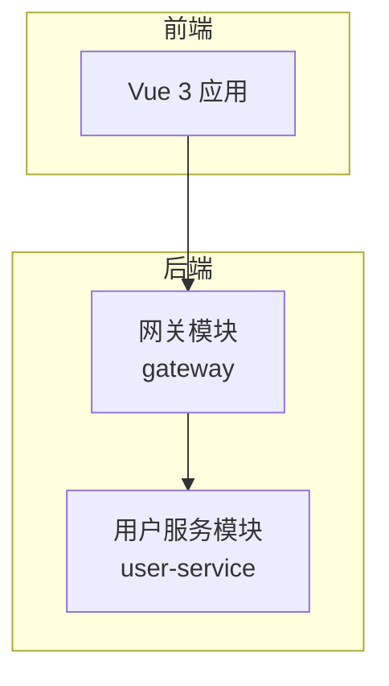
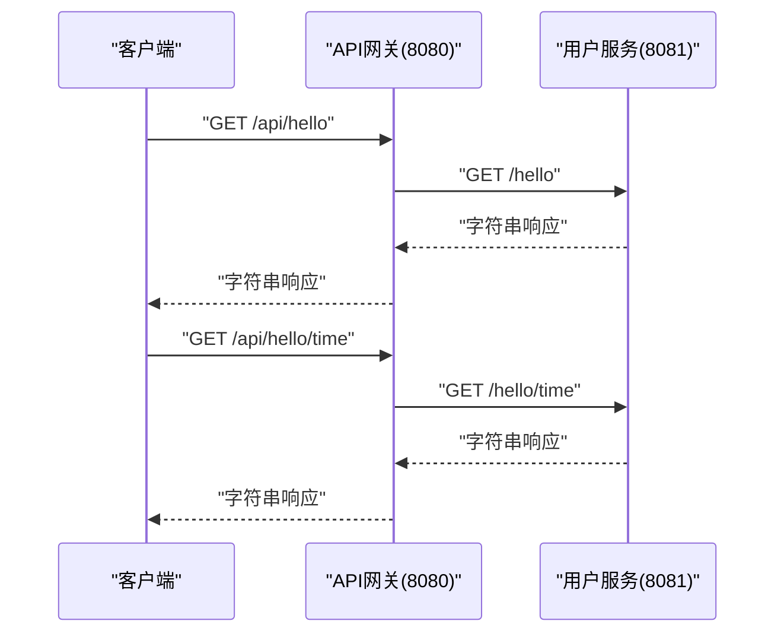
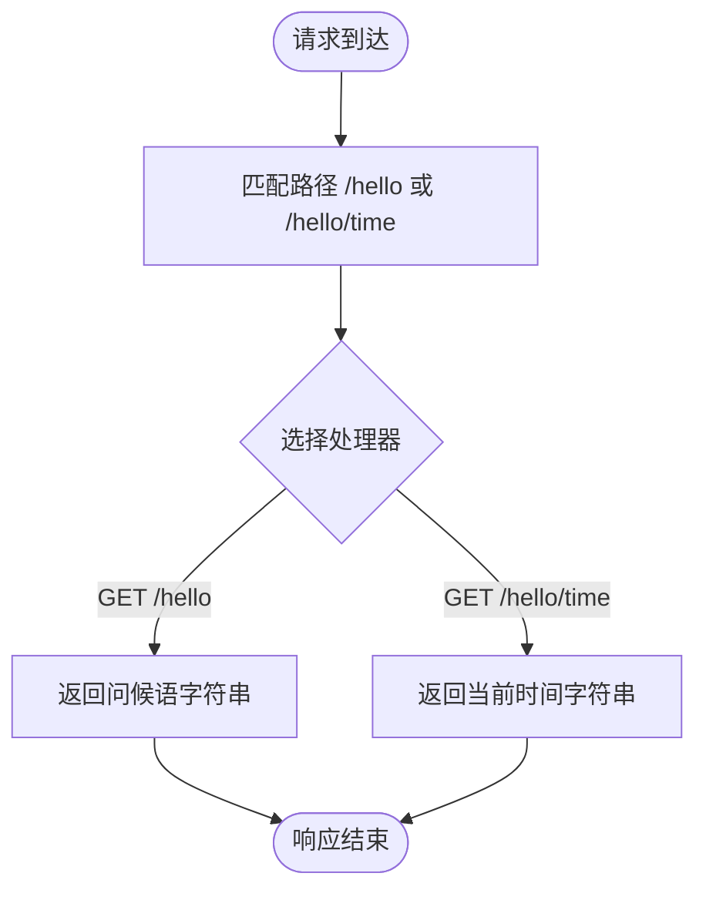
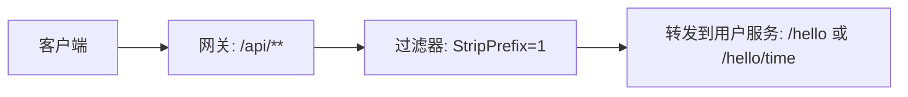
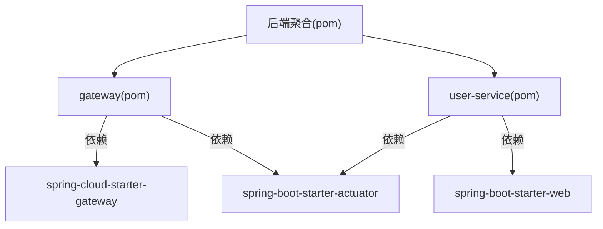

# API接口文档

<cite>
**本文档引用的文件**
- [HelloController.java](file://backend/user-service/src/main/java/com/example/userservice/controller/HelloController.java)
- [application.yml（网关）](file://backend/gateway/src/main/resources/application.yml)
- [application.yml（用户服务）](file://backend/user-service/src/main/resources/application.yml)
- [GatewayApplication.java](file://backend/gateway/src/main/java/com/example/gateway/GatewayApplication.java)
- [UserServiceApplication.java](file://backend/user-service/src/main/java/com/example/userservice/UserServiceApplication.java)
- [pom.xml（后端聚合）](file://backend/pom.xml)
- [pom.xml（网关模块）](file://backend/gateway/pom.xml)
- [pom.xml（用户服务模块）](file://backend/user-service/pom.xml)
- [login.md](file://requrement/login.md)
</cite>

## 目录
1. [简介](#简介)
2. [项目结构](#项目结构)
3. [核心组件](#核心组件)
4. [架构总览](#架构总览)
5. [详细组件分析](#详细组件分析)
6. [依赖分析](#依赖分析)
7. [性能考虑](#性能考虑)
8. [故障排除指南](#故障排除指南)
9. [结论](#结论)
10. [附录](#附录)

## 简介
本项目为一个基于Spring Cloud Gateway的微服务演示系统，包含一个API网关与一个用户服务（user-service）。API网关负责统一入口、路由转发与跨域配置；用户服务提供基础的问候接口。本文档面向开发者与集成方，提供完整的RESTful API端点说明、调用示例、错误处理与安全注意事项，并给出客户端集成建议。

## 项目结构
- 后端采用多模块Maven聚合工程，包含：
  - gateway：Spring Cloud Gateway网关模块
  - user-service：用户服务模块，提供HelloController接口
- 前端为Vue 3应用，使用Vite构建，Axios用于HTTP请求（当前未直接集成后端API）

**图表来源**
- [pom.xml（后端聚合）:30-33](file://backend/pom.xml#L30-L33)
- [GatewayApplication.java:1-12](file://backend/gateway/src/main/java/com/example/gateway/GatewayApplication.java#L1-L12)
- [UserServiceApplication.java:1-12](file://backend/user-service/src/main/java/com/example/userservice/UserServiceApplication.java#L1-L12)

**章节来源**
- [pom.xml（后端聚合）:1-56](file://backend/pom.xml#L1-L56)
- [pom.xml（网关模块）:1-36](file://backend/gateway/pom.xml#L1-L36)
- [pom.xml（用户服务模块）:1-36](file://backend/user-service/pom.xml#L1-L36)

## 核心组件
- API网关（Spring Cloud Gateway）
  - 监听端口：8080
  - 路由规则：将路径前缀为/api/的请求转发至用户服务（URI为http://localhost:8081），并剥离一层前缀
  - 跨域配置：允许任意来源、方法与头
  - 暴露管理端点：health、info、gateway
- 用户服务（Spring Web）
  - 监听端口：8081
  - 控制器：HelloController，提供两个GET端点
  - 暴露管理端点：health、info

**章节来源**
- [application.yml（网关）:1-28](file://backend/gateway/src/main/resources/application.yml#L1-L28)
- [application.yml（用户服务）:1-13](file://backend/user-service/src/main/resources/application.yml#L1-L13)

## 架构总览
API请求从客户端进入网关，根据路由规则匹配后转发到对应微服务，服务返回响应再由网关返回给客户端。

**图表来源**
- [application.yml（网关）:9-15](file://backend/gateway/src/main/resources/application.yml#L9-L15)
- [HelloController.java:11-19](file://backend/user-service/src/main/java/com/example/userservice/controller/HelloController.java#L11-L19)

## 详细组件分析

### HelloController 接口定义
- 基础路径：/hello
- 方法一：GET /hello
  - 功能：返回问候语
  - 请求参数：无
  - 响应格式：纯文本字符串
  - 状态码：200 OK
- 方法二：GET /hello/time
  - 功能：返回当前时间信息
  - 请求参数：无
  - 响应格式：纯文本字符串
  - 状态码：200 OK

**图表来源**
- [HelloController.java:11-19](file://backend/user-service/src/main/java/com/example/userservice/controller/HelloController.java#L11-L19)

**章节来源**
- [HelloController.java:1-21](file://backend/user-service/src/main/java/com/example/userservice/controller/HelloController.java#L1-L21)

### API网关路由配置
- 路由ID：user-service
- 目标URI：http://localhost:8081
- 匹配规则：Path=/api/**
- 过滤器：StripPrefix=1（去除第一段前缀，将/api/hello映射到/hello）
- 全局CORS：允许任意来源、方法与头

**图表来源**
- [application.yml（网关）:9-15](file://backend/gateway/src/main/resources/application.yml#L9-L15)

**章节来源**
- [application.yml（网关）:1-28](file://backend/gateway/src/main/resources/application.yml#L1-L28)

### 客户端调用示例
以下示例展示通过curl访问两个端点的方式。响应内容为纯文本字符串。

- 获取问候语
  - curl示例：curl http://localhost:8080/api/hello
  - 响应示例：字符串（例如“Hello from Spring Cloud Backend!”）
- 获取当前时间
  - curl示例：curl http://localhost:8080/api/hello/time
  - 响应示例：字符串（例如“Current time: 2025-04-05T12:34:56.789”）

提示：由于网关启用了全局CORS，浏览器端可直接从任意源访问上述端点。

**章节来源**
- [application.yml（网关）:16-21](file://backend/gateway/src/main/resources/application.yml#L16-L21)

### 认证机制
- 当前配置未启用任何认证或授权机制
- 登录页面需求在项目需求文档中提出，但当前仓库未包含后端认证接口实现
- 建议在生产环境引入Spring Security + JWT或OAuth2网关层过滤器进行鉴权

**章节来源**
- [login.md:1-5](file://requrement/login.md#L1-L5)

### 错误处理与异常
- 当前未发现显式的全局异常处理类
- 若目标服务不可达或路由不匹配，网关将按默认行为返回相应HTTP状态码
- 建议补充全局异常处理与统一错误响应格式，便于客户端解析

### 版本控制
- 当前未实现API版本控制策略
- 可通过路径前缀（如/api/v1/hello）、查询参数或头部字段进行版本化管理

### 速率限制
- 当前未配置限流策略
- 建议在网关层引入Spring Cloud Gateway限流过滤器或外部限流组件

### 安全考虑
- CORS已放开，便于前端联调；生产环境需限定具体来源
- 建议启用HTTPS、请求签名或Token校验
- 对外暴露的管理端点需限制访问范围

## 依赖分析
- 后端聚合工程定义了Spring Cloud版本与模块划分
- 网关模块依赖spring-cloud-starter-gateway与spring-boot-starter-actuator
- 用户服务模块依赖spring-boot-starter-web与spring-boot-starter-actuator

**图表来源**
- [pom.xml（后端聚合）:35-44](file://backend/pom.xml#L35-L44)
- [pom.xml（网关模块）:16-25](file://backend/gateway/pom.xml#L16-L25)
- [pom.xml（用户服务模块）:16-24](file://backend/user-service/pom.xml#L16-L24)

**章节来源**
- [pom.xml（后端聚合）:1-56](file://backend/pom.xml#L1-L56)
- [pom.xml（网关模块）:1-36](file://backend/gateway/pom.xml#L1-L36)
- [pom.xml（用户服务模块）:1-36](file://backend/user-service/pom.xml#L1-L36)

## 性能考虑
- 使用网关统一入口有利于集中限流、熔断与监控
- 建议开启Actuator指标，结合Prometheus/Grafana进行观测
- 对长文本响应可考虑压缩传输（Gzip）

## 故障排除指南
- 端口占用
  - 网关默认端口8080；用户服务默认端口8081
  - 如冲突，请修改对应application.yml中的server.port
- 路由不生效
  - 确认请求路径是否以/api/开头
  - 确认StripPrefix=1是否符合预期（/api/hello -> /hello）
- CORS问题
  - 当前为全局放开；若出现跨域错误，请检查浏览器控制台与网关CORS配置
- 服务不可达
  - 确认用户服务已启动且监听8081端口
  - 检查防火墙与网络连通性

**章节来源**
- [application.yml（网关）:1-28](file://backend/gateway/src/main/resources/application.yml#L1-L28)
- [application.yml（用户服务）:1-13](file://backend/user-service/src/main/resources/application.yml#L1-L13)

## 结论
本项目提供了简洁的微服务网关与用户服务示例，具备基础的路由与跨域能力。建议在后续迭代中完善认证授权、版本控制、限流与统一错误处理，并按需扩展用户服务的业务接口。

## 附录

### API端点清单
- GET /api/hello
  - 功能：获取问候语
  - 请求参数：无
  - 响应格式：纯文本字符串
  - 状态码：200 OK
- GET /api/hello/time
  - 功能：获取当前时间
  - 请求参数：无
  - 响应格式：纯文本字符串
  - 状态码：200 OK

**章节来源**
- [HelloController.java:11-19](file://backend/user-service/src/main/java/com/example/userservice/controller/HelloController.java#L11-L19)

### 客户端集成指南
- 前端（Vue 3 + Axios）
  - 可直接通过Axios访问 http://localhost:8080/api/hello 与 http://localhost:8080/api/hello/time
  - 响应类型为纯文本，无需解析JSON
- 注意事项
  - 生产环境请替换为实际域名并收紧CORS
  - 如需鉴权，请在请求头中携带Token并在网关侧校验