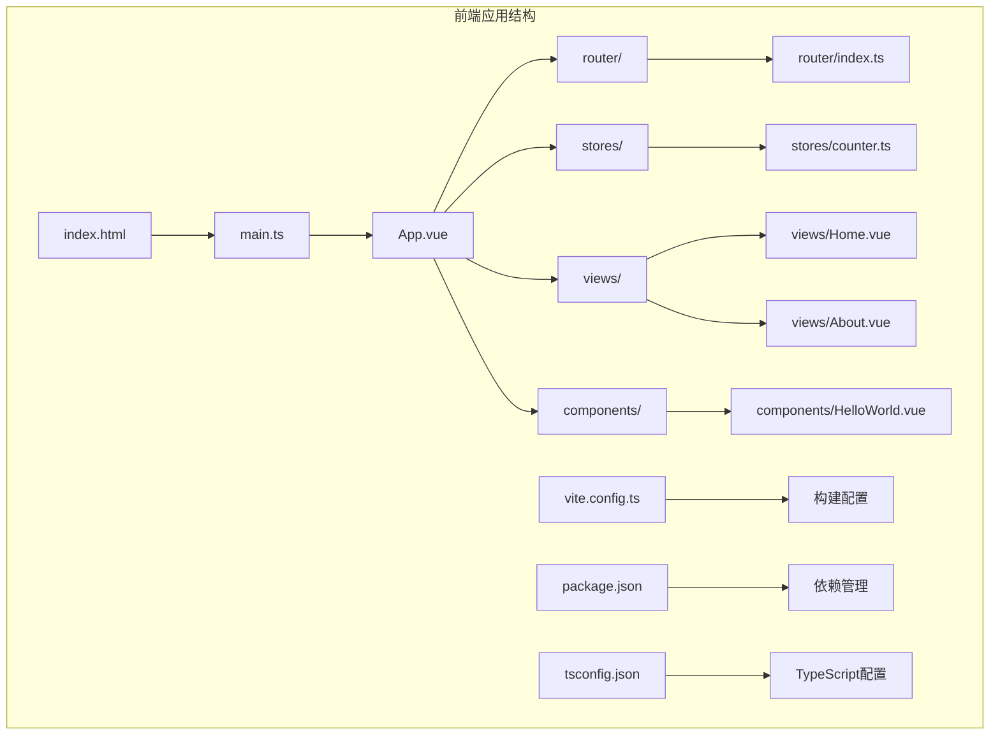
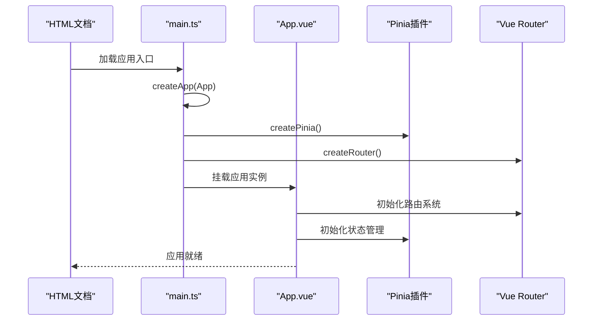
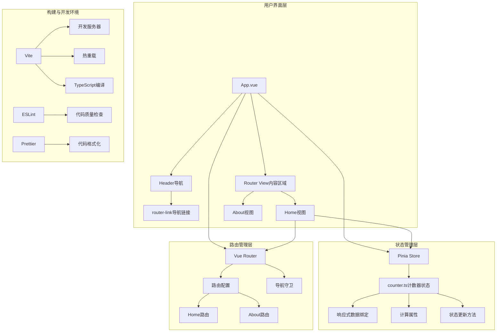
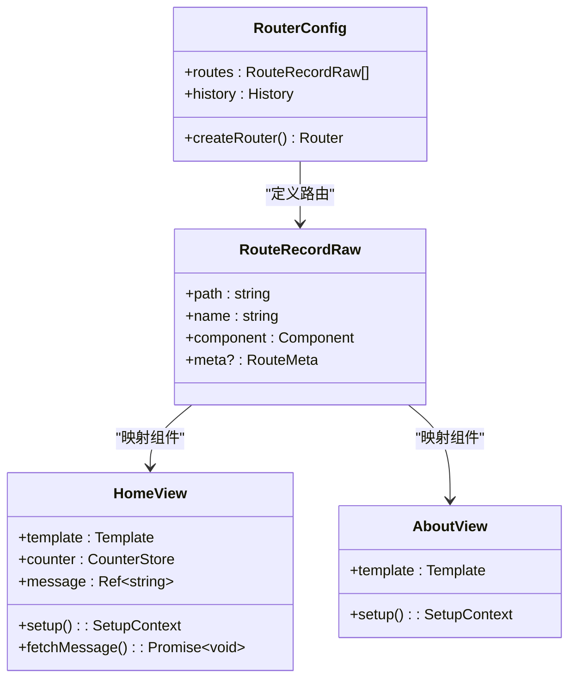
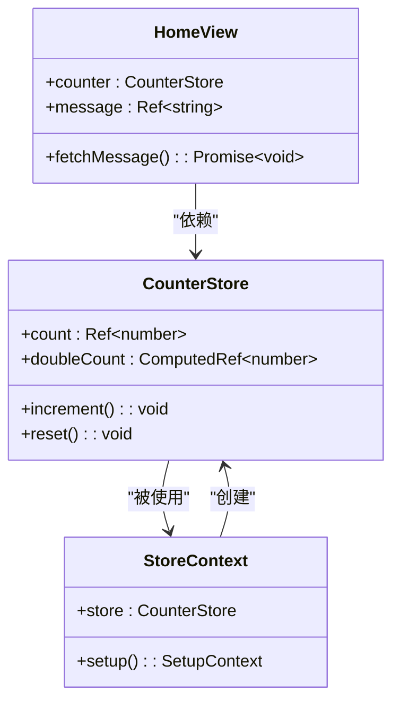
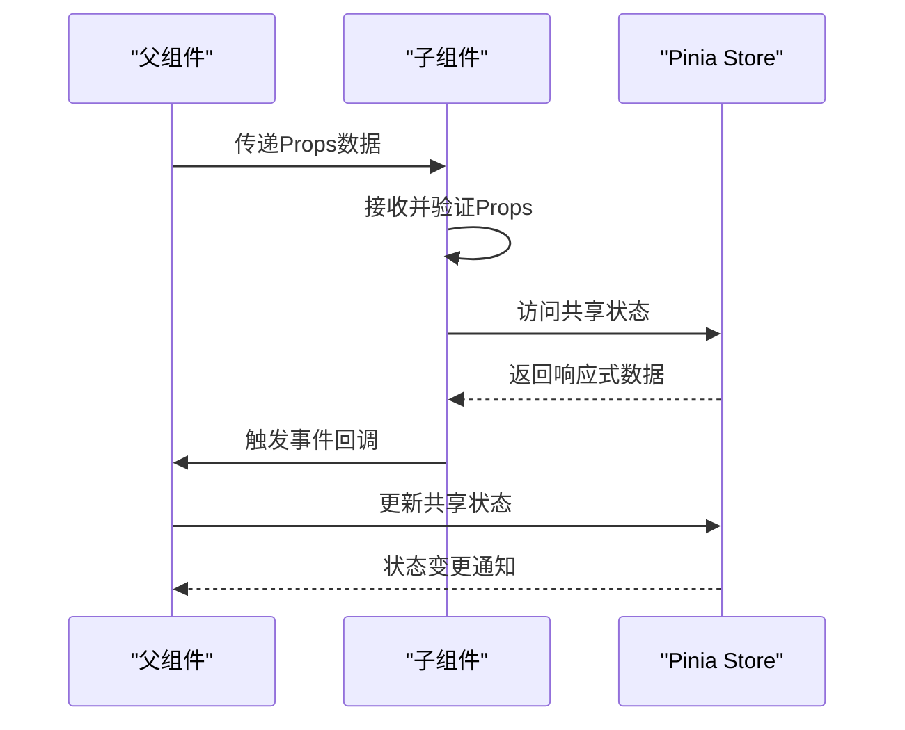
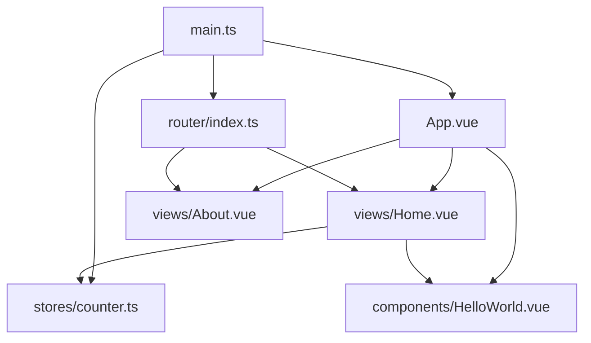

# 前端应用架构

<cite>
**本文档引用的文件**
- [main.ts](file://frontend/src/main.ts)
- [App.vue](file://frontend/src/App.vue)
- [router/index.ts](file://frontend/src/router/index.ts)
- [stores/counter.ts](file://frontend/src/stores/counter.ts)
- [views/Home.vue](file://frontend/src/views/Home.vue)
- [views/About.vue](file://frontend/src/views/About.vue)
- [components/HelloWorld.vue](file://frontend/src/components/HelloWorld.vue)
- [vite.config.ts](file://frontend/vite.config.ts)
- [package.json](file://frontend/package.json)
- [tsconfig.json](file://frontend/tsconfig.json)
- [tsconfig.node.json](file://frontend/tsconfig.node.json)
- [vite-env.d.ts](file://frontend/src/vite-env.d.ts)
- [index.html](file://frontend/index.html)
</cite>

## 目录
1. [引言](#引言)
2. [项目结构](#项目结构)
3. [核心组件](#核心组件)
4. [架构概览](#架构概览)
5. [详细组件分析](#详细组件分析)
6. [依赖关系分析](#依赖关系分析)
7. [性能考虑](#性能考虑)
8. [故障排除指南](#故障排除指南)
9. [结论](#结论)
10. [附录](#附录)

## 引言

本项目是一个基于Vue 3的单页应用(SPA)，采用现代化的前端技术栈构建，集成了TypeScript、Vite构建工具、Pinia状态管理和Vue Router路由系统。该应用展示了完整的前端架构设计，包括组件化开发、路由管理和状态管理的深度集成。

项目的核心目标是演示Vue 3组合式API的使用，特别是<script setup>语法糖的优势和应用场景，同时提供了一个可扩展的架构基础，支持动态路由、导航守卫和复杂的组件通信模式。

## 项目结构

该项目采用清晰的模块化组织结构，遵循Vue 3的最佳实践：



**图表来源**
- [main.ts:1-10](file://frontend/src/main.ts#L1-L10)
- [App.vue:1-41](file://frontend/src/App.vue#L1-L41)
- [router/index.ts:1-16](file://frontend/src/router/index.ts#L1-L16)

**章节来源**
- [main.ts:1-10](file://frontend/src/main.ts#L1-L10)
- [package.json:1-31](file://frontend/package.json#L1-L31)

## 核心组件

### 应用入口与初始化

应用通过main.ts文件进行初始化，这里展示了Vue 3应用的标准启动流程：



**图表来源**
- [main.ts:1-10](file://frontend/src/main.ts#L1-L10)
- [App.vue:1-41](file://frontend/src/App.vue#L1-L41)

应用的核心初始化流程包括：
- 创建Vue应用实例
- 配置Pinia状态管理
- 配置Vue Router路由系统
- 将应用挂载到DOM元素

**章节来源**
- [main.ts:1-10](file://frontend/src/main.ts#L1-L10)

### 组件化架构

项目采用组件化开发模式，主要组件包括：

1. **根组件App.vue** - 应用的顶层容器，负责全局布局和路由渲染
2. **视图组件** - 页面级别的组件，如Home和About
3. **业务组件** - 可复用的功能组件，如HelloWorld
4. **状态存储** - 使用Pinia管理应用状态

**章节来源**
- [App.vue:1-41](file://frontend/src/App.vue#L1-L41)
- [components/HelloWorld.vue:1-18](file://frontend/src/components/HelloWorld.vue#L1-L18)

## 架构概览

该应用采用了经典的SPA架构模式，结合了现代前端开发的最佳实践：



**图表来源**
- [App.vue:1-41](file://frontend/src/App.vue#L1-L41)
- [router/index.ts:1-16](file://frontend/src/router/index.ts#L1-L16)
- [stores/counter.ts:1-13](file://frontend/src/stores/counter.ts#L1-L13)

## 详细组件分析

### 路由系统分析

#### 路由配置与管理

路由系统基于Vue Router 4实现，提供了简洁而强大的路由管理能力：



**图表来源**
- [router/index.ts:1-16](file://frontend/src/router/index.ts#L1-L16)
- [views/Home.vue:1-64](file://frontend/src/views/Home.vue#L1-L64)
- [views/About.vue:1-18](file://frontend/src/views/About.vue#L1-L18)

#### 动态路由与导航

应用使用`<router-link>`和`<router-view>`实现导航，支持以下特性：

- **声明式导航**：使用`router-link`组件进行页面跳转
- **路由参数**：支持动态路由参数传递
- **导航守卫**：可扩展的路由保护机制
- **嵌套路由**：支持复杂的路由层级结构

**章节来源**
- [router/index.ts:1-16](file://frontend/src/router/index.ts#L1-L16)
- [App.vue:5-12](file://frontend/src/App.vue#L5-L12)

### 状态管理系统分析

#### Pinia Store设计

状态管理采用Pinia，提供了TypeScript友好的API和组合式风格的状态管理：



**图表来源**
- [stores/counter.ts:1-13](file://frontend/src/stores/counter.ts#L1-L13)
- [views/Home.vue:19-36](file://frontend/src/views/Home.vue#L19-L36)

#### 响应式数据绑定

Pinia提供了直观的响应式状态管理：

- **ref状态**：使用`ref`创建可变状态
- **computed计算**：基于状态派生的计算属性
- **自动类型推断**：TypeScript自动推断状态类型
- **组合式API**：支持在`<script setup>`中直接使用

**章节来源**
- [stores/counter.ts:1-13](file://frontend/src/stores/counter.ts#L1-L13)

### 组件通信模式分析

#### Props传递模式

组件间通信采用Props传递模式，实现了父子组件的数据流：



**图表来源**
- [views/Home.vue:19-36](file://frontend/src/views/Home.vue#L19-L36)
- [components/HelloWorld.vue:7-11](file://frontend/src/components/HelloWorld.vue#L7-L11)

#### 事件发射与监听

组件通过事件系统实现松耦合通信：

- **事件发射**：子组件向父组件发送事件
- **事件监听**：父组件监听并处理事件
- **数据回传**：支持双向数据流

**章节来源**
- [components/HelloWorld.vue:1-18](file://frontend/src/components/HelloWorld.vue#L1-L18)

### TypeScript集成分析

#### 类型安全配置

项目采用严格的TypeScript配置，确保类型安全：

```mermaid
flowchart TD
A[TypeScript配置] --> B[编译选项]
B --> C[target: ES2020]
B --> D[module: ESNext]
B --> E[strict: true]
B --> F[noUnusedLocals: true]
A --> G[路径映射]
G --> H[@/* -> src/*]
A --> I[模块解析]
I --> J[bundler]
I --> K[allowSyntheticDefaultImports]
A --> L[包含文件]
L --> M[src/**/*.ts]
L --> N[src/**/*.vue]
```

**图表来源**
- [tsconfig.json:1-26](file://frontend/tsconfig.json#L1-L26)
- [tsconfig.node.json:1-11](file://frontend/tsconfig.node.json#L1-L11)

**章节来源**
- [tsconfig.json:1-26](file://frontend/tsconfig.json#L1-L26)
- [vite-env.d.ts:1-8](file://frontend/src/vite-env.d.ts#L1-L8)

### 构建配置分析

#### Vite构建系统

项目使用Vite作为构建工具，提供了快速的开发体验：

```mermaid
flowchart LR
A[Vite配置] --> B[插件系统]
B --> C[@vitejs/plugin-vue]
A --> D[路径别名]
D --> E['@' -> 'src']
A --> F[开发服务器]
F --> G[port: 5173]
F --> H[代理配置]
H --> I['/api' -> 'http://localhost:8080']
A --> J[TypeScript支持]
J --> K[vue-tsc编译]
```

**图表来源**
- [vite.config.ts:1-23](file://frontend/vite.config.ts#L1-L23)

**章节来源**
- [vite.config.ts:1-23](file://frontend/vite.config.ts#L1-L23)

## 依赖关系分析

### 外部依赖关系

项目依赖关系清晰明确，各模块职责分离：

```mermaid
graph TB
subgraph "运行时依赖"
A[Vue 3.4.21] --> B[核心框架]
C[Vue Router 4.3.0] --> D[路由管理]
E[Pinia 2.1.7] --> F[状态管理]
G[axios 1.6.8] --> H[HTTP客户端]
end
subgraph "开发时依赖"
I[Vite 5.2.8] --> J[构建工具]
K[TypeScript 5.4.5] --> L[类型系统]
M[ESLint 8.57.0] --> N[代码质量]
O[Prettier 3.2.5] --> P[代码格式化]
end
subgraph "Vue生态"
Q[@vitejs/plugin-vue] --> R[Vue支持]
S[Vue TS Compiler] --> T[类型检查]
end
A --> Q
C --> A
E --> A
G --> A
```

**图表来源**
- [package.json:12-29](file://frontend/package.json#L12-L29)

### 内部模块依赖

内部模块间的依赖关系体现了清晰的分层架构：



**图表来源**
- [main.ts:1-10](file://frontend/src/main.ts#L1-L10)
- [router/index.ts:1-16](file://frontend/src/router/index.ts#L1-L16)

**章节来源**
- [package.json:1-31](file://frontend/package.json#L1-L31)

## 性能考虑

### 构建优化策略

项目采用了多项性能优化措施：

1. **Tree Shaking**：Vite默认启用Tree Shaking，移除未使用的代码
2. **懒加载**：路由级别的代码分割，按需加载组件
3. **缓存策略**：浏览器缓存和Vite开发缓存优化
4. **压缩优化**：生产环境自动代码压缩和资源优化

### 运行时性能

- **响应式系统优化**：Vue 3的组合式API提供了更好的性能
- **组件缓存**：Vue Router的keep-alive支持组件缓存
- **状态管理优化**：Pinia的轻量级设计减少状态管理开销

## 故障排除指南

### 常见问题诊断

#### 启动问题

**问题**：应用无法启动或出现空白页面
- 检查main.ts中的应用初始化
- 确认DOM元素#app存在
- 验证路由配置正确性

**问题**：路由跳转无效
- 检查router-link的to属性
- 验证路由配置中的path和name
- 确认router-view正确渲染

#### 状态管理问题

**问题**：状态不更新或更新无效
- 检查store的响应式数据绑定
- 验证状态更新方法的调用
- 确认组件中正确使用了store

#### TypeScript相关问题

**问题**：类型错误或编译失败
- 检查tsconfig.json配置
- 验证类型导入和导出
- 确认Vue组件的类型定义

**章节来源**
- [main.ts:1-10](file://frontend/src/main.ts#L1-L10)
- [router/index.ts:1-16](file://frontend/src/router/index.ts#L1-L16)
- [stores/counter.ts:1-13](file://frontend/src/stores/counter.ts#L1-L13)

## 结论

本项目展示了一个完整且可扩展的Vue 3前端应用架构，具有以下特点：

1. **现代化技术栈**：采用Vue 3、TypeScript、Vite等最新技术
2. **清晰的架构设计**：模块化组织，职责分离明确
3. **最佳实践体现**：组合式API、响应式编程、类型安全
4. **可扩展性**：支持动态路由、复杂状态管理和组件通信

该架构为大型Vue应用提供了良好的基础，可以轻松扩展到更复杂的企业级应用场景。

## 附录

### 开发工具链

#### 脚本命令

- `npm run dev`：启动开发服务器
- `npm run build`：构建生产版本
- `npm run preview`：预览生产构建
- `npm run lint`：代码质量检查

#### 配置文件参考

- **vite.config.ts**：Vite构建配置
- **tsconfig.json**：TypeScript编译配置
- **package.json**：项目依赖和脚本配置