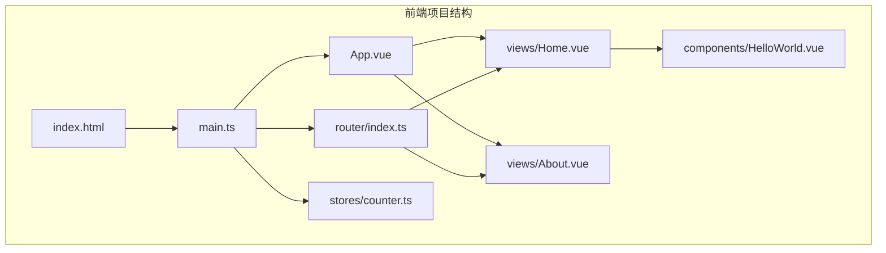
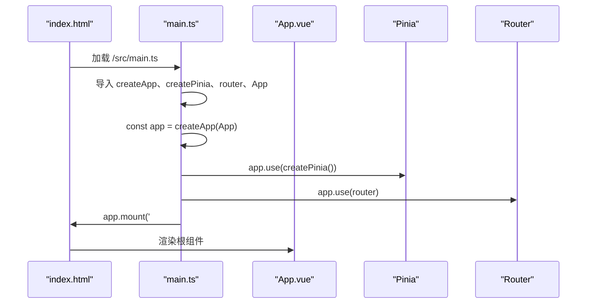
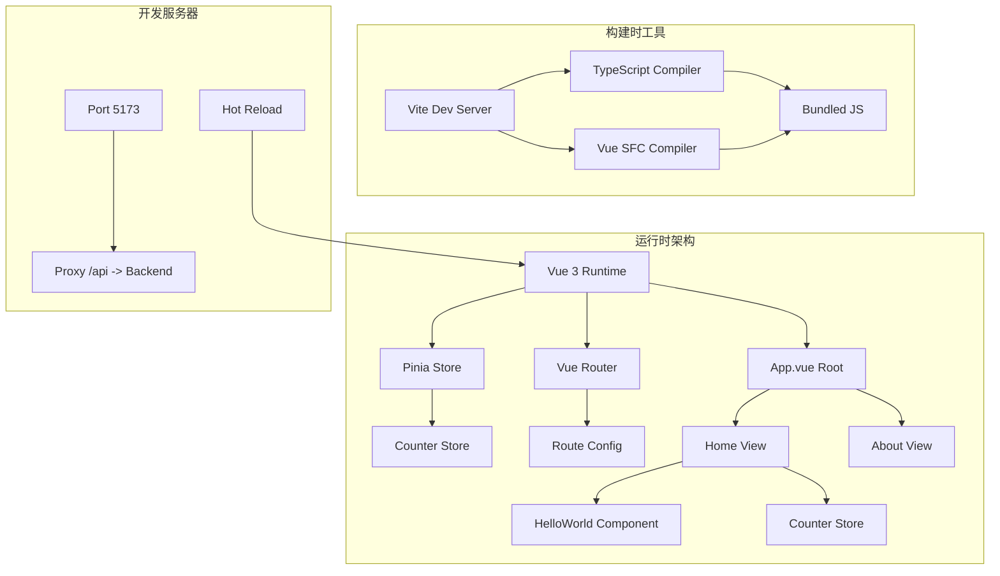

# 应用入口与初始化

<cite>
**本文档引用的文件**
- [main.ts](file://frontend/src/main.ts)
- [App.vue](file://frontend/src/App.vue)
- [vite-env.d.ts](file://frontend/src/vite-env.d.ts)
- [package.json](file://frontend/package.json)
- [vite.config.ts](file://frontend/vite.config.ts)
- [index.html](file://frontend/index.html)
- [router/index.ts](file://frontend/src/router/index.ts)
- [stores/counter.ts](file://frontend/src/stores/counter.ts)
- [views/Home.vue](file://frontend/src/views/Home.vue)
- [views/About.vue](file://frontend/src/views/About.vue)
- [tsconfig.json](file://frontend/tsconfig.json)
</cite>

## 目录
1. [简介](#简介)
2. [项目结构](#项目结构)
3. [核心组件](#核心组件)
4. [架构概览](#架构概览)
5. [详细组件分析](#详细组件分析)
6. [依赖关系分析](#依赖关系分析)
7. [性能考虑](#性能考虑)
8. [故障排除指南](#故障排除指南)
9. [结论](#结论)

## 简介

本文件详细解析了基于 Vue 3 + Vite + TypeScript 的单页应用入口与初始化流程。重点涵盖应用创建流程（createApp 函数使用）、插件注册顺序、应用挂载过程、根组件设计模式、Vite 环境声明文件作用以及 TypeScript 类型定义。同时提供最佳实践建议，包括错误边界处理、性能优化和开发调试配置，并给出扩展应用功能和集成第三方库的具体示例路径。

## 项目结构

该前端项目采用典型的 Vue 3 单页应用结构，主要目录包括：
- src：源代码目录，包含组件、路由、状态管理、视图等
- public：静态资源目录
- 配置文件：package.json、vite.config.ts、tsconfig.json 等



**图表来源**
- [index.html:1-14](file://frontend/index.html#L1-L14)
- [main.ts:1-10](file://frontend/src/main.ts#L1-L10)
- [router/index.ts:1-16](file://frontend/src/router/index.ts#L1-L16)

**章节来源**
- [index.html:1-14](file://frontend/index.html#L1-L14)
- [package.json:1-31](file://frontend/package.json#L1-L31)

## 核心组件

### 应用入口 main.ts 分析

应用入口文件负责创建 Vue 应用实例、注册插件并执行挂载。其核心流程如下：

1. 导入基础依赖
   - Vue 核心库用于创建应用实例
   - Pinia 状态管理库用于全局状态管理
   - 路由模块用于页面导航

2. 创建应用实例
   - 使用 createApp(App) 创建根组件的应用实例

3. 插件注册顺序
   - 先注册 Pinia，再注册路由
   - 这种顺序确保路由可以访问到 Pinia 提供的状态

4. 应用挂载
   - 将应用挂载到 DOM 中的 #app 容器



**图表来源**
- [main.ts:1-10](file://frontend/src/main.ts#L1-L10)
- [index.html:9-12](file://frontend/index.html#L9-L12)

**章节来源**
- [main.ts:1-10](file://frontend/src/main.ts#L1-L10)
- [index.html:9-12](file://frontend/index.html#L9-L12)

### 根组件 App.vue 设计模式

根组件采用简洁的布局结构，包含头部导航和主内容区域：

1. 模板结构
   - 头部包含标题和导航链接
   - 主区域使用 router-view 展示当前路由组件
   - 使用 router-link 实现页面跳转

2. 样式组织
   - 使用 scoped 样式确保样式隔离
   - 头部采用绿色主题配色方案
   - 导航链接支持活动状态样式

3. 全局状态注入
   - 通过 Pinia 提供的状态管理能力
   - 在子组件中可直接使用状态和计算属性

**章节来源**
- [App.vue:1-41](file://frontend/src/App.vue#L1-L41)

### Vite 环境声明文件

vite-env.d.ts 文件的作用是为 Vite 环境提供 TypeScript 类型声明：

1. 基础类型声明
   - 引用 Vite 的客户端类型定义
   - 为 .vue 文件提供默认导出类型

2. 模块声明
   - 为 Vue 组件文件建立类型映射
   - 确保在 TypeScript 中正确识别组件类型

**章节来源**
- [vite-env.d.ts:1-8](file://frontend/src/vite-env.d.ts#L1-L8)

## 架构概览

应用采用标准的 Vue 3 单页应用架构，结合现代工具链实现高效开发体验：



**图表来源**
- [main.ts:1-10](file://frontend/src/main.ts#L1-L10)
- [router/index.ts:1-16](file://frontend/src/router/index.ts#L1-L16)
- [stores/counter.ts:1-13](file://frontend/src/stores/counter.ts#L1-L13)
- [vite.config.ts:1-23](file://frontend/vite.config.ts#L1-L23)

## 详细组件分析

### 路由系统分析

路由系统采用 Vue Router 4 的组合式 API 风格：

1. 路由配置
   - 使用 createRouter 和 createWebHistory
   - 定义首页和关于页面的路由规则
   - 支持程序化导航和路由守卫

2. 路由导航
   - 在根组件中使用 router-link 实现声明式导航
   - router-view 动态渲染匹配的组件

**章节来源**
- [router/index.ts:1-16](file://frontend/src/router/index.ts#L1-L16)
- [App.vue:5-12](file://frontend/src/App.vue#L5-L12)

### 状态管理系统

Pinia 提供了轻量级但功能强大的状态管理解决方案：

1. Store 定义
   - 使用组合式 API 风格定义 store
   - 支持响应式状态、计算属性和方法
   - 自动类型推断和 IDE 支持

2. 状态使用
   - 在组件中通过 useCounterStore 访问状态
   - 支持直接修改响应式状态和计算属性

**章节来源**
- [stores/counter.ts:1-13](file://frontend/src/stores/counter.ts#L1-L13)
- [views/Home.vue:21-25](file://frontend/src/views/Home.vue#L21-L25)

### 视图组件分析

#### 首页组件设计

首页组件展示了完整的应用功能集成：

1. 组件结构
   - 包含计数器功能演示
   - 集成第三方库 axios 进行 API 调用
   - 使用自定义组件 HelloWorld

2. 功能实现
   - 计数器状态管理
   - 异步 API 调用和错误处理
   - 响应式数据绑定

3. 样式设计
   - 使用 scoped 样式避免样式冲突
   - 按钮悬停效果增强用户体验

**章节来源**
- [views/Home.vue:1-64](file://frontend/src/views/Home.vue#L1-L64)

#### 关于页面组件

关于页面提供项目信息展示：

1. 结构简单
   - 采用清晰的信息列表
   - 使用 scoped 样式保持视觉一致性

2. 内容组织
   - 展示技术栈信息
   - 提供项目背景说明

**章节来源**
- [views/About.vue:1-18](file://frontend/src/views/About.vue#L1-L18)

### TypeScript 配置分析

项目采用严格的 TypeScript 配置确保类型安全：

1. 编译选项
   - ES2020 目标和现代模块系统
   - DOM 和 DOM.Iterable 库支持
   - bundler 模块解析策略

2. 路径别名
   - @/* 映射到 src/* 目录
   - 简化导入路径书写

3. 开发配置
   - noEmit 确保仅进行类型检查
   - 严格模式启用全面的类型验证

**章节来源**
- [tsconfig.json:1-26](file://frontend/tsconfig.json#L1-L26)

## 依赖关系分析

应用的依赖关系体现了现代前端开发的最佳实践：

```mermaid
graph LR
subgraph "运行时依赖"
A[vue@^3.4.21] --> B[Vue 3 Runtime]
C[vue-router@^4.3.0] --> D[Vue Router 4]
E[pinia@^2.1.7] --> F[Pinia State Management]
G[axios@^1.6.8] --> H[HTTP Client]
end
subgraph "开发时依赖"
I[@vitejs/plugin-vue@^5.0.4] --> J[Vite Vue Plugin]
K[typescript@^5.4.5] --> L[TypeScript Compiler]
M[vite@^5.2.8] --> N[Vite Dev Server]
O[vue-tsc@^2.0.11] --> P[Vue Type Checker]
end
subgraph "构建工具"
Q[ESLint] --> R[代码质量检查]
S[Prettier] --> T[代码格式化]
end
```

**图表来源**
- [package.json:12-29](file://frontend/package.json#L12-L29)

**章节来源**
- [package.json:1-31](file://frontend/package.json#L1-L31)

## 性能考虑

基于现有配置，以下是一些性能优化建议：

### 构建优化
- 启用代码分割和懒加载路由组件
- 使用动态导入优化首屏加载
- 配置适当的缓存策略

### 运行时优化
- 合理使用响应式数据，避免不必要的重渲染
- 在组件中使用 computed 和 watch 的最佳实践
- 优化图片和静态资源的加载

### 开发体验
- 利用 Vite 的热更新功能提升开发效率
- 配置 ESLint 和 Prettier 确保代码质量
- 使用 TypeScript 提前发现潜在问题

## 故障排除指南

### 常见问题及解决方案

1. **应用无法启动**
   - 检查 main.ts 中的导入路径是否正确
   - 确认 App.vue 组件导出正常
   - 验证 index.html 中的脚本引用

2. **路由不工作**
   - 检查 router/index.ts 中的路由配置
   - 确认 router-link 的路径正确
   - 验证 App.vue 中是否包含 router-view

3. **状态管理异常**
   - 确认 Pinia 已正确注册
   - 检查 store 的定义和使用方式
   - 验证响应式数据的访问权限

4. **TypeScript 类型错误**
   - 检查 tsconfig.json 的配置
   - 确认路径别名设置正确
   - 验证类型声明文件的存在

**章节来源**
- [main.ts:1-10](file://frontend/src/main.ts#L1-L10)
- [router/index.ts:1-16](file://frontend/src/router/index.ts#L1-L16)
- [stores/counter.ts:1-13](file://frontend/src/stores/counter.ts#L1-L13)

## 结论

本项目展示了现代 Vue 3 应用的标准初始化流程和最佳实践。通过清晰的入口文件组织、合理的插件注册顺序、规范的组件设计和完善的 TypeScript 配置，为后续的功能扩展奠定了坚实基础。

关键要点包括：
- 应用创建遵循 createApp -> 插件注册 -> 挂载的标准流程
- Pinia 和 Vue Router 的集成提供了完整的状态管理和导航能力
- Vite 配置支持开发时的热更新和生产时的优化打包
- TypeScript 配置确保了代码质量和开发体验

对于未来的扩展，建议重点关注路由懒加载、状态管理的模块化拆分、组件库的统一设计以及性能监控的集成。