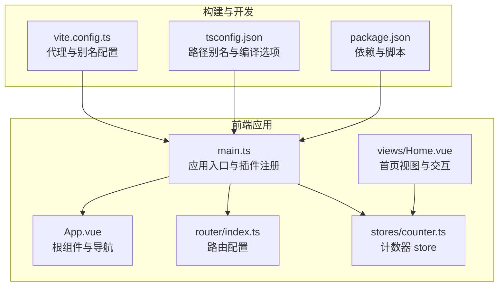
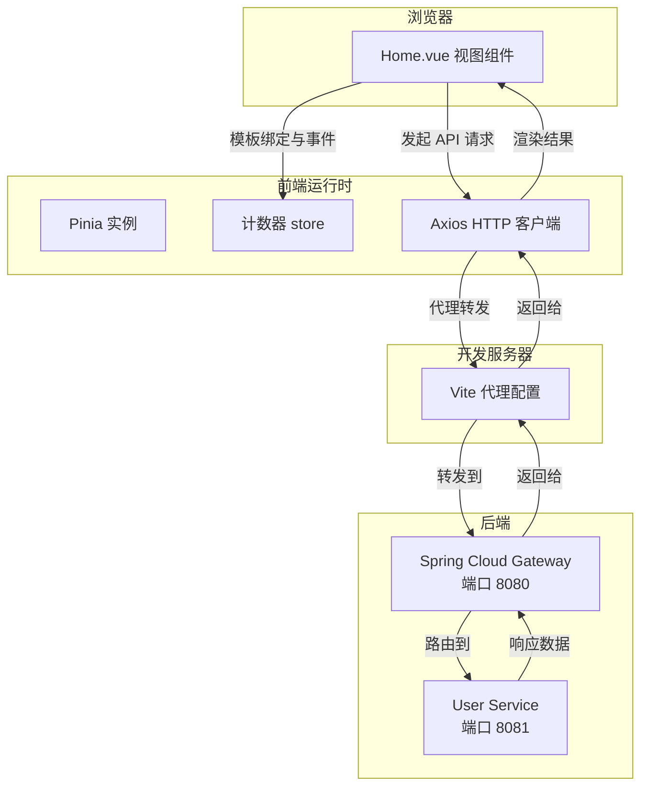
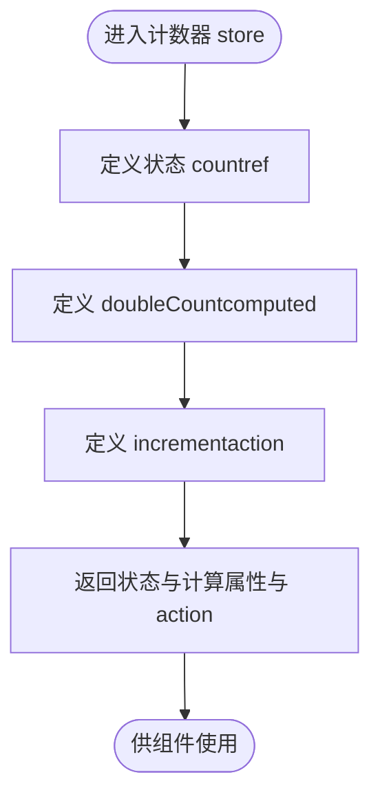
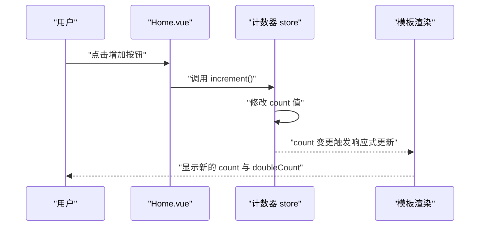
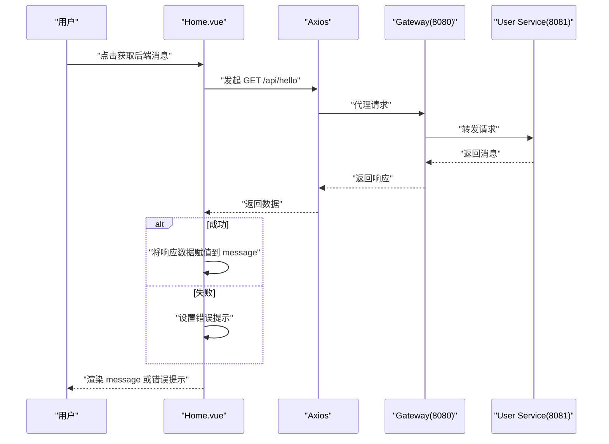
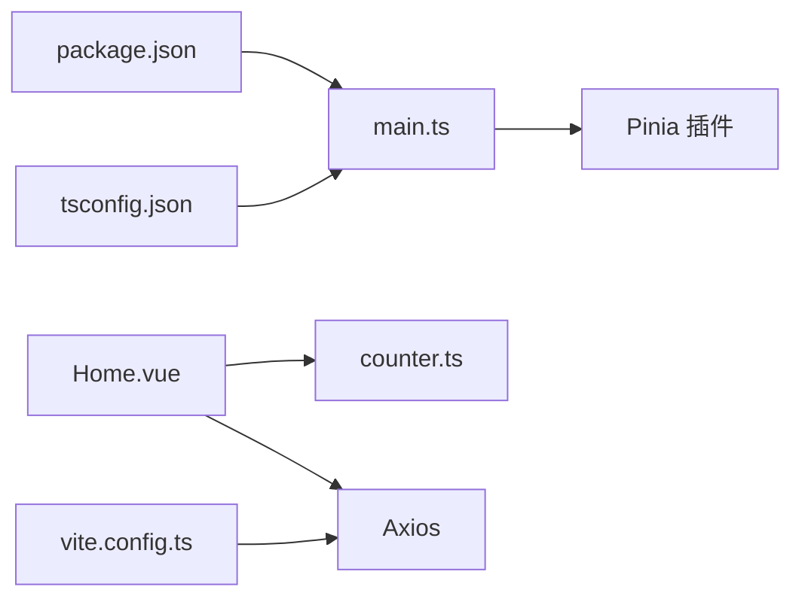

# 状态管理

<cite>
**本文引用的文件**
- [README.md](file://README.md)
- [frontend/src/stores/counter.ts](file://frontend/src/stores/counter.ts)
- [frontend/src/main.ts](file://frontend/src/main.ts)
- [frontend/src/views/Home.vue](file://frontend/src/views/Home.vue)
- [frontend/src/App.vue](file://frontend/src/App.vue)
- [frontend/src/router/index.ts](file://frontend/src/router/index.ts)
- [frontend/package.json](file://frontend/package.json)
- [frontend/vite.config.ts](file://frontend/vite.config.ts)
- [frontend/tsconfig.json](file://frontend/tsconfig.json)
</cite>

## 目录
1. [简介](#简介)
2. [项目结构](#项目结构)
3. [核心组件](#核心组件)
4. [架构总览](#架构总览)
5. [详细组件分析](#详细组件分析)
6. [依赖分析](#依赖分析)
7. [性能考虑](#性能考虑)
8. [故障排除指南](#故障排除指南)
9. [结论](#结论)
10. [附录](#附录)

## 简介
本项目是一个基于 Vue 3 + Spring Cloud 的全栈示例，前端采用 Vue 3 + Vite + TypeScript，集成了 Pinia 作为状态管理方案，并通过 Axios 发起 HTTP 请求与后端交互。本文档围绕 Pinia 的核心概念与最佳实践展开，结合项目中的计数器 store 示例，系统讲解：
- store 设计、状态定义与 action 方法
- 响应式状态的数据绑定机制（computed 计算属性与模板绑定）
- store 之间的依赖关系与模块化组织方式
- 状态持久化策略（localStorage/sessionStorage 的集成思路）
- 异步 action 的处理模式（API 调用与错误处理）
- 状态管理最佳实践（结构设计、命名规范、性能优化）

同时，本文还提供从计数器 store 到扩展应用的完整流程图与序列图，帮助读者快速理解并落地到实际项目中。

## 项目结构
前端项目采用典型的单页应用结构，核心入口在 main.ts 中初始化 Pinia 并挂载应用；计数器 store 定义在 stores 目录下；页面视图在 views 目录中，通过 script setup 与 store 进行交互；路由在 router/index.ts 中配置；构建工具使用 Vite，并通过代理将 /api 请求转发至后端网关。

图表来源
- [frontend/src/main.ts:1-10](file://frontend/src/main.ts#L1-L10)
- [frontend/src/App.vue:1-41](file://frontend/src/App.vue#L1-L41)
- [frontend/src/router/index.ts:1-16](file://frontend/src/router/index.ts#L1-L16)
- [frontend/src/stores/counter.ts:1-13](file://frontend/src/stores/counter.ts#L1-L13)
- [frontend/src/views/Home.vue:1-64](file://frontend/src/views/Home.vue#L1-L64)
- [frontend/vite.config.ts:1-23](file://frontend/vite.config.ts#L1-L23)
- [frontend/tsconfig.json:1-26](file://frontend/tsconfig.json#L1-L26)
- [frontend/package.json:1-31](file://frontend/package.json#L1-L31)

章节来源
- [README.md:23-57](file://README.md#L23-L57)
- [frontend/src/main.ts:1-10](file://frontend/src/main.ts#L1-L10)
- [frontend/src/stores/counter.ts:1-13](file://frontend/src/stores/counter.ts#L1-L13)
- [frontend/src/views/Home.vue:1-64](file://frontend/src/views/Home.vue#L1-L64)
- [frontend/src/router/index.ts:1-16](file://frontend/src/router/index.ts#L1-L16)
- [frontend/vite.config.ts:1-23](file://frontend/vite.config.ts#L1-L23)
- [frontend/tsconfig.json:1-26](file://frontend/tsconfig.json#L1-L26)
- [frontend/package.json:1-31](file://frontend/package.json#L1-L31)

## 核心组件
本节聚焦于 Pinia 的核心概念与在项目中的具体体现：
- store 设计：使用组合式 API 的 defineStore 定义，返回状态、计算属性与 action。
- 状态定义：通过 ref 定义可变状态，通过 computed 定义派生状态。
- action 方法：在 store 内部定义函数，用于修改状态或执行副作用。
- 模块化组织：按功能拆分 store 文件，便于维护与复用。
- 数据绑定：在组件模板中直接绑定 store 的状态与计算属性，实现响应式更新。

章节来源
- [frontend/src/stores/counter.ts:1-13](file://frontend/src/stores/counter.ts#L1-L13)
- [frontend/src/views/Home.vue:19-36](file://frontend/src/views/Home.vue#L19-L36)

## 架构总览
下图展示了从前端应用入口到视图组件与 store 的交互关系，以及 Vite 代理如何将 /api 请求转发至后端网关。

图表来源
- [frontend/src/views/Home.vue:19-36](file://frontend/src/views/Home.vue#L19-L36)
- [frontend/vite.config.ts:12-21](file://frontend/vite.config.ts#L12-L21)
- [README.md:63-67](file://README.md#L63-L67)
- [README.md:108-116](file://README.md#L108-L116)

## 详细组件分析

### 计数器 store 分析
计数器 store 是本项目的最小可用示例，演示了 Pinia 的基本用法：定义状态、计算属性与 action，并在组件中使用。

图表来源
- [frontend/src/stores/counter.ts:4-12](file://frontend/src/stores/counter.ts#L4-L12)

章节来源
- [frontend/src/stores/counter.ts:1-13](file://frontend/src/stores/counter.ts#L1-L13)

### 组件与 store 的交互流程
Home.vue 展示了如何在组件中使用计数器 store，并通过按钮触发 action 修改状态，同时展示模板对 store 状态与计算属性的绑定。

图表来源
- [frontend/src/views/Home.vue:7-10](file://frontend/src/views/Home.vue#L7-L10)
- [frontend/src/stores/counter.ts:7-9](file://frontend/src/stores/counter.ts#L7-L9)

章节来源
- [frontend/src/views/Home.vue:19-36](file://frontend/src/views/Home.vue#L19-L36)
- [frontend/src/stores/counter.ts:1-13](file://frontend/src/stores/counter.ts#L1-L13)

### 异步 action 与错误处理
项目中通过 Axios 发起 API 请求，演示了异步 action 的典型模式：在 try/catch 中处理网络异常，并将结果赋值到组件本地状态以驱动 UI 更新。

图表来源
- [frontend/src/views/Home.vue:28-35](file://frontend/src/views/Home.vue#L28-L35)
- [frontend/vite.config.ts:14-19](file://frontend/vite.config.ts#L14-L19)
- [README.md:108-116](file://README.md#L108-L116)

章节来源
- [frontend/src/views/Home.vue:19-36](file://frontend/src/views/Home.vue#L19-L36)
- [frontend/vite.config.ts:1-23](file://frontend/vite.config.ts#L1-L23)
- [README.md:108-116](file://README.md#L108-L116)

### 响应式状态与计算属性
- 状态定义：通过 ref 定义可变状态，例如计数器的 count。
- 计算属性：通过 computed 定义派生状态，例如 doubleCount 基于 count 计算而来。
- 模板绑定：在组件模板中直接使用 store 的状态与计算属性，实现自动响应式更新。

章节来源
- [frontend/src/stores/counter.ts:5-6](file://frontend/src/stores/counter.ts#L5-L6)
- [frontend/src/views/Home.vue:7-8](file://frontend/src/views/Home.vue#L7-L8)

### store 之间的依赖关系与模块化组织
- 模块化组织：每个功能域对应一个 store 文件，便于维护与复用。
- 依赖关系：组件通过 import 使用特定 store，store 之间不直接互相依赖，保持低耦合。
- 扩展建议：新增 store 时遵循相同模式，避免跨 store 的复杂耦合。

章节来源
- [frontend/src/stores/counter.ts:1-13](file://frontend/src/stores/counter.ts#L1-L13)
- [frontend/src/views/Home.vue:21-25](file://frontend/src/views/Home.vue#L21-L25)

### 状态持久化策略
本项目未直接实现 localStorage/sessionStorage 的持久化逻辑，但可以按照以下思路进行扩展：
- 在 store 中添加持久化插件或自定义逻辑，在状态变更时同步到 localStorage/sessionStorage。
- 在应用启动时从存储中恢复状态，确保刷新后状态不丢失。
- 注意键名命名规范与版本兼容性，避免不同版本间的数据冲突。

（本小节为通用指导，不直接分析具体源码文件）

## 依赖分析
- 应用入口依赖：main.ts 注入 Pinia 插件，使全局可用。
- 组件依赖：Home.vue 通过 import 使用计数器 store，并在模板中绑定其状态。
- 构建依赖：package.json 声明 Vue、Pinia、Axios 等依赖；vite.config.ts 提供 /api 代理；tsconfig.json 提供路径别名支持。

图表来源
- [frontend/src/main.ts:1-10](file://frontend/src/main.ts#L1-L10)
- [frontend/src/views/Home.vue:19-25](file://frontend/src/views/Home.vue#L19-L25)
- [frontend/vite.config.ts:1-23](file://frontend/vite.config.ts#L1-L23)
- [frontend/package.json:12-16](file://frontend/package.json#L12-L16)
- [frontend/tsconfig.json:18-21](file://frontend/tsconfig.json#L18-L21)

章节来源
- [frontend/src/main.ts:1-10](file://frontend/src/main.ts#L1-L10)
- [frontend/src/views/Home.vue:19-36](file://frontend/src/views/Home.vue#L19-L36)
- [frontend/vite.config.ts:1-23](file://frontend/vite.config.ts#L1-L23)
- [frontend/package.json:1-31](file://frontend/package.json#L1-L31)
- [frontend/tsconfig.json:1-26](file://frontend/tsconfig.json#L1-L26)

## 性能考虑
- 避免不必要的响应式开销：仅在需要响应式更新的状态上使用 ref/computed，避免过度包装。
- 合理拆分 store：按功能域划分 store，减少跨 store 的频繁通信。
- 异步 action 的节流与去抖：对于高频 API 请求，可在组件层或 store 层加入节流/去抖策略。
- 模板绑定优化：尽量使用浅层绑定，避免深层嵌套对象导致的深度响应式追踪。
- 缓存与懒加载：对昂贵的计算属性或异步数据进行缓存，必要时延迟加载。

（本小节为通用指导，不直接分析具体源码文件）

## 故障排除指南
- 无法获取后端消息
  - 检查 Vite 代理是否正确配置，确认 /api 前缀被剥离并转发到网关。
  - 确认后端服务（网关与用户服务）已启动且端口正确。
  - 查看浏览器控制台网络面板，定位请求失败原因。
- 计数器不更新
  - 确认组件中正确导入并使用了计数器 store。
  - 检查模板中是否正确绑定 store 的状态与计算属性。
- 类型错误或路径别名问题
  - 检查 tsconfig.json 中的路径别名配置，确保 @/* 正确指向 src。
  - 确认 package.json 中的依赖安装完成。

章节来源
- [frontend/vite.config.ts:12-21](file://frontend/vite.config.ts#L12-L21)
- [README.md:63-67](file://README.md#L63-L67)
- [frontend/tsconfig.json:18-21](file://frontend/tsconfig.json#L18-L21)
- [frontend/src/views/Home.vue:19-36](file://frontend/src/views/Home.vue#L19-L36)

## 结论
本项目以最小可行的计数器 store 为例，清晰地展示了 Pinia 的核心能力：组合式 API 的 store 定义、响应式状态与计算属性、action 的使用，以及与组件模板的无缝绑定。通过 Axios 与 Vite 代理，项目实现了前后端联调的完整链路。在此基础上，开发者可以按需扩展更多 store，引入持久化策略与异步 action 的健壮错误处理，并遵循模块化与性能优化的最佳实践，构建可维护、高性能的状态管理方案。

## 附录
- 快速开始
  - 启动后端服务（用户服务与网关）
  - 启动前端开发服务器
  - 在首页点击“获取后端消息”按钮验证联调
- 接口说明
  - 直接访问用户服务：GET http://localhost:8081/hello
  - 通过网关代理：GET http://localhost:8080/api/hello
  - 获取当前时间：GET http://localhost:8080/api/hello/time

章节来源
- [README.md:71-104](file://README.md#L71-L104)
- [README.md:108-116](file://README.md#L108-L116)