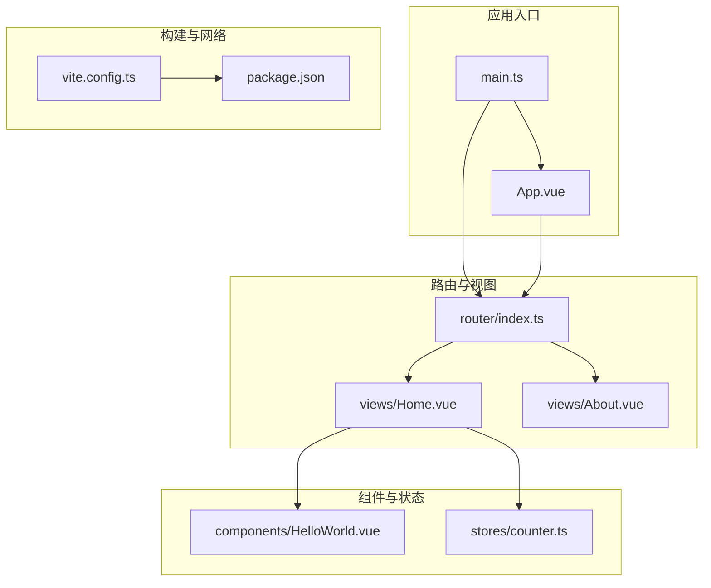
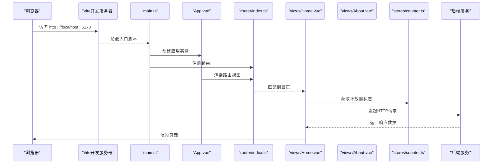
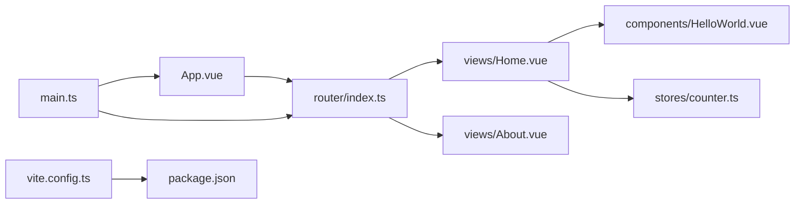

# 组件系统

<cite>
**本文引用的文件**
- [frontend/src/App.vue](file://frontend/src/App.vue)
- [frontend/src/components/HelloWorld.vue](file://frontend/src/components/HelloWorld.vue)
- [frontend/src/views/Home.vue](file://frontend/src/views/Home.vue)
- [frontend/src/views/About.vue](file://frontend/src/views/About.vue)
- [frontend/src/main.ts](file://frontend/src/main.ts)
- [frontend/src/router/index.ts](file://frontend/src/router/index.ts)
- [frontend/src/stores/counter.ts](file://frontend/src/stores/counter.ts)
- [frontend/src/stores/counter.ts](file://frontend/src/stores/counter.ts)
- [frontend/vite.config.ts](file://frontend/vite.config.ts)
- [frontend/package.json](file://frontend/package.json)
</cite>

## 目录
1. [简介](#简介)
2. [项目结构](#项目结构)
3. [核心组件](#核心组件)
4. [架构总览](#架构总览)
5. [详细组件分析](#详细组件分析)
6. [依赖关系分析](#依赖关系分析)
7. [性能考虑](#性能考虑)
8. [故障排除指南](#故障排除指南)
9. [结论](#结论)
10. [附录](#附录)

## 简介
本文件面向Vue.js组件系统，围绕单文件组件（.vue）的结构与组织方式进行系统化梳理，重点覆盖：
- template、script、style三部分的协作与作用域样式
- 组件通信机制：props传递、事件发射、插槽使用、provide/inject模式
- 生命周期钩子的使用场景与最佳实践
- 视图组件（Views）与普通组件的区别与应用
- 设计原则：单一职责、可复用性、性能优化
- 具体示例与组合使用模式

本项目采用Vue 3 + TypeScript + Vite + Pinia + Vue Router技术栈，通过最小可用示例展示组件系统的关键能力。

## 项目结构
前端项目采用按功能分层的目录组织：
- 根组件与路由容器：App.vue、router/index.ts
- 视图组件：views/Home.vue、views/About.vue
- 可复用组件：components/HelloWorld.vue
- 状态管理：stores/counter.ts
- 应用入口：main.ts
- 构建与代理配置：vite.config.ts、package.json

图表来源
- [frontend/src/main.ts:1-10](file://frontend/src/main.ts#L1-L10)
- [frontend/src/App.vue:1-41](file://frontend/src/App.vue#L1-L41)
- [frontend/src/router/index.ts:1-16](file://frontend/src/router/index.ts#L1-L16)
- [frontend/src/views/Home.vue:1-64](file://frontend/src/views/Home.vue#L1-L64)
- [frontend/src/views/About.vue:1-18](file://frontend/src/views/About.vue#L1-L18)
- [frontend/src/components/HelloWorld.vue:1-18](file://frontend/src/components/HelloWorld.vue#L1-L18)
- [frontend/src/stores/counter.ts:1-13](file://frontend/src/stores/counter.ts#L1-L13)
- [frontend/vite.config.ts:1-23](file://frontend/vite.config.ts#L1-L23)
- [frontend/package.json:1-31](file://frontend/package.json#L1-L31)

章节来源
- [frontend/src/main.ts:1-10](file://frontend/src/main.ts#L1-L10)
- [frontend/src/router/index.ts:1-16](file://frontend/src/router/index.ts#L1-L16)
- [frontend/src/App.vue:1-41](file://frontend/src/App.vue#L1-L41)

## 核心组件
本节聚焦于单文件组件的三部分协作与作用域样式，以及在项目中的实际应用。

- 模板（template）
  - App.vue：定义导航与路由出口，作为页面容器
  - Home.vue：包含子组件、状态展示与API调用
  - About.vue：静态信息展示
  - HelloWorld.vue：最小可复用组件，演示props接收

- 脚本（script setup + TypeScript）
  - 使用组合式API（setup）与TypeScript类型声明
  - Home.vue中引入store、子组件与HTTP客户端
  - HelloWorld.vue中通过defineProps声明属性

- 样式（scoped）
  - 所有组件均使用scoped样式，避免全局污染
  - App.vue与Home.vue展示了不同样式的组织方式

章节来源
- [frontend/src/App.vue:1-41](file://frontend/src/App.vue#L1-L41)
- [frontend/src/components/HelloWorld.vue:1-18](file://frontend/src/components/HelloWorld.vue#L1-L18)
- [frontend/src/views/Home.vue:1-64](file://frontend/src/views/Home.vue#L1-L64)
- [frontend/src/views/About.vue:1-18](file://frontend/src/views/About.vue#L1-L18)

## 架构总览
应用启动流程与组件交互如下：

图表来源
- [frontend/src/main.ts:1-10](file://frontend/src/main.ts#L1-L10)
- [frontend/src/App.vue:1-41](file://frontend/src/App.vue#L1-L41)
- [frontend/src/router/index.ts:1-16](file://frontend/src/router/index.ts#L1-L16)
- [frontend/src/views/Home.vue:19-36](file://frontend/src/views/Home.vue#L19-L36)
- [frontend/src/stores/counter.ts:1-13](file://frontend/src/stores/counter.ts#L1-L13)
- [frontend/vite.config.ts:14-20](file://frontend/vite.config.ts#L14-L20)

## 详细组件分析

### App.vue：根组件与路由容器
- 结构要点
  - 导航区域与路由出口，作为页面骨架
  - 作用域样式限定头部背景、导航链接等
- 通信与渲染
  - 通过router-link进行导航
  - 通过router-view动态渲染当前视图
- 最佳实践
  - 将通用布局与导航抽离为根组件，保持视图组件的纯净
  - 使用作用域样式避免样式泄漏

章节来源
- [frontend/src/App.vue:1-41](file://frontend/src/App.vue#L1-L41)

### HelloWorld.vue：最小可复用组件
- 结构要点
  - 简洁模板输出传入的消息
  - 通过defineProps声明可选属性
  - 作用域样式控制组件内元素间距
- 通信机制
  - props：父组件向子组件传递数据
  - 事件：可在父组件中通过事件监听器与子组件交互（本示例未显式使用）
- 设计原则
  - 单一职责：仅负责显示消息
  - 可复用性：通过props接收输入，不依赖外部状态

章节来源
- [frontend/src/components/HelloWorld.vue:1-18](file://frontend/src/components/HelloWorld.vue#L1-L18)

### Home.vue：视图组件与状态集成
- 结构要点
  - 展示欢迎语、计数器与后端接口测试区
  - 引入HelloWorld子组件
  - 使用作用域样式组织区块
- 状态管理
  - 通过Pinia store暴露count、doubleCount与increment
  - 在模板中直接绑定状态与方法
- 事件处理
  - 定义异步函数发起HTTP请求
  - 错误处理：捕获异常并提示用户
- 通信机制
  - 子组件：HelloWorld通过props接收消息
  - 父组件：Home通过store与子组件协作
- 最佳实践
  - 将UI逻辑与业务逻辑分离
  - 在视图组件中聚合多个子组件与状态

章节来源
- [frontend/src/views/Home.vue:1-64](file://frontend/src/views/Home.vue#L1-L64)
- [frontend/src/stores/counter.ts:1-13](file://frontend/src/stores/counter.ts#L1-L13)

### About.vue：静态视图组件
- 结构要点
  - 简洁模板展示静态内容
  - 作用域样式控制最大宽度与居中布局
- 设计原则
  - 静态视图适合无复杂交互或状态的页面

章节来源
- [frontend/src/views/About.vue:1-18](file://frontend/src/views/About.vue#L1-L18)

### router/index.ts：路由配置
- 路由表：定义首页与关于页的路径与组件映射
- 路由历史模式：HTML5 History API
- 与App.vue配合：通过router-view渲染对应视图

章节来源
- [frontend/src/router/index.ts:1-16](file://frontend/src/router/index.ts#L1-L16)

### main.ts：应用入口
- 创建Vue应用实例
- 注册Pinia与Vue Router
- 挂载根组件

章节来源
- [frontend/src/main.ts:1-10](file://frontend/src/main.ts#L1-L10)

### stores/counter.ts：Pinia状态管理
- 使用defineStore定义命名store
- 暴露响应式状态与计算属性
- 暴露动作（increment）供视图组件调用

章节来源
- [frontend/src/stores/counter.ts:1-13](file://frontend/src/stores/counter.ts#L1-L13)

### vite.config.ts：构建与代理
- 插件：@vitejs/plugin-vue
- 别名：@指向src目录
- 开发服务器：本地端口与API代理规则（将/api前缀转发至后端）

章节来源
- [frontend/vite.config.ts:1-23](file://frontend/vite.config.ts#L1-L23)

### package.json：依赖与脚本
- 运行时依赖：vue、vue-router、pinia、axios
- 开发依赖：vite、typescript、eslint、vue-tsc等
- 脚本：dev、build、preview、lint

章节来源
- [frontend/package.json:1-31](file://frontend/package.json#L1-L31)

## 依赖关系分析
组件间的依赖关系与数据流向如下：

图表来源
- [frontend/src/main.ts:1-10](file://frontend/src/main.ts#L1-L10)
- [frontend/src/App.vue:1-41](file://frontend/src/App.vue#L1-L41)
- [frontend/src/router/index.ts:1-16](file://frontend/src/router/index.ts#L1-L16)
- [frontend/src/views/Home.vue:1-64](file://frontend/src/views/Home.vue#L1-L64)
- [frontend/src/components/HelloWorld.vue:1-18](file://frontend/src/components/HelloWorld.vue#L1-L18)
- [frontend/src/stores/counter.ts:1-13](file://frontend/src/stores/counter.ts#L1-L13)
- [frontend/vite.config.ts:1-23](file://frontend/vite.config.ts#L1-L23)
- [frontend/package.json:1-31](file://frontend/package.json#L1-L31)

章节来源
- [frontend/src/main.ts:1-10](file://frontend/src/main.ts#L1-L10)
- [frontend/src/router/index.ts:1-16](file://frontend/src/router/index.ts#L1-L16)
- [frontend/src/views/Home.vue:19-36](file://frontend/src/views/Home.vue#L19-L36)

## 性能考虑
- 响应式粒度
  - 使用ref与computed精确表达状态与派生值，减少不必要的重渲染
- 组件拆分
  - 将UI拆分为小而专的组件，降低单个组件的复杂度
- 作用域样式
  - 使用scoped样式避免全局选择器带来的样式冲突与重绘
- 资源加载
  - 通过Vite按需打包与Tree-shaking优化体积
- 网络请求
  - 合理处理错误与空状态，避免重复请求
- 代理与跨域
  - 在开发环境通过Vite代理简化后端联调

## 故障排除指南
- 路由无法渲染
  - 检查路由配置与路径是否匹配
  - 确认App.vue中存在router-view
- 组件样式不生效
  - 确认使用了scoped样式
  - 检查类名拼写与选择器优先级
- 状态不更新
  - 确认store中状态为响应式
  - 检查动作调用与模板绑定
- API请求失败
  - 检查代理配置与后端服务是否启动
  - 查看控制台错误与网络面板

章节来源
- [frontend/src/router/index.ts:1-16](file://frontend/src/router/index.ts#L1-L16)
- [frontend/src/App.vue:1-41](file://frontend/src/App.vue#L1-L41)
- [frontend/src/stores/counter.ts:1-13](file://frontend/src/stores/counter.ts#L1-L13)
- [frontend/vite.config.ts:14-20](file://frontend/vite.config.ts#L14-L20)

## 结论
本项目以最小实现展示了Vue 3组件系统的核心要素：
- 单文件组件的三部分协作与作用域样式
- 视图组件与普通组件的职责划分
- 状态管理与路由的协同工作
- 通过组合式API与TypeScript提升可维护性

建议在实际项目中进一步扩展：
- 提供/注入模式用于深层组件通信
- 插槽（具名/作用域）增强组件可扩展性
- 更丰富的生命周期钩子实践（如onMounted、onUnmounted）
- 组件库化与文档化

## 附录

### 组件通信机制与最佳实践
- Props传递
  - 子组件通过defineProps声明输入
  - 父组件传递必要数据，保持子组件无状态
- 事件发射
  - 子组件通过$emit触发事件，父组件监听并处理
- 插槽（Slots）
  - 默认插槽、具名插槽、作用域插槽用于内容分发与上下文传递
- Provide/Inject
  - 用于跨层级传递共享数据，避免多级props传递

### 生命周期钩子使用场景
- onMounted：执行副作用（如订阅、请求）
- onUpdated：在更新后执行（谨慎使用）
- onUnmounted：清理副作用（如取消订阅、定时器）

### 视图组件与普通组件的区别
- 视图组件（Views）
  - 通常与路由绑定，承载页面级逻辑与状态
  - 聚合多个普通组件
- 普通组件（Components）
  - 可复用性强，职责单一，通过props与事件与外界通信

### 设计原则
- 单一职责：每个组件只做一件事
- 可复用性：通过props与插槽解耦
- 性能优化：合理拆分、避免过度渲染、使用计算属性与响应式