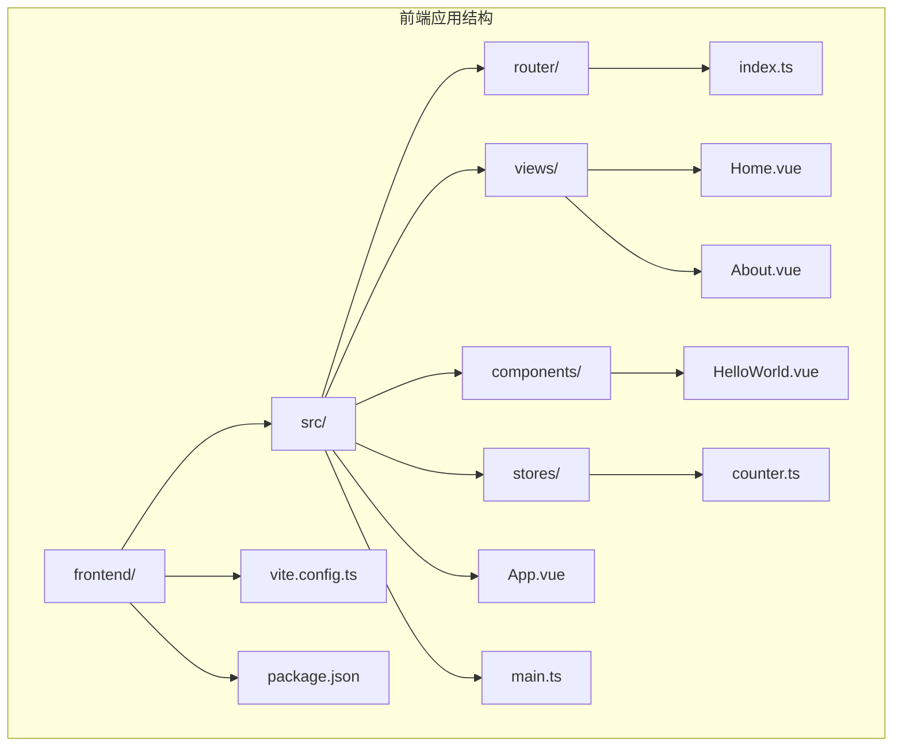
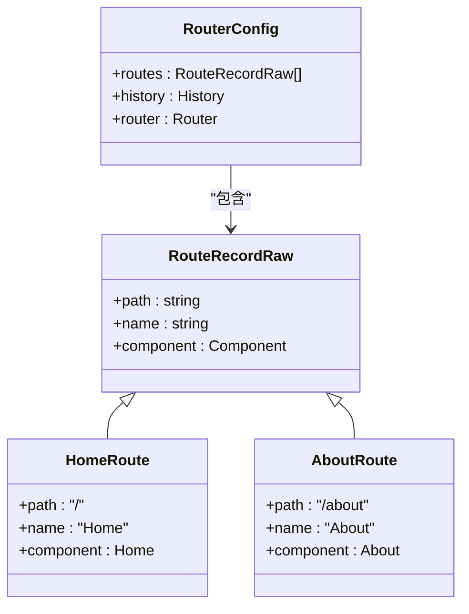
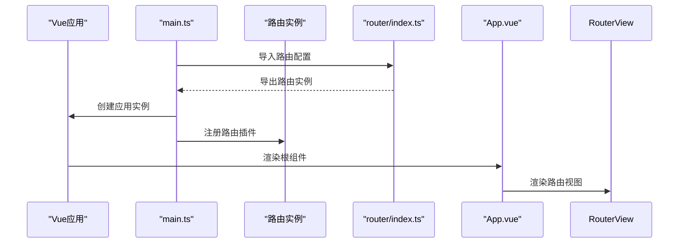
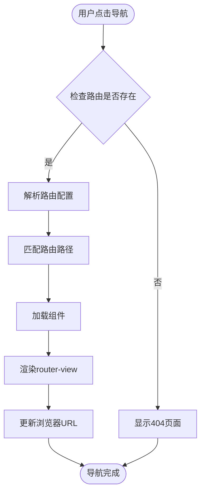
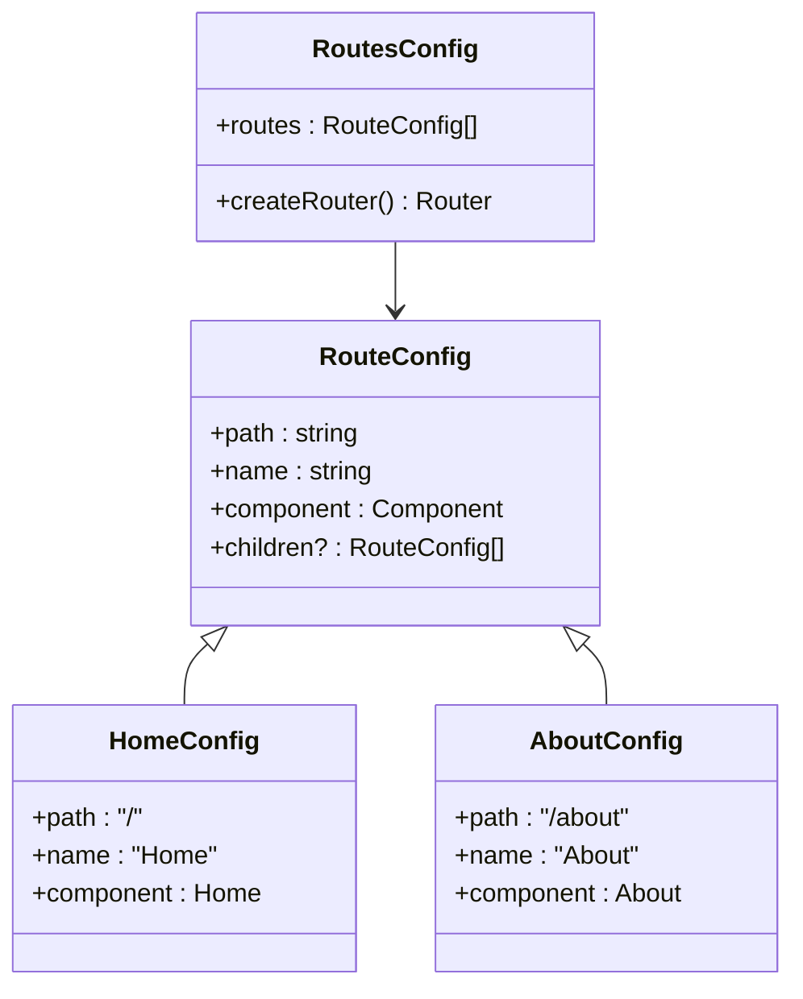
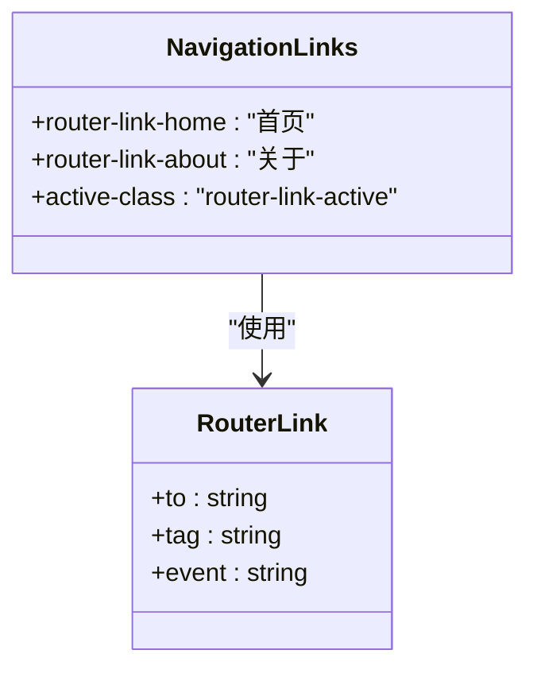
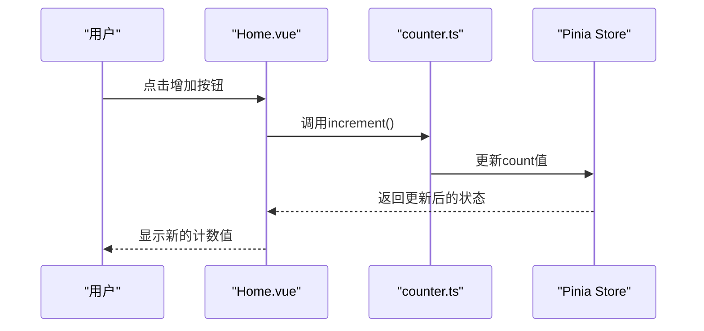
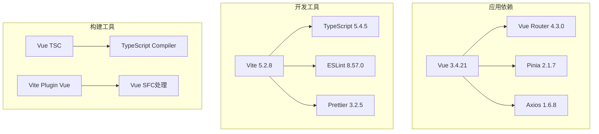
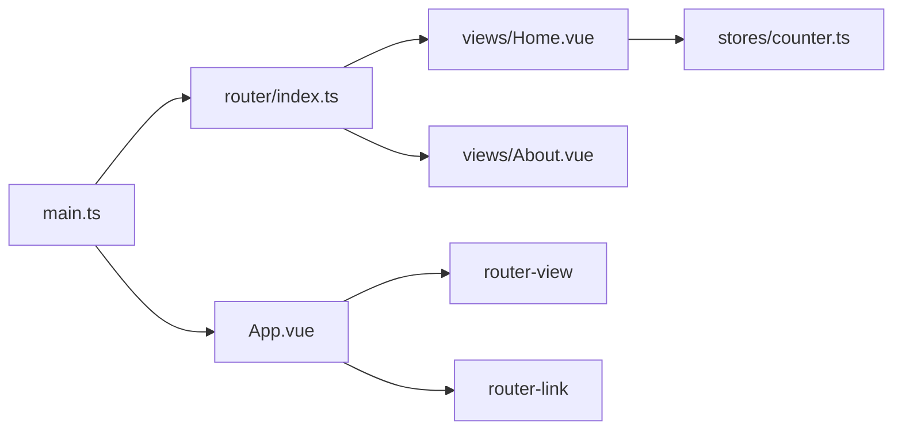

# 路由系统

<cite>
**本文档引用的文件**
- [frontend/src/router/index.ts](file://frontend/src/router/index.ts)
- [frontend/src/main.ts](file://frontend/src/main.ts)
- [frontend/src/App.vue](file://frontend/src/App.vue)
- [frontend/src/views/Home.vue](file://frontend/src/views/Home.vue)
- [frontend/src/views/About.vue](file://frontend/src/views/About.vue)
- [frontend/src/stores/counter.ts](file://frontend/src/stores/counter.ts)
- [frontend/package.json](file://frontend/package.json)
- [frontend/tsconfig.json](file://frontend/tsconfig.json)
</cite>

## 目录
1. [简介](#简介)
2. [项目结构](#项目结构)
3. [核心组件](#核心组件)
4. [架构概览](#架构概览)
5. [详细组件分析](#详细组件分析)
6. [依赖分析](#依赖分析)
7. [性能考虑](#性能考虑)
8. [故障排除指南](#故障排除指南)
9. [结论](#结论)

## 简介

本项目是一个基于 Vue 3 + Spring Cloud 的全栈示例项目，前端部分实现了基础的路由系统。该路由系统使用 Vue Router 4.x 版本，提供了基本的路由配置、导航和组件映射功能。项目展示了如何在 Vue 应用中集成路由系统，包括路由定义、导航链接、路由视图渲染等核心概念。

## 项目结构

该项目采用标准的 Vue 3 单页应用结构，路由系统主要集中在前端目录中：



**图表来源**
- [frontend/src/router/index.ts:1-16](file://frontend/src/router/index.ts#L1-L16)
- [frontend/src/main.ts:1-10](file://frontend/src/main.ts#L1-L10)

**章节来源**
- [frontend/src/router/index.ts:1-16](file://frontend/src/router/index.ts#L1-L16)
- [frontend/src/main.ts:1-10](file://frontend/src/main.ts#L1-L10)
- [frontend/package.json:1-31](file://frontend/package.json#L1-L31)

## 核心组件

### 路由配置核心

项目的核心路由配置位于 `frontend/src/router/index.ts` 文件中，这是一个简洁而完整的路由配置示例：



**图表来源**
- [frontend/src/router/index.ts:5-8](file://frontend/src/router/index.ts#L5-L8)

### 应用初始化流程

应用通过 `frontend/src/main.ts` 文件进行初始化，这里展示了 Vue 应用与路由系统的集成过程：



**图表来源**
- [frontend/src/main.ts:1-10](file://frontend/src/main.ts#L1-L10)
- [frontend/src/router/index.ts:1-16](file://frontend/src/router/index.ts#L1-L16)

**章节来源**
- [frontend/src/router/index.ts:1-16](file://frontend/src/router/index.ts#L1-L16)
- [frontend/src/main.ts:1-10](file://frontend/src/main.ts#L1-L10)

## 架构概览

### 路由系统整体架构

```mermaid
graph TB
subgraph "用户界面层"
A[App.vue] --> B[router-view]
A --> C[router-link导航]
end
subgraph "路由管理层"
D[router/index.ts] --> E[createRouter]
E --> F[createWebHistory]
E --> G[路由表(routes)]
end
subgraph "应用层"
H[main.ts] --> I[Vue应用]
I --> J[注册路由插件]
end
subgraph "视图层"
K[Home.vue] --> L[计数器组件]
M[About.vue] --> N[项目信息]
end
A --> D
B --> K
B --> M
C --> D
```

**图表来源**
- [frontend/src/App.vue:1-41](file://frontend/src/App.vue#L1-L41)
- [frontend/src/router/index.ts:1-16](file://frontend/src/router/index.ts#L1-L16)
- [frontend/src/main.ts:1-10](file://frontend/src/main.ts#L1-L10)

### 路由导航流程



**图表来源**
- [frontend/src/App.vue:6-7](file://frontend/src/App.vue#L6-L7)
- [frontend/src/router/index.ts:5-8](file://frontend/src/router/index.ts#L5-L8)

## 详细组件分析

### 路由配置分析

#### 基础路由配置

当前项目实现了两个基础路由：

1. **首页路由 (`/`)**
   - 路由名称: `Home`
   - 组件: `Home.vue`
   - 功能: 展示欢迎信息、计数器功能和后端API测试

2. **关于页面路由 (`/about`)**
   - 路由名称: `About`
   - 组件: `About.vue`
   - 功能: 显示项目技术栈信息

#### 路由配置实现模式



**图表来源**
- [frontend/src/router/index.ts:5-8](file://frontend/src/router/index.ts#L5-L8)

**章节来源**
- [frontend/src/router/index.ts:5-8](file://frontend/src/router/index.ts#L5-L8)

### 视图组件分析

#### 首页组件 (`Home.vue`)

首页组件展示了多个功能特性：

1. **计数器功能**: 使用 Pinia 状态管理
2. **后端API测试**: 展示前后端通信
3. **组件复用**: 引入 `HelloWorld.vue` 组件

#### 关于页面组件 (`About.vue`)

关于页面组件相对简单，主要用于展示项目信息和技术栈详情。

**章节来源**
- [frontend/src/views/Home.vue:1-64](file://frontend/src/views/Home.vue#L1-L64)
- [frontend/src/views/About.vue:1-18](file://frontend/src/views/About.vue#L1-L18)

### 导航组件分析

#### 声明式导航 (`App.vue`)

应用中的导航使用了 Vue Router 提供的 `router-link` 组件：



**图表来源**
- [frontend/src/App.vue:6-7](file://frontend/src/App.vue#L6-L7)

**章节来源**
- [frontend/src/App.vue:1-41](file://frontend/src/App.vue#L1-L41)

### 状态管理集成

#### 计数器状态管理

项目使用 Pinia 进行状态管理，计数器功能展示了状态持久化和计算属性的使用：



**图表来源**
- [frontend/src/views/Home.vue:25-35](file://frontend/src/views/Home.vue#L25-L35)
- [frontend/src/stores/counter.ts:1-13](file://frontend/src/stores/counter.ts#L1-L13)

**章节来源**
- [frontend/src/stores/counter.ts:1-13](file://frontend/src/stores/counter.ts#L1-L13)

## 依赖分析

### 外部依赖关系



**图表来源**
- [frontend/package.json:12-28](file://frontend/package.json#L12-L28)

### 内部模块依赖



**图表来源**
- [frontend/src/main.ts:1-10](file://frontend/src/main.ts#L1-L10)
- [frontend/src/router/index.ts:1-16](file://frontend/src/router/index.ts#L1-L16)

**章节来源**
- [frontend/package.json:12-28](file://frontend/package.json#L12-L28)
- [frontend/tsconfig.json:18-22](file://frontend/tsconfig.json#L18-L22)

## 性能考虑

### 模块解析优化

项目配置了路径别名以优化模块解析：

- `@/*` 指向 `src/*` 目录
- 支持 ES 模块解析
- 使用 bundler 模式提高打包效率

### 代码分割策略

虽然当前项目没有实现懒加载，但 Vue Router 支持以下代码分割方式：

1. **路由级别的代码分割**: 使用动态导入
2. **组件级别的代码分割**: 在路由组件中使用动态导入
3. **第三方库的代码分割**: 将不常用的库单独打包

## 故障排除指南

### 常见问题诊断

#### 路由无法匹配

**症状**: 导航到不存在的路由时页面空白
**解决方案**: 
1. 检查路由配置中的路径是否正确
2. 确认组件导入路径有效
3. 验证路由表结构

#### 导航链接无效

**症状**: `router-link` 点击无响应
**解决方案**:
1. 检查 `to` 属性的路径格式
2. 确认路由名称与配置一致
3. 验证 `router-view` 是否存在

#### 组件未渲染

**症状**: 页面显示空白内容
**解决方案**:
1. 检查 `router-view` 组件是否正确引入
2. 确认组件导出格式
3. 验证路由配置中的组件引用

**章节来源**
- [frontend/src/App.vue:1-41](file://frontend/src/App.vue#L1-L41)
- [frontend/src/router/index.ts:1-16](file://frontend/src/router/index.ts#L1-L16)

## 结论

本项目的路由系统展现了 Vue Router 的基础使用模式，包括：

1. **简洁的路由配置**: 通过 `createRouter` 和 `createWebHistory` 实现基础路由功能
2. **清晰的组件映射**: 每个路由对应一个专门的视图组件
3. **声明式导航**: 使用 `router-link` 实现用户导航
4. **状态管理集成**: 与 Pinia 的无缝协作

虽然当前项目相对简单，但为更复杂的路由需求（如嵌套路由、动态路由、导航守卫、路由元信息等）提供了良好的基础。开发者可以根据需要在此基础上扩展路由功能，实现更高级的路由特性。

对于生产环境，建议考虑以下改进：
- 实现路由懒加载和代码分割
- 添加全局导航守卫
- 配置路由元信息用于权限控制
- 实现面包屑导航
- 添加路由过渡动画
- 集成路由权限验证系统