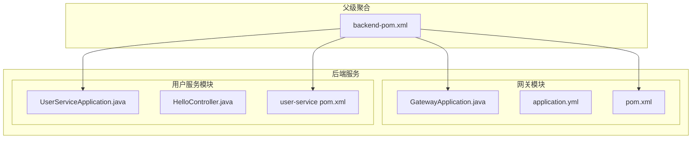
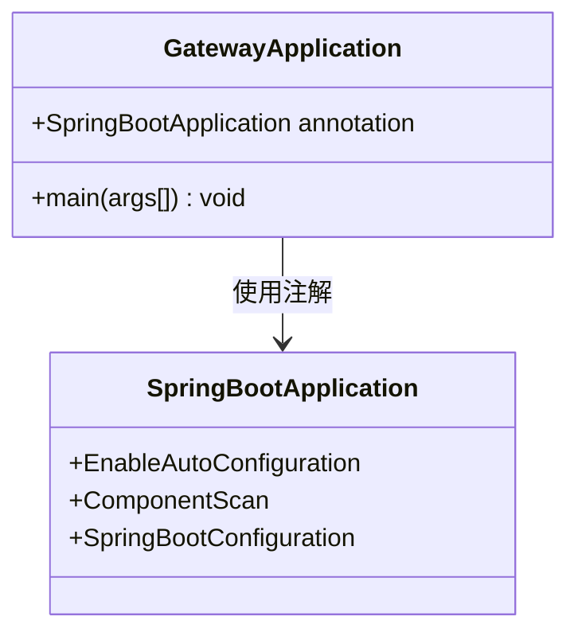
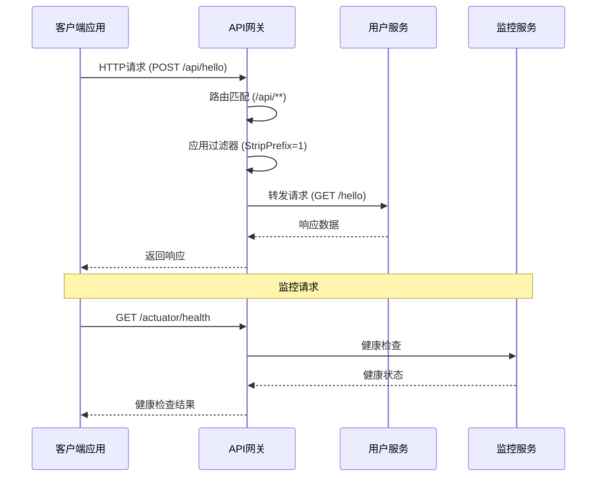
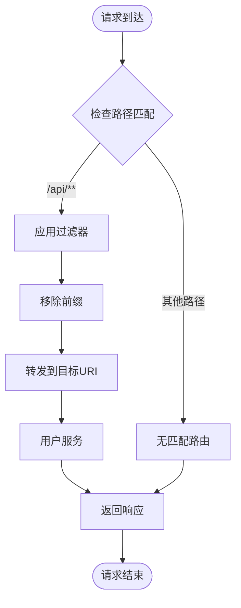
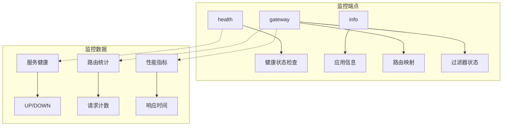
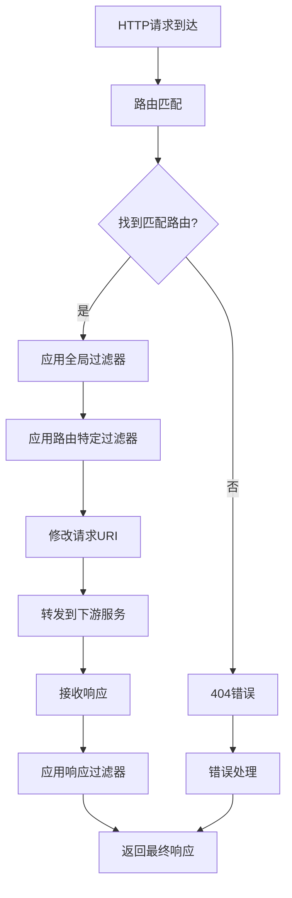
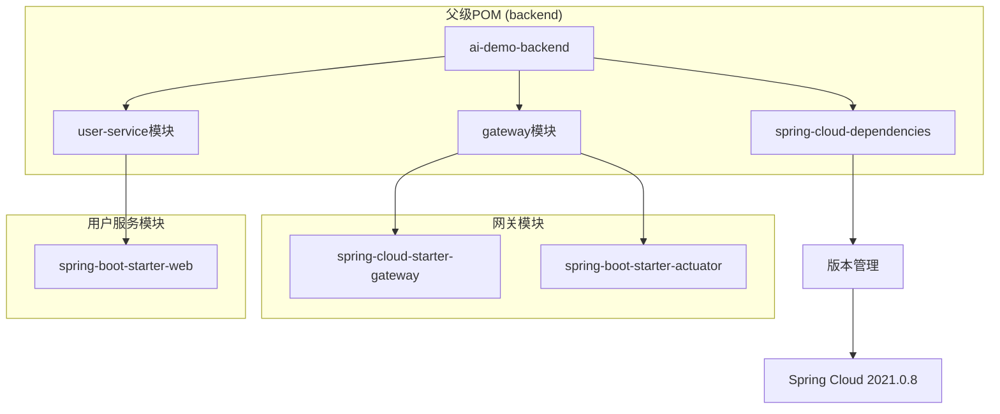

# API网关服务

<cite>
**本文档引用的文件**
- [GatewayApplication.java](file://backend/gateway/src/main/java/com/example/gateway/GatewayApplication.java)
- [application.yml](file://backend/gateway/src/main/resources/application.yml)
- [pom.xml](file://backend/gateway/pom.xml)
- [UserServiceApplication.java](file://backend/user-service/src/main/java/com/example/userservice/UserServiceApplication.java)
- [HelloController.java](file://backend/user-service/src/main/java/com/example/userservice/controller/HelloController.java)
- [backend-pom.xml](file://backend/pom.xml)
</cite>

## 目录
1. [简介](#简介)
2. [项目结构](#项目结构)
3. [核心组件](#核心组件)
4. [架构概览](#架构概览)
5. [详细组件分析](#详细组件分析)
6. [依赖分析](#依赖分析)
7. [性能考虑](#性能考虑)
8. [故障排除指南](#故障排除指南)
9. [结论](#结论)
10. [附录](#附录)

## 简介

本项目是一个基于Spring Cloud Gateway构建的API网关服务，为微服务架构提供统一的请求入口、路由转发和跨域处理能力。该网关服务通过单一入口点管理多个后端服务，实现了请求的智能路由、过滤和监控功能。

Spring Cloud Gateway作为现代微服务架构中的关键组件，提供了高性能的HTTP代理和负载均衡能力，支持动态路由配置、请求过滤、限流、熔断等企业级特性。

## 项目结构

该项目采用多模块Maven结构，包含网关服务和用户服务两个主要模块：



**图表来源**
- [GatewayApplication.java:1-12](file://backend/gateway/src/main/java/com/example/gateway/GatewayApplication.java#L1-L12)
- [UserServiceApplication.java:1-12](file://backend/user-service/src/main/java/com/example/userservice/UserServiceApplication.java#L1-L12)
- [backend-pom.xml:30-33](file://backend/pom.xml#L30-L33)

**章节来源**
- [backend-pom.xml:30-33](file://backend/pom.xml#L30-L33)
- [GatewayApplication.java:1-12](file://backend/gateway/src/main/java/com/example/gateway/GatewayApplication.java#L1-L12)
- [UserServiceApplication.java:1-12](file://backend/user-service/src/main/java/com/example/userservice/UserServiceApplication.java#L1-L12)

## 核心组件

### 网关应用主类

GatewayApplication是Spring Boot应用程序的入口点，采用了最小化的配置方式：



**图表来源**
- [GatewayApplication.java:6-10](file://backend/gateway/src/main/java/com/example/gateway/GatewayApplication.java#L6-L10)

该主类具有以下特点：
- 使用标准的Spring Boot注解启用自动配置
- 保持极简的启动逻辑，专注于配置驱动的网关功能
- 支持通过application.yml进行完全的配置管理

**章节来源**
- [GatewayApplication.java:6-11](file://backend/gateway/src/main/java/com/example/gateway/GatewayApplication.java#L6-L11)

### 配置文件系统

application.yml包含了网关的所有核心配置，采用YAML格式提供清晰的层次结构：

```mermaid
graph TD
A[application.yml] --> B[服务器配置]
A --> C[Spring Cloud Gateway配置]
A --> D[全局CORS配置]
A --> E[管理端点配置]
B --> B1[端口设置: 8080]
C --> C1[路由定义]
C --> C2[过滤器配置]
D --> D1[跨域资源共享]
E --> E1[Actuator监控]
C1 --> C1a[用户服务路由]
C1 --> C1b[路径匹配: /api/**
C2 --> C2a[StripPrefix=1]
```

**图表来源**
- [application.yml:1-28](file://backend/gateway/src/main/resources/application.yml#L1-L28)

**章节来源**
- [application.yml:1-28](file://backend/gateway/src/main/resources/application.yml#L1-L28)

## 架构概览

该API网关服务采用客户端直连模式，通过路由规则将请求转发到相应的后端服务：



**图表来源**
- [application.yml:10-15](file://backend/gateway/src/main/resources/application.yml#L10-L15)
- [HelloController.java:11-14](file://backend/user-service/src/main/java/com/example/userservice/controller/HelloController.java#L11-L14)

## 详细组件分析

### 路由配置系统

网关的核心功能是基于路由规则的智能请求转发。当前配置定义了一个用户服务路由：



**图表来源**
- [application.yml:10-15](file://backend/gateway/src/main/resources/application.yml#L10-L15)

路由配置的关键要素：
- **路由ID**: user-service - 唯一标识符
- **目标URI**: http://localhost:8081 - 后端服务地址
- **路径谓词**: /api/** - 匹配所有/api开头的请求
- **过滤器**: StripPrefix=1 - 移除第一个路径段

**章节来源**
- [application.yml:10-15](file://backend/gateway/src/main/resources/application.yml#L10-L15)

### CORS跨域处理

网关实现了全局CORS配置，确保前后端分离架构下的安全通信：

```mermaid
graph LR
subgraph "CORS配置"
A[globalcors] --> B[cors-configurations]
B --> C[/**]
C --> D[allowedOrigins: *]
C --> E[allowedMethods: *]
C --> F[allowedHeaders: *]
end
subgraph "跨域请求处理"
G[OPTIONS预检请求] --> H[允许所有来源]
I[实际请求] --> J[允许所有方法]
K[自定义头] --> L[允许所有头]
end
```

**图表来源**
- [application.yml:16-21](file://backend/gateway/src/main/resources/application.yml#L16-L21)

**章节来源**
- [application.yml:16-21](file://backend/gateway/src/main/resources/application.yml#L16-L21)

### Actuator监控集成

网关集成了Spring Boot Actuator，提供完整的运行时监控能力：



**图表来源**
- [application.yml:23-27](file://backend/gateway/src/main/resources/application.yml#L23-L27)

**章节来源**
- [application.yml:23-27](file://backend/gateway/src/main/resources/application.yml#L23-L27)

### 请求处理流程

网关的请求处理遵循标准的Spring WebFlux异步处理模式：



**图表来源**
- [application.yml:14-15](file://backend/gateway/src/main/resources/application.yml#L14-L15)

## 依赖分析

### Maven依赖关系

项目采用分层的Maven依赖管理策略：



**图表来源**
- [backend-pom.xml:35-44](file://backend/pom.xml#L35-L44)
- [pom.xml:16-25](file://backend/gateway/pom.xml#L16-L25)

**章节来源**
- [backend-pom.xml:35-44](file://backend/pom.xml#L35-L44)
- [pom.xml:16-25](file://backend/gateway/pom.xml#L16-L25)

### 运行时依赖

网关服务的核心依赖包括：

| 依赖项 | 版本 | 用途 |
|--------|------|------|
| spring-cloud-starter-gateway | 2021.0.8 | API网关核心功能 |
| spring-boot-starter-actuator | 2.7.18 | 监控和健康检查 |
| spring-boot-starter-web | 2.7.18 | Web框架支持 |

**章节来源**
- [backend-pom.xml:37-43](file://backend/pom.xml#L37-L43)
- [pom.xml:17-24](file://backend/gateway/pom.xml#L17-L24)

## 性能考虑

### 异步非阻塞架构

Spring Cloud Gateway基于WebFlux构建，提供异步非阻塞的请求处理能力：

- **事件驱动模型**: 基于Netty的异步I/O
- **零拷贝传输**: 减少内存复制开销
- **连接池优化**: 复用HTTP连接提高吞吐量
- **背压处理**: 自动处理请求积压

### 内存管理

- **响应式流**: 按需加载数据，避免大对象内存占用
- **背压传播**: 下游服务可以控制数据流速
- **资源回收**: 及时释放网络连接和缓冲区

## 故障排除指南

### 常见问题及解决方案

#### 1. 路由无法访问

**症状**: 请求返回404或连接超时
**可能原因**:
- 目标服务未启动
- URI配置错误
- 端口冲突

**解决步骤**:
1. 验证目标服务是否正常运行
2. 检查application.yml中的URI配置
3. 确认端口未被占用

#### 2. CORS跨域失败

**症状**: 浏览器显示跨域错误
**可能原因**:
- CORS配置不正确
- 预检请求未通过

**解决步骤**:
1. 检查globalcors配置
2. 验证allowedOrigins设置
3. 确认预检请求的HTTP方法

#### 3. 监控端点不可用

**症状**: 访问/actuator/health返回404
**可能原因**:
- Actuator端点未启用
- 安全配置阻止访问

**解决步骤**:
1. 检查management端点配置
2. 验证暴露的端点列表
3. 检查安全过滤器配置

**章节来源**
- [application.yml:16-27](file://backend/gateway/src/main/resources/application.yml#L16-L27)

## 结论

本API网关服务成功实现了基于Spring Cloud Gateway的企业级网关解决方案。通过简洁的配置管理和强大的路由功能，为微服务架构提供了可靠的统一入口。

主要优势包括：
- **配置驱动**: 通过application.yml实现完全的配置管理
- **跨域支持**: 全局CORS配置简化了前后端分离开发
- **监控集成**: Actuator提供完整的运行时监控能力
- **扩展性**: 支持多种路由规则和过滤器组合

建议的后续改进方向：
- 添加服务发现集成（如Eureka）
- 实现请求限流和熔断机制
- 集成API文档生成工具
- 添加请求日志和追踪功能

## 附录

### 配置最佳实践

#### 路由配置模板
```yaml
spring:
  cloud:
    gateway:
      routes:
        - id: service-name
          uri: lb://service-name
          predicates:
            - Path=/api/**
          filters:
            - StripPrefix=1
```

#### CORS配置模板
```yaml
spring:
  cloud:
    gateway:
      globalcors:
        cors-configurations:
          '[/**]':
            allowedOrigins: "*"
            allowedMethods: "*"
            allowedHeaders: "*"
            allowCredentials: true
```

#### Actuator配置模板
```yaml
management:
  endpoints:
    web:
      exposure:
        include: health,info,gateway,metrics
  endpoint:
    health:
      show-details: always
```

### 扩展开发指南

#### 自定义过滤器开发
1. 创建实现GatewayFilter接口的类
2. 在application.yml中注册过滤器
3. 实现业务逻辑和异常处理

#### 路由规则扩展
1. 定义新的路径谓词
2. 配置相应的过滤器链
3. 测试路由匹配逻辑

#### 监控指标收集
1. 添加自定义指标定义
2. 配置Prometheus导出器
3. 设置告警规则和阈值