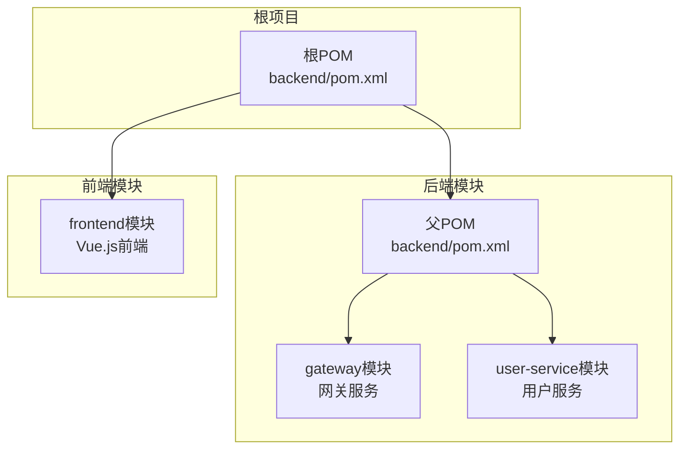
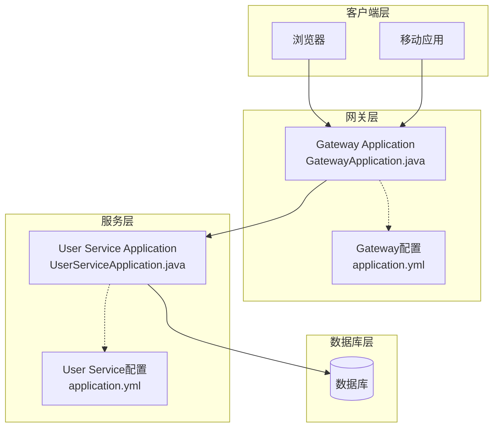
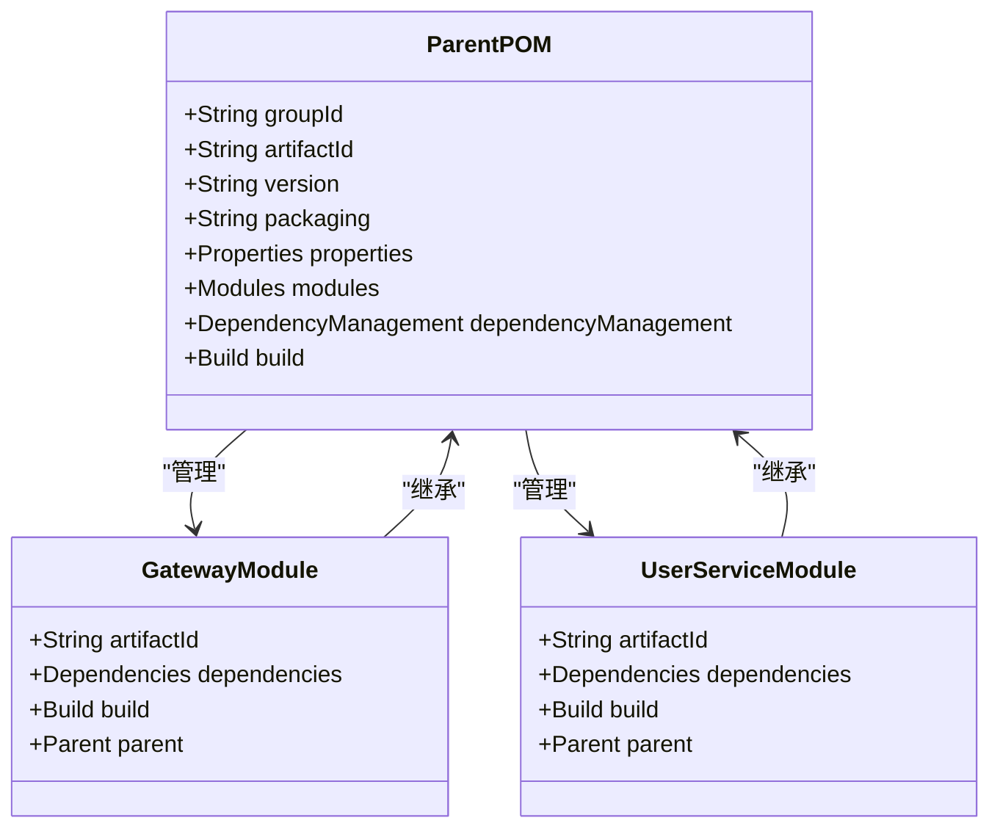
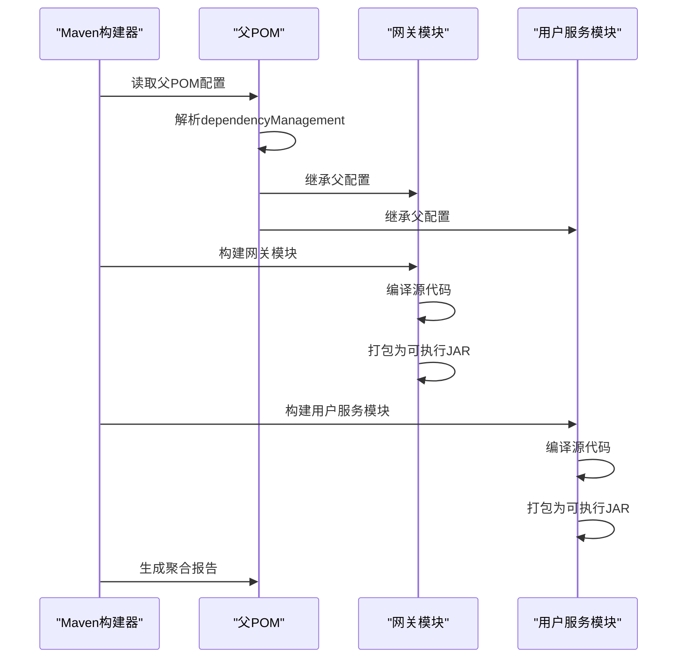
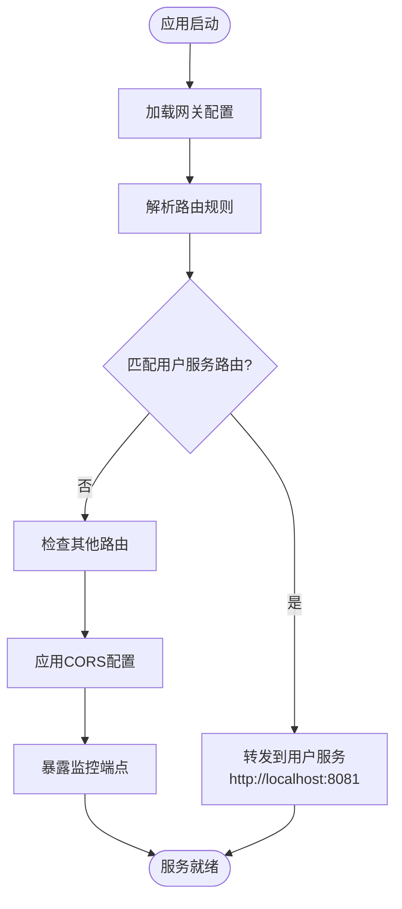
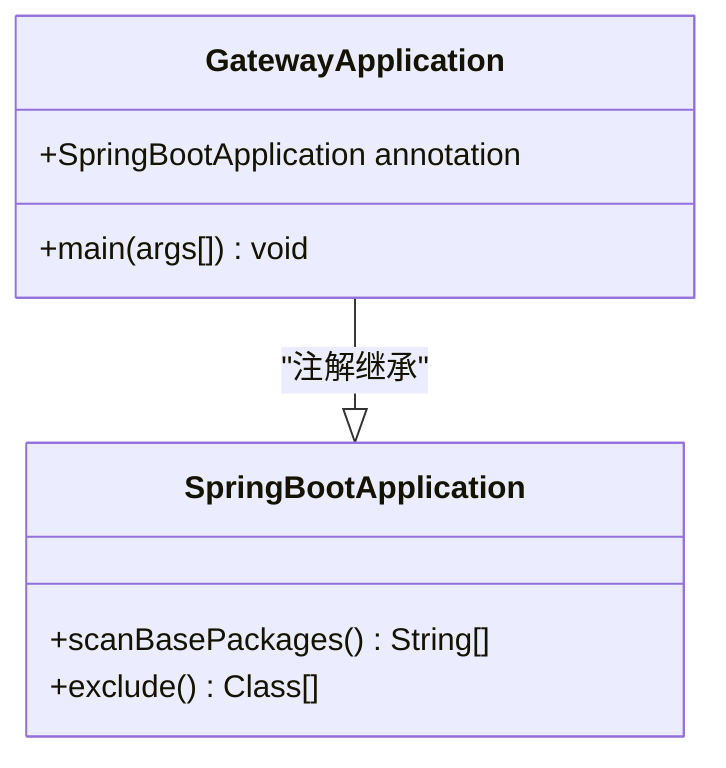
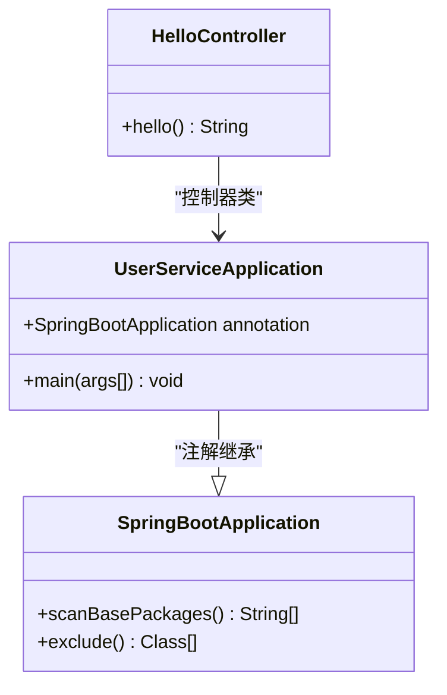
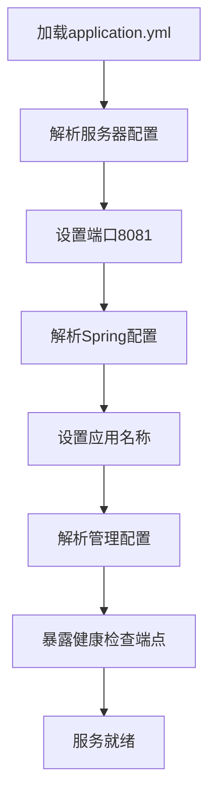
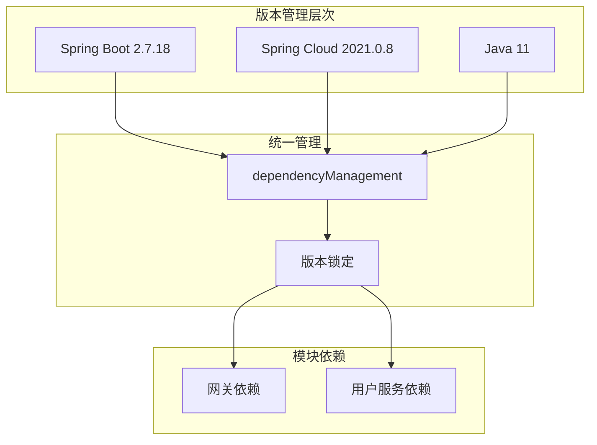
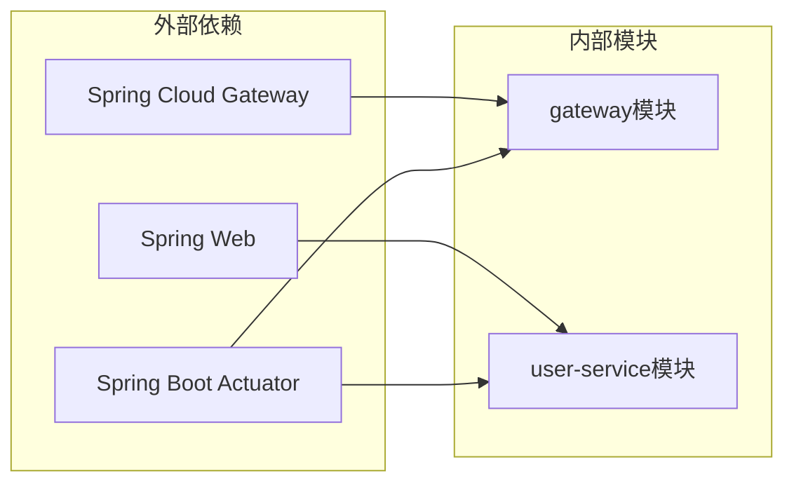

# Maven多模块架构

<cite>
**本文档引用的文件**
- [backend/pom.xml](file://backend/pom.xml)
- [backend/gateway/pom.xml](file://backend/gateway/pom.xml)
- [backend/user-service/pom.xml](file://backend/user-service/pom.xml)
- [GatewayApplication.java](file://backend/gateway/src/main/java/com/example/gateway/GatewayApplication.java)
- [UserServiceApplication.java](file://backend/user-service/src/main/java/com/example/userservice/UserServiceApplication.java)
- [gateway application.yml](file://backend/gateway/src/main/resources/application.yml)
- [user-service application.yml](file://backend/user-service/src/main/resources/application.yml)
- [login.md](file://requrement/login.md)
</cite>

## 目录
1. [简介](#简介)
2. [项目结构](#项目结构)
3. [核心组件](#核心组件)
4. [架构概览](#架构概览)
5. [详细组件分析](#详细组件分析)
6. [依赖分析](#依赖分析)
7. [性能考虑](#性能考虑)
8. [故障排除指南](#故障排除指南)
9. [结论](#结论)
10. [附录](#附录)

## 简介

本项目是一个基于Maven的多模块架构示例，展示了现代Spring Cloud微服务应用的构建模式。该项目采用分层模块化设计，通过父POM统一管理版本和依赖，实现了清晰的模块边界和职责分离。

该架构的核心目标是：
- 提供统一的依赖版本管理
- 实现模块间的松耦合设计
- 支持独立的构建和部署流程
- 确保构建过程的可重复性和一致性

## 项目结构

项目采用标准的Maven多模块布局，主要分为后端和前端两个主要部分：

**图表来源**
- [backend/pom.xml:1-56](file://backend/pom.xml#L1-L56)
- [backend/gateway/pom.xml:1-36](file://backend/gateway/pom.xml#L1-L36)
- [backend/user-service/pom.xml:1-36](file://backend/user-service/pom.xml#L1-L36)

**章节来源**
- [backend/pom.xml:1-56](file://backend/pom.xml#L1-L56)
- [backend/gateway/pom.xml:1-36](file://backend/gateway/pom.xml#L1-L36)
- [backend/user-service/pom.xml:1-36](file://backend/user-service/pom.xml#L1-L36)

## 核心组件

### 父POM配置分析

父POM作为整个后端系统的管理中心，承担着以下关键职责：

#### 版本统一管理
- **Java版本**: 使用JDK 11确保向后兼容性
- **Spring Boot版本**: 基于2.7.18版本，提供稳定的企业级特性
- **Spring Cloud版本**: 采用2021.0.8版本，与Spring Boot 2.7系列兼容

#### 模块声明机制
父POM通过`<modules>`标签明确声明子模块：
- `gateway`: Spring Cloud Gateway网关服务
- `user-service`: 用户管理微服务

#### 依赖管理策略
使用`dependencyManagement`统一管理Spring Cloud依赖，确保版本一致性：
- 通过`spring-cloud-dependencies`坐标导入完整的依赖树
- 避免子模块重复声明相同依赖的版本信息

**章节来源**
- [backend/pom.xml:15-45](file://backend/pom.xml#L15-L45)

### 网关模块（Gateway）

网关模块作为系统的入口点，负责请求路由和统一处理：

#### 核心功能
- **请求路由**: 将/api/**路径转发到用户服务
- **CORS配置**: 全局跨域资源共享支持
- **健康监控**: 集成Actuator端点监控

#### 技术栈
- Spring Cloud Gateway: 现代化的API网关解决方案
- Spring Boot Actuator: 应用监控和管理

**章节来源**
- [backend/gateway/pom.xml:16-25](file://backend/gateway/pom.xml#L16-L25)
- [gateway application.yml:8-22](file://backend/gateway/src/main/resources/application.yml#L8-L22)

### 用户服务模块（User Service）

用户服务模块提供核心业务功能：

#### 核心功能
- **REST API**: 提供用户相关的HTTP接口
- **健康监控**: 基础的健康检查端点
- **Web服务**: 基于Spring Web的轻量级服务

#### 技术栈
- Spring Boot Web: 快速构建Web应用
- Spring Boot Actuator: 应用监控

**章节来源**
- [backend/user-service/pom.xml:16-25](file://backend/user-service/pom.xml#L16-L25)
- [user-service application.yml:1-13](file://backend/user-service/src/main/resources/application.yml#L1-L13)

## 架构概览

系统采用典型的微服务架构，通过网关实现统一入口：

**图表来源**
- [GatewayApplication.java:1-12](file://backend/gateway/src/main/java/com/example/gateway/GatewayApplication.java#L1-L12)
- [UserServiceApplication.java:1-12](file://backend/user-service/src/main/java/com/example/userservice/UserServiceApplication.java#L1-L12)
- [gateway application.yml:1-28](file://backend/gateway/src/main/resources/application.yml#L1-L28)
- [user-service application.yml:1-13](file://backend/user-service/src/main/resources/application.yml#L1-L13)

## 详细组件分析

### 父POM组件深度分析

#### 组件关系图

**图表来源**
- [backend/pom.xml:15-56](file://backend/pom.xml#L15-L56)
- [backend/gateway/pom.xml:7-36](file://backend/gateway/pom.xml#L7-L36)
- [backend/user-service/pom.xml:7-36](file://backend/user-service/pom.xml#L7-L36)

#### 构建流程序列图

**图表来源**
- [backend/pom.xml:47-54](file://backend/pom.xml#L47-L54)
- [backend/gateway/pom.xml:27-34](file://backend/gateway/pom.xml#L27-L34)
- [backend/user-service/pom.xml:27-34](file://backend/user-service/pom.xml#L27-L34)

**章节来源**
- [backend/pom.xml:1-56](file://backend/pom.xml#L1-L56)

### 网关模块详细分析

#### 功能配置分析

网关模块通过YAML配置实现了完整的路由和监控功能：

**图表来源**
- [gateway application.yml:8-22](file://backend/gateway/src/main/resources/application.yml#L8-L22)

#### 应用程序类结构

**图表来源**
- [GatewayApplication.java:6-11](file://backend/gateway/src/main/java/com/example/gateway/GatewayApplication.java#L6-L11)

**章节来源**
- [gateway application.yml:1-28](file://backend/gateway/src/main/resources/application.yml#L1-L28)
- [GatewayApplication.java:1-12](file://backend/gateway/src/main/java/com/example/gateway/GatewayApplication.java#L1-L12)

### 用户服务模块详细分析

#### 服务架构分析

用户服务模块采用简洁的设计模式：

**图表来源**
- [UserServiceApplication.java:6-11](file://backend/user-service/src/main/java/com/example/userservice/UserServiceApplication.java#L6-L11)

#### 配置文件分析

用户服务的配置相对简单，专注于核心功能：

**图表来源**
- [user-service application.yml:1-13](file://backend/user-service/src/main/resources/application.yml#L1-L13)

**章节来源**
- [user-service application.yml:1-13](file://backend/user-service/src/main/resources/application.yml#L1-L13)
- [UserServiceApplication.java:1-12](file://backend/user-service/src/main/java/com/example/userservice/UserServiceApplication.java#L1-L12)

## 依赖分析

### 依赖管理策略

项目采用了分层依赖管理策略，确保版本一致性和模块独立性：

**图表来源**
- [backend/pom.xml:22-45](file://backend/pom.xml#L22-L45)

### 模块间依赖关系

**图表来源**
- [backend/gateway/pom.xml:16-25](file://backend/gateway/pom.xml#L16-L25)
- [backend/user-service/pom.xml:16-25](file://backend/user-service/pom.xml#L16-L25)

### 依赖冲突解决

项目通过以下机制避免依赖冲突：

1. **版本统一**: 在父POM中集中管理所有依赖版本
2. **范围控制**: 使用适当的依赖作用域
3. **传递性管理**: 明确声明传递性依赖的版本

**章节来源**
- [backend/pom.xml:35-45](file://backend/pom.xml#L35-L45)
- [backend/gateway/pom.xml:16-25](file://backend/gateway/pom.xml#L16-L25)
- [backend/user-service/pom.xml:16-25](file://backend/user-service/pom.xml#L16-L25)

## 性能考虑

### 构建性能优化

1. **并行构建**: Maven默认支持多线程构建，可进一步优化
2. **缓存策略**: 利用Maven本地仓库缓存减少重复下载
3. **增量编译**: 启用JVM参数优化编译性能

### 运行时性能

1. **内存配置**: 根据模块复杂度调整JVM堆大小
2. **连接池**: 合理配置数据库和HTTP连接池
3. **监控指标**: 通过Actuator端点监控应用状态

## 故障排除指南

### 常见构建问题

1. **版本不兼容**: 确保Spring Boot和Spring Cloud版本匹配
2. **依赖冲突**: 使用`mvn dependency:tree`诊断冲突
3. **模块缺失**: 检查父POM中的模块声明是否正确

### 运行时问题

1. **端口冲突**: 网关和用户服务使用不同端口（8080 vs 8081）
2. **路由配置**: 检查网关的路由规则是否正确
3. **CORS问题**: 验证跨域配置是否满足需求

**章节来源**
- [gateway application.yml:1-28](file://backend/gateway/src/main/resources/application.yml#L1-L28)
- [user-service application.yml:1-13](file://backend/user-service/src/main/resources/application.yml#L1-L13)

## 结论

本Maven多模块架构展示了现代微服务应用的最佳实践：

### 设计优势
- **清晰的模块边界**: 网关和服务职责分离
- **统一的版本管理**: 通过父POM集中控制依赖版本
- **灵活的扩展性**: 易于添加新的微服务模块
- **标准化的构建流程**: 一致的构建和部署体验

### 技术亮点
- **Spring Cloud集成**: 完整的微服务生态系统支持
- **现代化配置**: YAML配置文件提供清晰的配置管理
- **监控友好**: 内置Actuator端点支持运维监控

### 发展建议
1. **增加测试覆盖**: 为每个模块添加单元测试和集成测试
2. **完善文档**: 补充API文档和部署指南
3. **CI/CD集成**: 建立自动化构建和部署流水线
4. **安全加固**: 添加认证授权和安全配置

## 附录

### 开发最佳实践

#### 模块划分原则
1. **单一职责**: 每个模块专注于特定的业务领域
2. **高内聚低耦合**: 模块内部紧密相关，模块间松散耦合
3. **边界清晰**: 明确模块的输入输出接口

#### 依赖管理规范
1. **版本锁定**: 在父POM中统一管理所有依赖版本
2. **作用域明确**: 正确使用compile、provided、test等作用域
3. **传递性控制**: 避免不必要的传递性依赖

#### 版本控制策略
1. **语义化版本**: 遵循MAJOR.MINOR.PATCH版本规范
2. **分支管理**: 使用Git Flow或GitHub Flow进行版本控制
3. **发布策略**: 建立自动化的发布流程

### 团队协作指导

#### 开发流程
1. **代码审查**: 建立Pull Request审查机制
2. **持续集成**: 配置自动化测试和构建
3. **文档同步**: 保持代码注释和文档的一致性

#### 质量保证
1. **静态分析**: 使用SonarQube等工具进行代码质量检查
2. **安全扫描**: 定期进行依赖漏洞扫描
3. **性能监控**: 建立应用性能监控体系