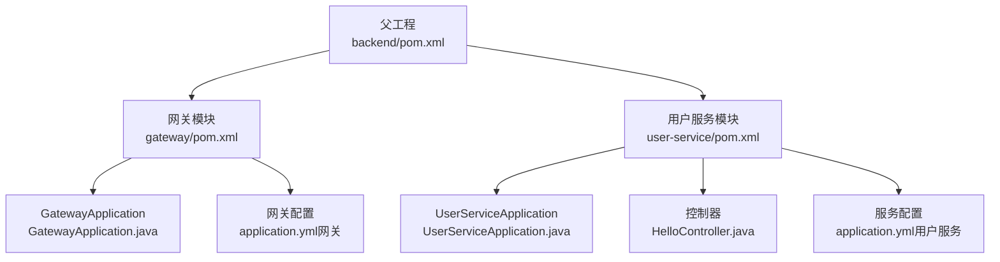
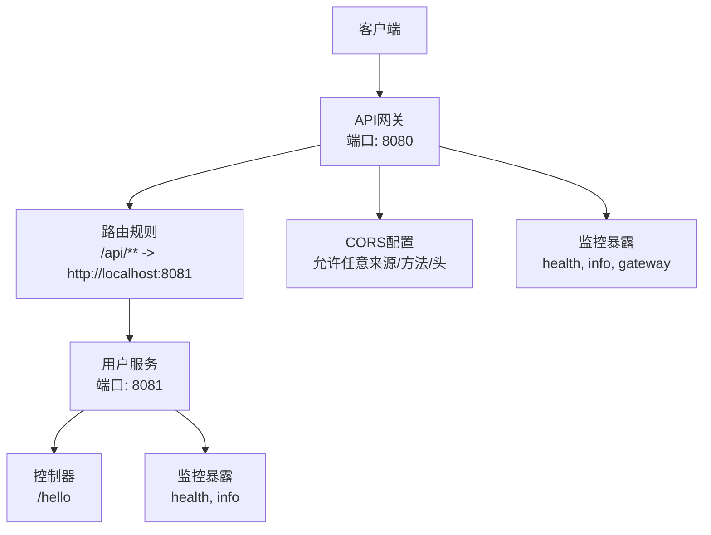
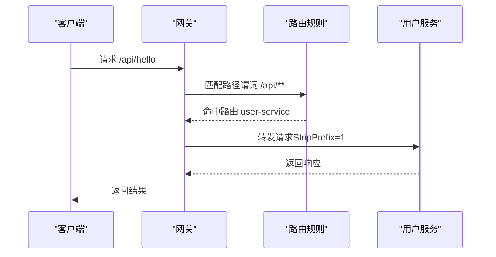
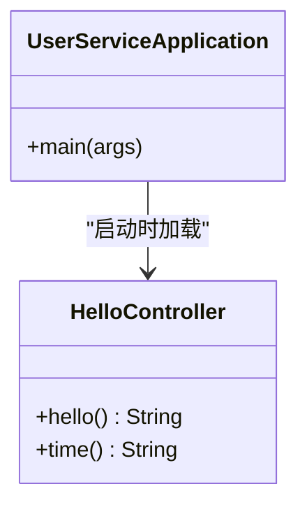
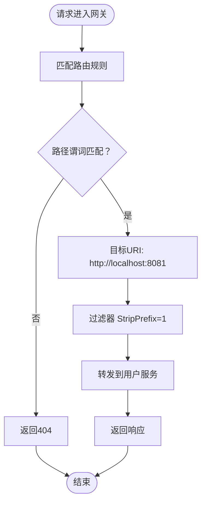
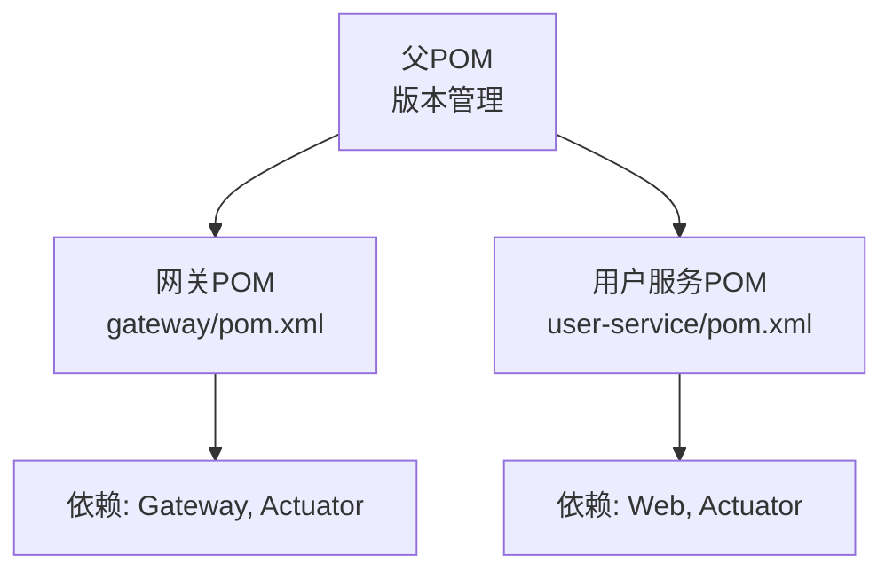

# 后端服务架构

<cite>
**本文档引用的文件**
- [GatewayApplication.java](file://backend/gateway/src/main/java/com/example/gateway/GatewayApplication.java)
- [application.yml（网关）](file://backend/gateway/src/main/resources/application.yml)
- [UserServiceApplication.java](file://backend/user-service/src/main/java/com/example/userservice/UserServiceApplication.java)
- [HelloController.java](file://backend/user-service/src/main/java/com/example/userservice/controller/HelloController.java)
- [application.yml（用户服务）](file://backend/user-service/src/main/resources/application.yml)
- [pom.xml（父项目）](file://backend/pom.xml)
- [pom.xml（网关模块）](file://backend/gateway/pom.xml)
- [pom.xml（用户服务模块）](file://backend/user-service/pom.xml)
</cite>

## 目录
1. [简介](#简介)
2. [项目结构](#项目结构)
3. [核心组件](#核心组件)
4. [架构总览](#架构总览)
5. [详细组件分析](#详细组件分析)
6. [依赖分析](#依赖分析)
7. [性能考虑](#性能考虑)
8. [故障排除指南](#故障排除指南)
9. [结论](#结论)
10. [附录](#附录)

## 简介
本项目是一个基于Spring Cloud的微服务架构示例，包含一个API网关服务与一个用户服务。网关负责统一入口、路由转发、CORS跨域处理以及监控暴露；用户服务提供基础的RESTful接口。项目采用Maven多模块结构进行组织，并通过Spring Boot与Spring Cloud版本管理确保依赖一致性。

## 项目结构
项目采用父子聚合的Maven结构：
- 父工程定义公共属性、Spring Cloud版本管理和插件配置
- 子模块分别为网关服务与用户服务，各自独立打包运行

图表来源
- [pom.xml（父项目）:1-56](file://backend/pom.xml#L1-L56)
- [pom.xml（网关模块）:1-36](file://backend/gateway/pom.xml#L1-L36)
- [pom.xml（用户服务模块）:1-36](file://backend/user-service/pom.xml#L1-L36)

章节来源
- [pom.xml（父项目）:1-56](file://backend/pom.xml#L1-L56)
- [pom.xml（网关模块）:1-36](file://backend/gateway/pom.xml#L1-L36)
- [pom.xml（用户服务模块）:1-36](file://backend/user-service/pom.xml#L1-L36)

## 核心组件
- 网关服务：提供统一入口、路径路由、CORS跨域支持与监控端点暴露
- 用户服务：提供基础RESTful接口，用于演示服务间调用与响应
- 配置系统：通过YAML配置文件集中管理端口、路由规则与监控暴露

章节来源
- [GatewayApplication.java:1-12](file://backend/gateway/src/main/java/com/example/gateway/GatewayApplication.java#L1-L12)
- [application.yml（网关）:1-28](file://backend/gateway/src/main/resources/application.yml#L1-L28)
- [UserServiceApplication.java:1-12](file://backend/user-service/src/main/java/com/example/userservice/UserServiceApplication.java#L1-L12)
- [HelloController.java:1-21](file://backend/user-service/src/main/java/com/example/userservice/controller/HelloController.java#L1-L21)
- [application.yml（用户服务）:1-13](file://backend/user-service/src/main/resources/application.yml#L1-L13)

## 架构总览
整体架构采用“单体网关 + 多微服务”的模式。客户端请求先到达网关，网关根据路由规则将请求转发到对应的服务实例。当前示例中，网关将/api/**前缀的请求转发至用户服务。

图表来源
- [application.yml（网关）:1-28](file://backend/gateway/src/main/resources/application.yml#L1-L28)
- [application.yml（用户服务）:1-13](file://backend/user-service/src/main/resources/application.yml#L1-L13)
- [HelloController.java:1-21](file://backend/user-service/src/main/java/com/example/userservice/controller/HelloController.java#L1-L21)

## 详细组件分析

### 网关服务（API Gateway）
- 应用入口：网关应用启动类负责引导Spring Boot应用上下文
- 路由配置：通过YAML配置定义路由ID、目标URI、路径谓词与过滤器
- CORS配置：全局跨域配置允许任意来源、方法与头，便于前端调试
- 监控暴露：开启健康检查、应用信息与网关自身监控端点

图表来源
- [application.yml（网关）:8-15](file://backend/gateway/src/main/resources/application.yml#L8-L15)
- [HelloController.java:7-14](file://backend/user-service/src/main/java/com/example/userservice/controller/HelloController.java#L7-L14)

章节来源
- [GatewayApplication.java:1-12](file://backend/gateway/src/main/java/com/example/gateway/GatewayApplication.java#L1-L12)
- [application.yml（网关）:1-28](file://backend/gateway/src/main/resources/application.yml#L1-L28)

### 用户服务（User Service）
- 应用入口：用户服务启动类负责引导Spring Web应用
- 控制器层：提供RESTful接口，包含根路径与时间路径两个GET端点
- 监控暴露：开启健康检查与应用信息端点

图表来源
- [UserServiceApplication.java:1-12](file://backend/user-service/src/main/java/com/example/userservice/UserServiceApplication.java#L1-L12)
- [HelloController.java:1-21](file://backend/user-service/src/main/java/com/example/userservice/controller/HelloController.java#L1-L21)

章节来源
- [UserServiceApplication.java:1-12](file://backend/user-service/src/main/java/com/example/userservice/UserServiceApplication.java#L1-L12)
- [HelloController.java:1-21](file://backend/user-service/src/main/java/com/example/userservice/controller/HelloController.java#L1-L21)
- [application.yml（用户服务）:1-13](file://backend/user-service/src/main/resources/application.yml#L1-L13)

### 配置文件解析
- 网关配置要点
  - 服务器端口：8080
  - 应用名称：gateway
  - 路由规则：将/api/**前缀的请求转发到http://localhost:8081
  - 过滤器：StripPrefix=1，移除第一个路径段
  - CORS：全局允许任意来源、方法与头
  - 监控：暴露health、info、gateway端点
- 用户服务配置要点
  - 服务器端口：8081
  - 应用名称：user-service
  - 监控：暴露health、info端点

章节来源
- [application.yml（网关）:1-28](file://backend/gateway/src/main/resources/application.yml#L1-L28)
- [application.yml（用户服务）:1-13](file://backend/user-service/src/main/resources/application.yml#L1-L13)

### 服务间通信机制
- 当前实现：网关直接将请求转发到用户服务（硬编码URI），未集成服务发现与负载均衡
- 可选改进：引入服务发现（如Eureka）与负载均衡（@LoadBalanced + RestTemplate/WebClient）

图表来源
- [application.yml（网关）:9-15](file://backend/gateway/src/main/resources/application.yml#L9-L15)

## 依赖分析
- 版本管理：父POM统一管理Spring Boot与Spring Cloud版本，子模块继承
- 网关模块依赖：Spring Cloud Gateway、Spring Boot Actuator
- 用户服务模块依赖：Spring Web、Spring Boot Actuator

图表来源
- [pom.xml（父项目）:22-44](file://backend/pom.xml#L22-L44)
- [pom.xml（网关模块）:16-25](file://backend/gateway/pom.xml#L16-L25)
- [pom.xml（用户服务模块）:16-24](file://backend/user-service/pom.xml#L16-L24)

章节来源
- [pom.xml（父项目）:1-56](file://backend/pom.xml#L1-L56)
- [pom.xml（网关模块）:1-36](file://backend/gateway/pom.xml#L1-L36)
- [pom.xml（用户服务模块）:1-36](file://backend/user-service/pom.xml#L1-L36)

## 性能考虑
- 路由与过滤器：合理配置路由匹配与过滤器链，避免不必要的路径处理
- CORS：生产环境建议限制来源、方法与头，减少预检请求开销
- 监控端点：仅暴露必要端点，降低安全风险与资源消耗
- 负载均衡：在多实例部署时启用服务发现与负载均衡，提升可用性与吞吐量

## 故障排除指南
- 端口冲突：确认网关（8080）与用户服务（8081）端口未被占用
- 路由不生效：检查路径谓词是否匹配，过滤器是否正确移除前缀
- CORS问题：核对全局CORS配置，确保允许的来源、方法与头满足需求
- 监控不可访问：确认监控端点已暴露，且访问路径正确

章节来源
- [application.yml（网关）:1-28](file://backend/gateway/src/main/resources/application.yml#L1-L28)
- [application.yml（用户服务）:8-13](file://backend/user-service/src/main/resources/application.yml#L8-L13)

## 结论
本项目展示了基于Spring Cloud的最小可行微服务架构：网关统一入口与路由转发、用户服务提供RESTful接口、配置驱动的CORS与监控。当前实现偏向演示性，后续可扩展服务发现、负载均衡与更完善的监控策略，以满足生产级要求。

## 附录
- 最佳实践
  - 生产环境禁用全局CORS通配，按需精确配置
  - 仅暴露必要的监控端点，结合权限控制
  - 使用服务发现与负载均衡，提升弹性与容错能力
  - 统一日志与追踪，便于问题定位与性能分析