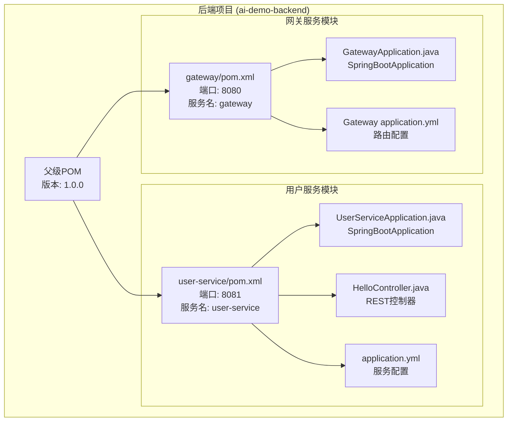
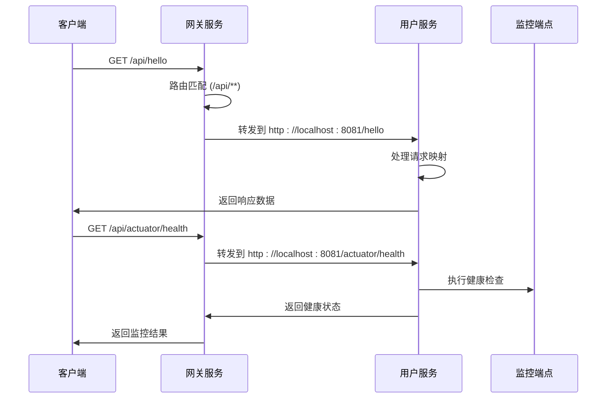
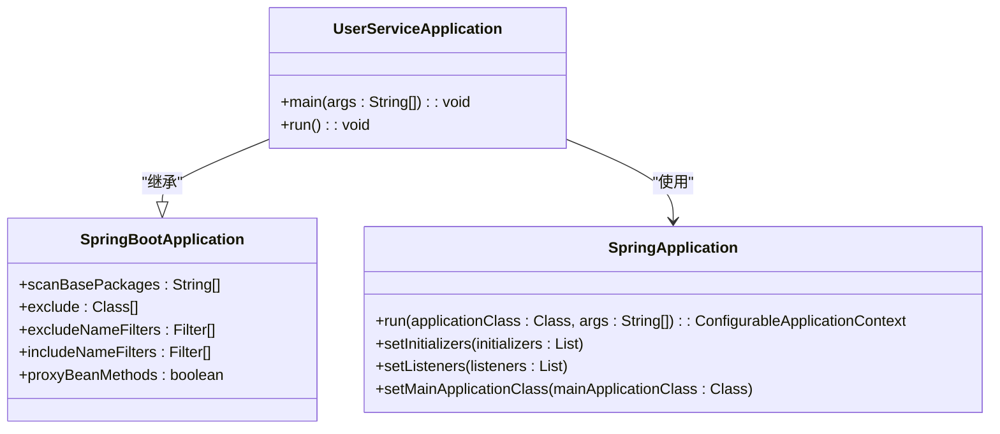
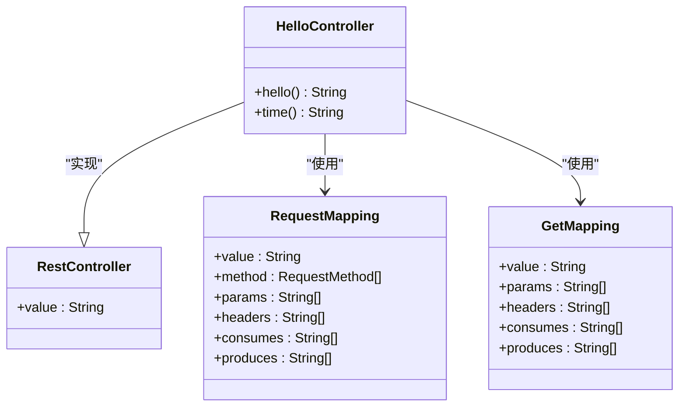
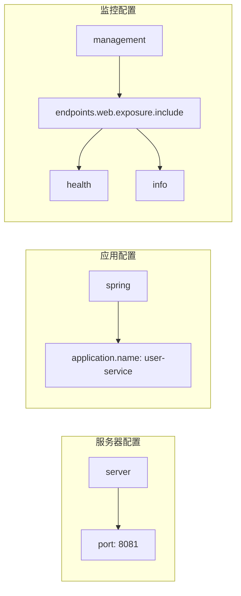
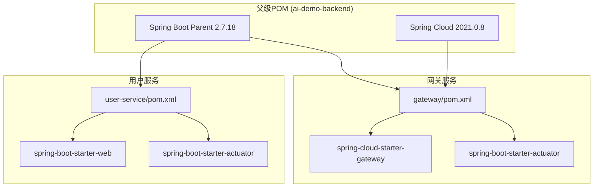

# 用户服务

<cite>
**本文档引用的文件**
- [UserServiceApplication.java](file://backend/user-service/src/main/java/com/example/userservice/UserServiceApplication.java)
- [HelloController.java](file://backend/user-service/src/main/java/com/example/userservice/controller/HelloController.java)
- [application.yml](file://backend/user-service/src/main/resources/application.yml)
- [GatewayApplication.java](file://backend/gateway/src/main/java/com/example/gateway/GatewayApplication.java)
- [Gateway application.yml](file://backend/gateway/src/main/resources/application.yml)
- [user-service pom.xml](file://backend/user-service/pom.xml)
- [gateway pom.xml](file://backend/gateway/pom.xml)
- [backend pom.xml](file://backend/pom.xml)
</cite>

## 目录
1. [简介](#简介)
2. [项目结构](#项目结构)
3. [核心组件](#核心组件)
4. [架构概览](#架构概览)
5. [详细组件分析](#详细组件分析)
6. [依赖分析](#依赖分析)
7. [性能考虑](#性能考虑)
8. [故障排除指南](#故障排除指南)
9. [结论](#结论)
10. [附录](#附录)

## 简介

本项目是一个基于Spring Boot和Spring Cloud的微服务架构示例，专注于演示用户服务的完整实现。该项目采用前后端分离的设计模式，包含一个用户服务模块和一个网关服务模块，通过Spring Cloud Gateway实现统一入口和路由转发。

用户服务作为后端服务的核心组件，提供了基础的RESTful API接口，用于演示Spring Boot Web开发的基本概念和最佳实践。同时，网关服务负责处理跨域配置、路由规则和请求转发，为整个微服务架构提供统一的入口点。

## 项目结构

项目采用多模块Maven结构，主要包含以下核心模块：



**图表来源**
- [backend pom.xml:30-33](file://backend/pom.xml#L30-L33)
- [user-service pom.xml:1-36](file://backend/user-service/pom.xml#L1-L36)
- [gateway pom.xml:1-36](file://backend/gateway/pom.xml#L1-L36)

**章节来源**
- [backend pom.xml:1-56](file://backend/pom.xml#L1-L56)
- [user-service pom.xml:1-36](file://backend/user-service/pom.xml#L1-L36)
- [gateway pom.xml:1-36](file://backend/gateway/pom.xml#L1-L36)

## 核心组件

### 用户服务应用入口

UserServiceApplication是用户服务的主启动类，采用了标准的Spring Boot注解配置：

- 使用`@SpringBootApplication`注解启用自动配置功能
- 提供标准的main方法入口
- 支持组件扫描和自动配置

该应用类位于`com.example.userservice`包下，确保了正确的包结构组织。

**章节来源**
- [UserServiceApplication.java:1-12](file://backend/user-service/src/main/java/com/example/userservice/UserServiceApplication.java#L1-L12)

### 控制器层架构

HelloController实现了基础的RESTful API接口，展示了Spring MVC的核心概念：

- 使用`@RestController`注解标记为REST控制器
- 通过`@RequestMapping("/hello")`定义基础路径
- 提供两个GET端点：
  - `/hello` - 返回欢迎信息
  - `/hello/time` - 返回当前时间信息

**章节来源**
- [HelloController.java:1-21](file://backend/user-service/src/main/java/com/example/userservice/controller/HelloController.java#L1-L21)

### 配置管理

用户服务使用YAML格式的application.yml进行配置管理：

- **服务器配置**: 端口设置为8081
- **应用名称**: 设置为"user-service"
- **监控配置**: 启用health和info端点

**章节来源**
- [application.yml:1-13](file://backend/user-service/src/main/resources/application.yml#L1-L13)

## 架构概览

系统采用微服务架构，通过Spring Cloud Gateway实现统一入口和路由管理：



**图表来源**
- [Gateway application.yml:9-15](file://backend/gateway/src/main/resources/application.yml#L9-L15)
- [application.yml:8-12](file://backend/user-service/src/main/resources/application.yml#L8-L12)

**章节来源**
- [Gateway application.yml:1-28](file://backend/gateway/src/main/resources/application.yml#L1-L28)
- [application.yml:1-13](file://backend/user-service/src/main/resources/application.yml#L1-L13)

## 详细组件分析

### UserServiceApplication 主类分析

UserServiceApplication体现了Spring Boot的标准启动模式：



**图表来源**
- [UserServiceApplication.java:6-10](file://backend/user-service/src/main/java/com/example/userservice/UserServiceApplication.java#L6-L10)

该类的主要职责：
- 启动Spring Boot应用程序上下文
- 触发自动配置流程
- 加载应用程序配置

**章节来源**
- [UserServiceApplication.java:1-12](file://backend/user-service/src/main/java/com/example/userservice/UserServiceApplication.java#L1-L12)

### HelloController 控制器实现

HelloController展示了Spring MVC控制器的基本实现模式：



**图表来源**
- [HelloController.java:7-19](file://backend/user-service/src/main/java/com/example/userservice/controller/HelloController.java#L7-L19)

控制器的实现特点：
- 使用@RestController简化REST控制器开发
- 通过@RequestMapping定义基础URL路径
- 使用@GetMapping映射HTTP GET请求
- 返回字符串类型响应，Spring Boot自动处理序列化

**章节来源**
- [HelloController.java:1-21](file://backend/user-service/src/main/java/com/example/userservice/controller/HelloController.java#L1-L21)

### API 接口设计与实现

用户服务提供了两个基础API端点：

#### 基础问候接口
- **URL**: `/hello`
- **HTTP方法**: GET
- **功能**: 返回欢迎信息
- **响应**: 文本字符串

#### 时间查询接口
- **URL**: `/hello/time`
- **HTTP方法**: GET
- **功能**: 返回当前系统时间
- **响应**: 文本字符串

```mermaid
flowchart TD
Start([请求到达]) --> Route{路由匹配}
Route --> |/hello| HelloHandler[HelloController.hello()]
Route --> |/hello/time| TimeHandler[HelloController.time()]
HelloHandler --> FormatResponse[格式化响应]
TimeHandler --> FormatResponse
FormatResponse --> Return[返回响应给客户端]
```

**图表来源**
- [HelloController.java:11-19](file://backend/user-service/src/main/java/com/example/userservice/controller/HelloController.java#L11-L19)

**章节来源**
- [HelloController.java:10-19](file://backend/user-service/src/main/java/com/example/userservice/controller/HelloController.java#L10-L19)

### 配置解析与管理

#### 用户服务配置详解

application.yml文件包含了服务运行所需的核心配置：



**图表来源**
- [application.yml:1-13](file://backend/user-service/src/main/resources/application.yml#L1-L13)

**章节来源**
- [application.yml:1-13](file://backend/user-service/src/main/resources/application.yml#L1-L13)

#### 网关服务配置

Gateway application.yml提供了完整的路由和CORS配置：

- **路由规则**: 将/api/**路径转发到用户服务
- **CORS配置**: 允许所有来源、方法和头部
- **监控端点**: 暴露health、info和gateway端点

**章节来源**
- [Gateway application.yml:1-28](file://backend/gateway/src/main/resources/application.yml#L1-L28)

## 依赖分析

项目采用Spring Boot和Spring Cloud技术栈，具有清晰的依赖层次结构：



**图表来源**
- [backend pom.xml:22-44](file://backend/pom.xml#L22-L44)
- [user-service pom.xml:16-25](file://backend/user-service/pom.xml#L16-L25)
- [gateway pom.xml:16-25](file://backend/gateway/pom.xml#L16-L25)

**章节来源**
- [backend pom.xml:1-56](file://backend/pom.xml#L1-L56)
- [user-service pom.xml:1-36](file://backend/user-service/pom.xml#L1-L36)
- [gateway pom.xml:1-36](file://backend/gateway/pom.xml#L1-L36)

## 性能考虑

基于当前实现的性能特性分析：

### 内存使用
- Spring Boot应用启动内存占用适中
- REST控制器无状态设计，便于水平扩展
- 字符串响应处理开销较小

### 并发处理
- Spring MVC默认支持多线程并发处理
- 无数据库连接池配置，适合轻量级应用
- 建议在生产环境中添加连接池配置

### 监控指标
- Actuator端点提供健康检查能力
- 建议添加更多业务指标监控
- 可考虑集成APM工具进行性能追踪

## 故障排除指南

### 常见问题及解决方案

#### 应用启动失败
**症状**: 应用无法正常启动
**可能原因**:
- 端口冲突（8081已被占用）
- Java版本不兼容
- 依赖包下载失败

**解决方法**:
1. 检查端口占用情况
2. 确认Java 11环境
3. 清理Maven缓存重新构建

#### API访问异常
**症状**: API请求返回错误
**可能原因**:
- 网关路由配置错误
- 用户服务未启动
- CORS跨域问题

**解决方法**:
1. 检查网关路由配置
2. 确认用户服务状态
3. 验证CORS配置

#### 监控端点不可用
**症状**: /actuator/health返回404
**可能原因**:
- Actuator端点未正确暴露
- 配置文件语法错误

**解决方法**:
1. 检查application.yml中的exposure配置
2. 确认Actuator依赖已正确添加

**章节来源**
- [application.yml:8-12](file://backend/user-service/src/main/resources/application.yml#L8-L12)
- [Gateway application.yml:23-27](file://backend/gateway/src/main/resources/application.yml#L23-L27)

## 结论

本用户服务项目成功演示了Spring Boot和Spring Cloud微服务架构的基础实现。通过简洁的代码结构和清晰的配置管理，为开发者提供了良好的学习和扩展基础。

项目的主要优势：
- **简单易懂**: 代码结构清晰，易于理解和维护
- **配置明确**: YAML配置文件直观明了
- **架构合理**: 微服务分层设计符合最佳实践
- **可扩展性强**: 基于Spring Cloud框架，便于功能扩展

建议的后续改进方向：
- 添加数据库集成和实体模型
- 实现更丰富的业务逻辑和API接口
- 集成完整的认证授权机制
- 添加单元测试和集成测试
- 配置日志管理和错误处理

## 附录

### API 测试方法

#### 基础接口测试
使用curl命令进行基本功能测试：

```bash
# 测试问候接口
curl http://localhost:8080/api/hello

# 测试时间接口
curl http://localhost:8080/api/hello/time

# 测试监控端点
curl http://localhost:8080/api/actuator/health
```

#### 调试技巧
1. **查看应用日志**: 启动时观察控制台输出
2. **使用Postman**: 创建API集合进行批量测试
3. **浏览器调试**: 直接在浏览器中访问API端点
4. **网络抓包**: 使用浏览器开发者工具查看请求响应

### 开发最佳实践

#### 新接口开发指南
1. **遵循RESTful设计原则**
2. **使用适当的HTTP状态码**
3. **保持接口版本化**
4. **添加必要的输入验证**
5. **实现统一的错误处理**

#### 代码组织建议
1. **按功能模块划分包结构**
2. **使用有意义的命名约定**
3. **添加必要的注释和文档**
4. **遵循单一职责原则**
5. **定期重构和优化代码**