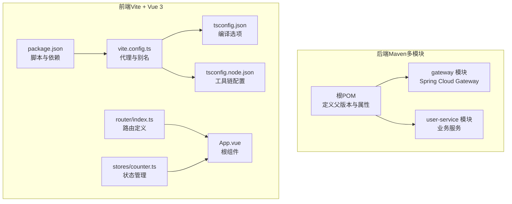
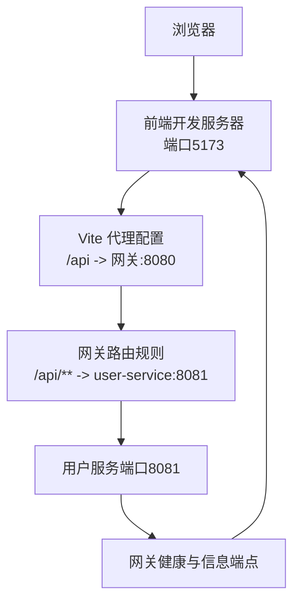
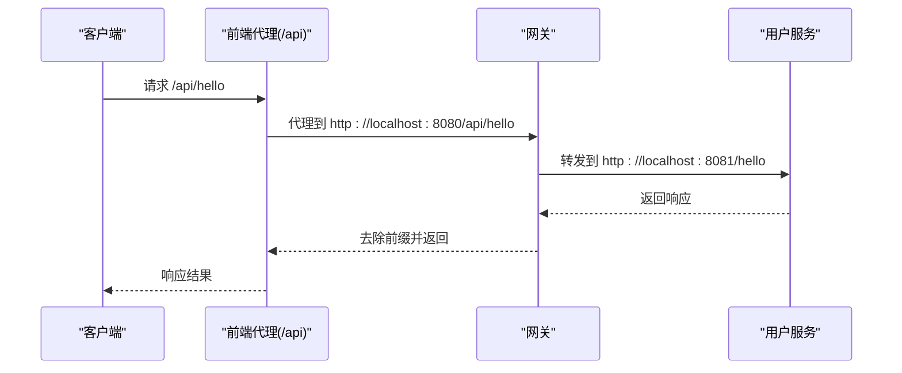
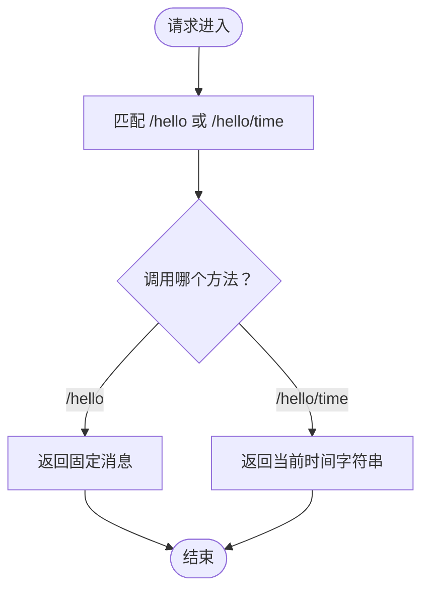
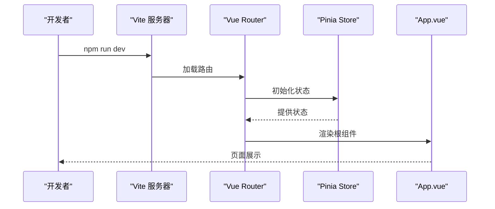
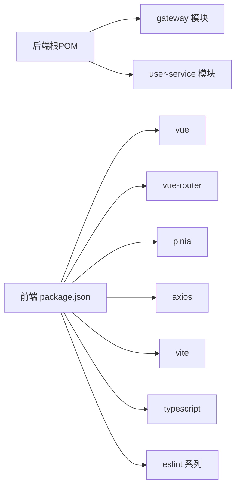

# 开发指南

<cite>
**本文引用的文件**
- [根POM（后端）](file://backend/pom.xml)
- [网关应用入口（后端）](file://backend/gateway/src/main/java/com/example/gateway/GatewayApplication.java)
- [用户服务应用入口（后端）](file://backend/user-service/src/main/java/com/example/userservice/UserServiceApplication.java)
- [用户服务控制器示例（后端）](file://backend/user-service/src/main/java/com/example/userservice/controller/HelloController.java)
- [网关配置（后端）](file://backend/gateway/src/main/resources/application.yml)
- [用户服务配置（后端）](file://backend/user-service/src/main/resources/application.yml)
- [前端包管理配置](file://frontend/package.json)
- [前端Vite配置](file://frontend/vite.config.ts)
- [前端TypeScript配置（浏览器端）](file://frontend/tsconfig.json)
- [前端TypeScript配置（Node工具链）](file://frontend/tsconfig.node.json)
- [前端路由配置](file://frontend/src/router/index.ts)
- [前端计数器状态管理](file://frontend/src/stores/counter.ts)
- [前端应用根组件](file://frontend/src/App.vue)
- [需求说明（登录页面）](file://requrement/login.md)
</cite>

## 目录
1. [简介](#简介)
2. [项目结构](#项目结构)
3. [核心组件](#核心组件)
4. [架构总览](#架构总览)
5. [详细组件分析](#详细组件分析)
6. [依赖分析](#依赖分析)
7. [性能考虑](#性能考虑)
8. [故障排查指南](#故障排查指南)
9. [结论](#结论)
10. [附录](#附录)

## 简介
本开发指南面向新老开发者，旨在统一开发流程与代码规范，覆盖以下方面：
- 开发环境搭建：IDE配置、推荐插件、调试设置
- 后端（Spring Boot/Spring Cloud）与前端（Vue 3 + TypeScript + Vite）编码规范
- 构建与打包：Maven多模块构建与Vite前端构建
- 测试策略：单元测试、集成测试与端到端测试
- Git工作流与分支管理：提交规范与代码评审流程
- CI/CD配置建议与最佳实践
- 新人入职指引与学习资源

## 项目结构
该项目采用前后端分离架构：
- 后端为Maven多模块工程，包含网关模块与用户服务模块，使用Spring Boot与Spring Cloud
- 前端为Vue 3单页应用，基于Vite构建，TypeScript类型检查，配合Vue Router与Pinia状态管理

图表来源
- [根POM（后端）:1-56](file://backend/pom.xml#L1-L56)
- [前端包管理配置:1-31](file://frontend/package.json#L1-L31)
- [前端Vite配置:1-23](file://frontend/vite.config.ts#L1-L23)
- [前端TypeScript配置（浏览器端）:1-26](file://frontend/tsconfig.json#L1-L26)
- [前端TypeScript配置（Node工具链）:1-11](file://frontend/tsconfig.node.json#L1-L11)
- [前端路由配置:1-16](file://frontend/src/router/index.ts#L1-L16)
- [前端计数器状态管理:1-13](file://frontend/src/stores/counter.ts#L1-L13)
- [前端应用根组件:1-41](file://frontend/src/App.vue#L1-L41)

章节来源
- [根POM（后端）:1-56](file://backend/pom.xml#L1-L56)
- [前端包管理配置:1-31](file://frontend/package.json#L1-L31)

## 核心组件
- 后端网关模块：负责路由转发、跨域配置与健康监控暴露
- 用户服务模块：提供REST接口示例，包含基础控制器
- 前端应用：包含路由、状态管理与根组件，具备开发服务器与代理配置

章节来源
- [网关应用入口（后端）:1-12](file://backend/gateway/src/main/java/com/example/gateway/GatewayApplication.java#L1-L12)
- [用户服务应用入口（后端）:1-12](file://backend/user-service/src/main/java/com/example/userservice/UserServiceApplication.java#L1-L12)
- [用户服务控制器示例（后端）:1-21](file://backend/user-service/src/main/java/com/example/userservice/controller/HelloController.java#L1-L21)
- [前端应用根组件:1-41](file://frontend/src/App.vue#L1-L41)

## 架构总览
系统由前端应用通过本地代理访问后端网关，网关根据路径规则将请求转发至用户服务。

图表来源
- [前端Vite配置:1-23](file://frontend/vite.config.ts#L1-L23)
- [网关配置（后端）:1-28](file://backend/gateway/src/main/resources/application.yml#L1-L28)
- [用户服务配置（后端）:1-13](file://backend/user-service/src/main/resources/application.yml#L1-L13)

## 详细组件分析

### 后端：Spring Cloud Gateway
- 应用入口：标准Spring Boot启动类
- 配置要点：
  - 路由规则：将/api前缀的请求转发至用户服务
  - 跨域配置：允许任意来源、方法与头
  - 管理端点：暴露health、info、gateway相关端点
- 运行端口：8080

图表来源
- [前端Vite配置:14-20](file://frontend/vite.config.ts#L14-L20)
- [网关配置（后端）:9-15](file://backend/gateway/src/main/resources/application.yml#L9-L15)
- [用户服务控制器示例（后端）:11-19](file://backend/user-service/src/main/java/com/example/userservice/controller/HelloController.java#L11-L19)

章节来源
- [网关应用入口（后端）:1-12](file://backend/gateway/src/main/java/com/example/gateway/GatewayApplication.java#L1-L12)
- [网关配置（后端）:1-28](file://backend/gateway/src/main/resources/application.yml#L1-L28)

### 后端：用户服务（示例）
- 应用入口：标准Spring Boot启动类
- 控制器示例：提供/hello与/hello/time两个GET端点
- 端口：8081
- 管理端点：health、info

图表来源
- [用户服务控制器示例（后端）:11-19](file://backend/user-service/src/main/java/com/example/userservice/controller/HelloController.java#L11-L19)

章节来源
- [用户服务应用入口（后端）:1-12](file://backend/user-service/src/main/java/com/example/userservice/UserServiceApplication.java#L1-L12)
- [用户服务控制器示例（后端）:1-21](file://backend/user-service/src/main/java/com/example/userservice/controller/HelloController.java#L1-L21)
- [用户服务配置（后端）:1-13](file://backend/user-service/src/main/resources/application.yml#L1-L13)

### 前端：Vue 3 + TypeScript + Vite
- 路由：使用history模式，定义首页与关于页
- 状态管理：使用Pinia定义计数器store
- 构建与开发：
  - dev：启动Vite开发服务器
  - build：先进行类型检查再打包
  - preview：预览生产包
  - lint：运行ESLint修复
- 别名与代理：@指向src；/api代理到网关

图表来源
- [前端包管理配置:6-11](file://frontend/package.json#L6-L11)
- [前端Vite配置:1-23](file://frontend/vite.config.ts#L1-L23)
- [前端路由配置:1-16](file://frontend/src/router/index.ts#L1-L16)
- [前端计数器状态管理:1-13](file://frontend/src/stores/counter.ts#L1-L13)
- [前端应用根组件:1-41](file://frontend/src/App.vue#L1-L41)

章节来源
- [前端包管理配置:1-31](file://frontend/package.json#L1-L31)
- [前端Vite配置:1-23](file://frontend/vite.config.ts#L1-L23)
- [前端TypeScript配置（浏览器端）:1-26](file://frontend/tsconfig.json#L1-L26)
- [前端TypeScript配置（Node工具链）:1-11](file://frontend/tsconfig.node.json#L1-L11)
- [前端路由配置:1-16](file://frontend/src/router/index.ts#L1-L16)
- [前端计数器状态管理:1-13](file://frontend/src/stores/counter.ts#L1-L13)
- [前端应用根组件:1-41](file://frontend/src/App.vue#L1-L41)

## 依赖分析
- 后端：
  - 父POM统一版本与属性，声明Spring Cloud版本，定义子模块
  - 网关模块依赖Spring Cloud Gateway
  - 用户服务模块依赖Spring Web（通过Spring Boot Starter）
- 前端：
  - 依赖Vue 3、Vue Router、Pinia、Axios
  - 开发依赖Vite、Vue插件、TypeScript、ESLint、Prettier等

图表来源
- [根POM（后端）:30-33](file://backend/pom.xml#L30-L33)
- [前端包管理配置:12-29](file://frontend/package.json#L12-L29)

章节来源
- [根POM（后端）:1-56](file://backend/pom.xml#L1-L56)
- [前端包管理配置:1-31](file://frontend/package.json#L1-L31)

## 性能考虑
- 前端：
  - 使用Vite的按需加载与Tree-shaking，减少首屏体积
  - 类型检查在构建阶段执行，避免运行时开销
  - 代理仅用于开发环境，生产环境通过反向代理或CDN处理
- 后端：
  - Spring Cloud Gateway作为单一入口，注意路由规则简洁性与过滤器链长度
  - 合理配置跨域以避免不必要的OPTIONS请求
  - 管理端点仅在受控网络暴露

## 故障排查指南
- 前端无法访问后端接口
  - 检查Vite代理是否正确配置为将/api前缀转发至网关地址
  - 确认网关路由规则是否包含/api/**且目标URI正确
- 端口冲突
  - 前端默认端口为5173；网关为8080；用户服务为8081
  - 如端口被占用，请在对应配置中修改端口
- CORS问题
  - 网关已配置全局CORS，若仍失败，检查具体路由filters与allowedHeaders
- 类型检查失败
  - 执行构建前先修复类型错误；确保tsconfig路径映射与模块解析配置一致

章节来源
- [前端Vite配置:12-21](file://frontend/vite.config.ts#L12-L21)
- [网关配置（后端）:16-21](file://backend/gateway/src/main/resources/application.yml#L16-L21)
- [用户服务配置（后端）:1-13](file://backend/user-service/src/main/resources/application.yml#L1-L13)
- [前端TypeScript配置（浏览器端）:18-22](file://frontend/tsconfig.json#L18-L22)

## 结论
本指南提供了从环境搭建到开发、测试、部署与运维的全流程建议。请严格遵循编码规范与工作流，确保团队协作的一致性与可维护性。

## 附录

### 开发环境搭建与IDE配置
- Java后端
  - JDK版本：11（与项目属性一致）
  - 推荐插件：Spring Assistant、Lombok（如使用）、EditorConfig、SonarLint
  - 调试设置：分别启动网关与用户服务主类；设置断点于控制器方法
- 前端
  - Node版本：与团队约定（建议长期稳定版）
  - 推荐插件：Volar、ESLint、Prettier、TypeScript Importer
  - 调试设置：使用浏览器开发者工具；Vite开发服务器自动热更新

### 编码规范（后端：Spring Boot/Spring Cloud）
- 包命名：按模块分包，如controller、service、repository
- 控制器：
  - 使用@RestController与@RequestMapping
  - GET方法返回数据对象或字符串；必要时使用ResponseEntity
  - 对外暴露的路径以模块名或领域名词开头，保持清晰
- 配置：
  - application.yml中集中管理端口、路由与跨域
  - 管理端点按需暴露，生产环境限制访问
- 日志与异常：
  - 统一日志格式；对外异常统一包装
- 单元测试：
  - 使用@SpringBootTest与MockMvc或@WebMvcTest
  - 针对控制器与Service编写测试用例

### 编码规范（前端：Vue 3 + TypeScript）
- 组件：
  - 使用Composition API与<script setup>语法
  - props与emits显式声明类型
- 路由：
  - 使用history模式；路由名称与路径清晰
- 状态管理：
  - 使用Pinia；每个模块拆分为独立store
- 类型安全：
  - tsconfig严格模式开启；禁止any；未使用变量与参数启用告警
- 代码风格：
  - ESLint + Prettier；提交前执行lint与fix
- 构建与预览：
  - dev/build/preview/lint脚本按约定使用

### 构建与打包
- 后端（Maven）
  - 多模块：在根目录执行构建，父POM统一版本与插件
  - 插件：spring-boot-maven-plugin用于生成可执行jar
- 前端（Vite）
  - dev：启动开发服务器
  - build：先类型检查，再打包
  - preview：本地预览生产包

章节来源
- [根POM（后端）:47-54](file://backend/pom.xml#L47-L54)
- [前端包管理配置:6-11](file://frontend/package.json#L6-L11)

### 测试策略
- 单元测试
  - 后端：针对Controller与Service编写JUnit测试，Mock外部依赖
  - 前端：使用Vitest或Jest，覆盖组件与store逻辑
- 集成测试
  - 后端：使用@IntegrationTest或Testcontainers启动完整上下文
  - 前端：使用Cypress或Playwright进行端到端测试
- 端到端测试
  - 覆盖登录、导航、状态变更等关键流程
  - 与需求文档中的登录页面功能对齐

章节来源
- [需求说明（登录页面）:1-5](file://requrement/login.md#L1-L5)

### Git工作流与分支管理
- 分支模型
  - main/master：发布线；hotfix分支用于紧急修复
  - develop：每日集成；功能从develop切出，完成后合并回develop
  - feature/*：功能开发分支；完成后合并回develop
- 提交规范
  - type(scope): subject
  - 示例：feat(gateway): 添加跨域配置；fix(user-controller): 修正时间格式
- 代码评审
  - PR必须有至少一名Reviewer同意；解决所有评论后再合并
  - 合并前确保CI通过与测试通过

### CI/CD配置建议与最佳实践
- 触发条件
  - push到develop触发集成；push到main触发发布
- 步骤建议
  - 安装依赖（后端Maven、前端npm）
  - 代码检查（后端checkstyle/Spotless，前端ESLint/Prettier）
  - 单元测试与覆盖率收集
  - 集成测试与端到端测试
  - 构建产物（后端jar，前端静态资源）
  - 发布制品与部署（可选自动化）
- 最佳实践
  - 将敏感信息放入密钥管理；使用环境变量注入
  - 并行化任务提升效率；缓存依赖加速构建

### 新人入职指导
- 必读
  - 本开发指南全文
  - 需求说明与原型（登录页面）
- 第一天
  - 安装JDK/Node/Vite/IDE插件
  - 克隆仓库，安装依赖，运行后端与前端
  - 阅读各模块的application.yml与路由配置
- 第一周
  - 阅读控制器与store示例
  - 修改并提交第一个小功能，体验PR流程
  - 参加代码评审会议，熟悉评审意见