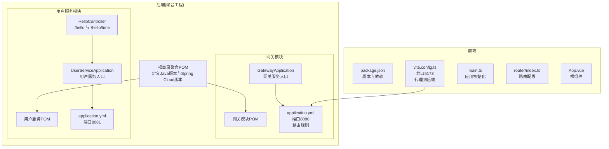
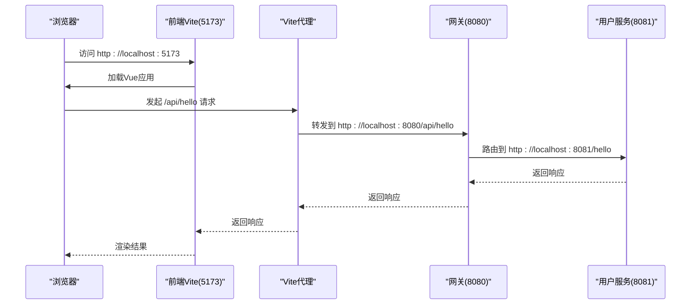

# 快速开始

<cite>
**本文引用的文件**
- [根目录聚合POM](file://backend/pom.xml)
- [网关模块POM](file://backend/gateway/pom.xml)
- [用户服务模块POM](file://backend/user-service/pom.xml)
- [网关应用入口](file://backend/gateway/src/main/java/com/example/gateway/GatewayApplication.java)
- [用户服务应用入口](file://backend/user-service/src/main/java/com/example/userservice/UserServiceApplication.java)
- [网关配置](file://backend/gateway/src/main/resources/application.yml)
- [用户服务配置](file://backend/user-service/src/main/resources/application.yml)
- [用户服务控制器](file://backend/user-service/src/main/java/com/example/userservice/controller/HelloController.java)
- [前端包管理配置](file://frontend/package.json)
- [前端Vite配置](file://frontend/vite.config.ts)
- [前端路由配置](file://frontend/src/router/index.ts)
- [前端应用入口](file://frontend/src/main.ts)
- [前端应用根组件](file://frontend/src/App.vue)
- [前端TS配置](file://frontend/tsconfig.json)
- [需求文档](file://requrement/login.md)
</cite>

## 目录
1. [简介](#简介)
2. [项目结构](#项目结构)
3. [环境要求](#环境要求)
4. [后端服务启动](#后端服务启动)
5. [前端应用启动](#前端应用启动)
6. [验证步骤](#验证步骤)
7. [常见问题排查](#常见问题排查)
8. [架构概览](#架构概览)
9. [故障排除指南](#故障排除指南)
10. [结语](#结语)

## 简介
本指南旨在帮助开发者在30分钟内完成AI演示项目的搭建与运行。项目采用前后端分离架构：后端基于Spring Boot和Spring Cloud构建微服务（网关与用户服务），前端使用Vue 3 + TypeScript + Vite技术栈。通过本指南，您将完成环境准备、依赖安装、服务启动以及功能验证。

## 项目结构
项目采用多模块设计，后端为Maven聚合工程，包含网关模块与用户服务模块；前端为独立的Vue 3应用。

**图表来源**
- [根目录聚合POM:1-56](file://backend/pom.xml#L1-L56)
- [网关模块POM:1-36](file://backend/gateway/pom.xml#L1-L36)
- [用户服务模块POM:1-36](file://backend/user-service/pom.xml#L1-L36)
- [网关应用入口:1-12](file://backend/gateway/src/main/java/com/example/gateway/GatewayApplication.java#L1-L12)
- [用户服务应用入口:1-12](file://backend/user-service/src/main/java/com/example/userservice/UserServiceApplication.java#L1-L12)
- [网关配置:1-28](file://backend/gateway/src/main/resources/application.yml#L1-L28)
- [用户服务配置:1-13](file://backend/user-service/src/main/resources/application.yml#L1-L13)
- [用户服务控制器:1-21](file://backend/user-service/src/main/java/com/example/userservice/controller/HelloController.java#L1-L21)
- [前端包管理配置:1-31](file://frontend/package.json#L1-L31)
- [前端Vite配置:1-23](file://frontend/vite.config.ts#L1-L23)
- [前端路由配置:1-16](file://frontend/src/router/index.ts#L1-L16)
- [前端应用入口:1-10](file://frontend/src/main.ts#L1-L10)
- [前端应用根组件:1-41](file://frontend/src/App.vue#L1-L41)

**章节来源**
- [根目录聚合POM:1-56](file://backend/pom.xml#L1-L56)
- [网关模块POM:1-36](file://backend/gateway/pom.xml#L1-L36)
- [用户服务模块POM:1-36](file://backend/user-service/pom.xml#L1-L36)
- [前端包管理配置:1-31](file://frontend/package.json#L1-L31)
- [前端Vite配置:1-23](file://frontend/vite.config.ts#L1-L23)

## 环境要求
- Java 11
  - 根目录聚合POM中明确设置Java版本为11，编译源与目标版本均为11。
- Maven
  - 使用Maven进行后端依赖管理与打包。
- Node.js
  - 前端使用Vite，需安装Node.js（建议使用LTS版本）。
- IDE推荐
  - 后端：IntelliJ IDEA或Spring Tool Suite
  - 前端：Visual Studio Code（建议安装Vue相关插件）
- 操作系统
  - Windows、macOS或Linux均可

**章节来源**
- [根目录聚合POM:22-28](file://backend/pom.xml#L22-L28)

## 后端服务启动
后端为Maven聚合工程，包含网关与用户服务两个子模块。启动顺序应先启动用户服务，再启动网关。

### 步骤1：安装Maven依赖
- 在后端根目录执行Maven命令安装所有模块依赖
- 命令路径参考：[根目录聚合POM:1-56](file://backend/pom.xml#L1-L56)

### 步骤2：启动用户服务
- 进入用户服务模块目录
- 执行Spring Boot应用启动命令
- 应用入口类参考：[用户服务应用入口:1-12](file://backend/user-service/src/main/java/com/example/userservice/UserServiceApplication.java#L1-L12)
- 用户服务端口配置参考：[用户服务配置:1-13](file://backend/user-service/src/main/resources/application.yml#L1-L13)

### 步骤3：启动网关服务
- 进入网关模块目录
- 执行Spring Boot应用启动命令
- 网关应用入口类参考：[网关应用入口:1-12](file://backend/gateway/src/main/java/com/example/gateway/GatewayApplication.java#L1-L12)
- 网关端口配置参考：[网关配置:1-28](file://backend/gateway/src/main/resources/application.yml#L1-L28)

### 验证后端服务
- 访问用户服务健康检查端点：http://localhost:8081/actuator/health
- 访问网关健康检查端点：http://localhost:8080/actuator/health
- 通过网关访问用户服务接口：http://localhost:8080/api/hello

**章节来源**
- [用户服务应用入口:1-12](file://backend/user-service/src/main/java/com/example/userservice/UserServiceApplication.java#L1-L12)
- [网关应用入口:1-12](file://backend/gateway/src/main/java/com/example/gateway/GatewayApplication.java#L1-L12)
- [用户服务配置:1-13](file://backend/user-service/src/main/resources/application.yml#L1-L13)
- [网关配置:1-28](file://backend/gateway/src/main/resources/application.yml#L1-L28)

## 前端应用启动
前端采用Vue 3 + TypeScript + Vite技术栈，开发服务器默认端口为5173。

### 步骤1：安装依赖
- 在前端根目录执行npm install安装依赖
- 依赖定义参考：[前端包管理配置:1-31](file://frontend/package.json#L1-L31)

### 步骤2：启动开发服务器
- 执行npm run dev启动Vite开发服务器
- 开发服务器端口配置参考：[前端Vite配置:12-21](file://frontend/vite.config.ts#L12-L21)

### 步骤3：访问应用
- 默认访问地址：http://localhost:5173
- 路由配置参考：[前端路由配置:1-16](file://frontend/src/router/index.ts#L1-L16)
- 应用入口参考：[前端应用入口:1-10](file://frontend/src/main.ts#L1-L10)
- 根组件参考：[前端应用根组件:1-41](file://frontend/src/App.vue#L1-L41)

**章节来源**
- [前端包管理配置:1-31](file://frontend/package.json#L1-L31)
- [前端Vite配置:1-23](file://frontend/vite.config.ts#L1-L23)
- [前端路由配置:1-16](file://frontend/src/router/index.ts#L1-L16)
- [前端应用入口:1-10](file://frontend/src/main.ts#L1-L10)
- [前端应用根组件:1-41](file://frontend/src/App.vue#L1-L41)

## 验证步骤
项目成功运行后，应能完成以下验证：

### 后端验证
- 用户服务接口
  - 访问：http://localhost:8081/hello
  - 访问：http://localhost:8081/hello/time
  - 控制器实现参考：[用户服务控制器:1-21](file://backend/user-service/src/main/java/com/example/userservice/controller/HelloController.java#L1-L21)
- 网关转发
  - 访问：http://localhost:8080/api/hello
  - 访问：http://localhost:8080/api/hello/time
  - 网关路由配置参考：[网关配置:9-15](file://backend/gateway/src/main/resources/application.yml#L9-L15)
- 健康检查
  - 用户服务：http://localhost:8081/actuator/health
  - 网关：http://localhost:8080/actuator/health

### 前端验证
- 页面加载
  - 访问：http://localhost:5173
  - 路由导航正常（首页与关于页面）
- 开发服务器
  - 热更新功能正常
  - 控制台无错误

**章节来源**
- [用户服务控制器:1-21](file://backend/user-service/src/main/java/com/example/userservice/controller/HelloController.java#L1-L21)
- [网关配置:1-28](file://backend/gateway/src/main/resources/application.yml#L1-L28)
- [用户服务配置:1-13](file://backend/user-service/src/main/resources/application.yml#L1-L13)
- [前端Vite配置:1-23](file://frontend/vite.config.ts#L1-L23)
- [前端路由配置:1-16](file://frontend/src/router/index.ts#L1-L16)

## 常见问题排查
- 端口冲突
  - 后端：8080（网关）、8081（用户服务）
  - 前端：5173
  - 如端口被占用，请修改对应配置文件中的端口号
- 跨域问题
  - 网关已配置全局CORS，允许所有来源与方法
  - CORS配置参考：[网关配置:16-21](file://backend/gateway/src/main/resources/application.yml#L16-L21)
- 代理配置
  - 前端Vite代理指向后端网关地址
  - 代理配置参考：[前端Vite配置:14-20](file://frontend/vite.config.ts#L14-L20)
- 依赖安装失败
  - 清理npm缓存并重新安装依赖
  - 参考：[前端包管理配置:1-31](file://frontend/package.json#L1-L31)
- Java版本不匹配
  - 确保使用Java 11
  - 版本配置参考：[根目录聚合POM:22-28](file://backend/pom.xml#L22-L28)

**章节来源**
- [网关配置:16-21](file://backend/gateway/src/main/resources/application.yml#L16-L21)
- [前端Vite配置:14-20](file://frontend/vite.config.ts#L14-L20)
- [前端包管理配置:1-31](file://frontend/package.json#L1-L31)
- [根目录聚合POM:22-28](file://backend/pom.xml#L22-L28)

## 架构概览
下图展示了前后端交互的整体架构与数据流向。

**图表来源**
- [前端Vite配置:12-21](file://frontend/vite.config.ts#L12-L21)
- [网关配置:9-15](file://backend/gateway/src/main/resources/application.yml#L9-L15)
- [用户服务配置:1-13](file://backend/user-service/src/main/resources/application.yml#L1-L13)

## 故障排除指南
- 启动顺序错误
  - 必须先启动用户服务，再启动网关
  - 入口类参考：
    - [用户服务应用入口:1-12](file://backend/user-service/src/main/java/com/example/userservice/UserServiceApplication.java#L1-L12)
    - [网关应用入口:1-12](file://backend/gateway/src/main/java/com/example/gateway/GatewayApplication.java#L1-L12)
- 接口无法访问
  - 检查网关路由是否正确配置
  - 路由配置参考：[网关配置:9-15](file://backend/gateway/src/main/resources/application.yml#L9-L15)
- TypeScript类型错误
  - 检查TS配置与依赖版本
  - TS配置参考：[前端TS配置:1-26](file://frontend/tsconfig.json#L1-L26)
- 登录页面开发需求
  - 需求文档参考：[需求文档:1-5](file://requrement/login.md#L1-L5)

**章节来源**
- [用户服务应用入口:1-12](file://backend/user-service/src/main/java/com/example/userservice/UserServiceApplication.java#L1-L12)
- [网关应用入口:1-12](file://backend/gateway/src/main/java/com/example/gateway/GatewayApplication.java#L1-L12)
- [网关配置:9-15](file://backend/gateway/src/main/resources/application.yml#L9-L15)
- [前端TS配置:1-26](file://frontend/tsconfig.json#L1-L26)
- [需求文档:1-5](file://requrement/login.md#L1-L5)

## 结语
按照本指南的步骤，您应该能在30分钟内成功启动并验证AI演示项目的后端与前端服务。如遇问题，请根据故障排除指南逐一排查。项目采用清晰的模块化设计与标准的技术栈，便于后续扩展与维护。