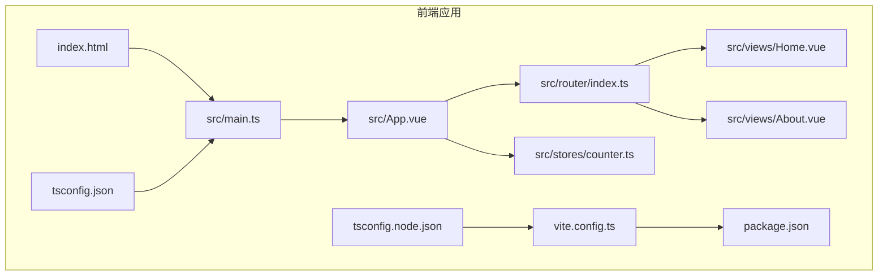
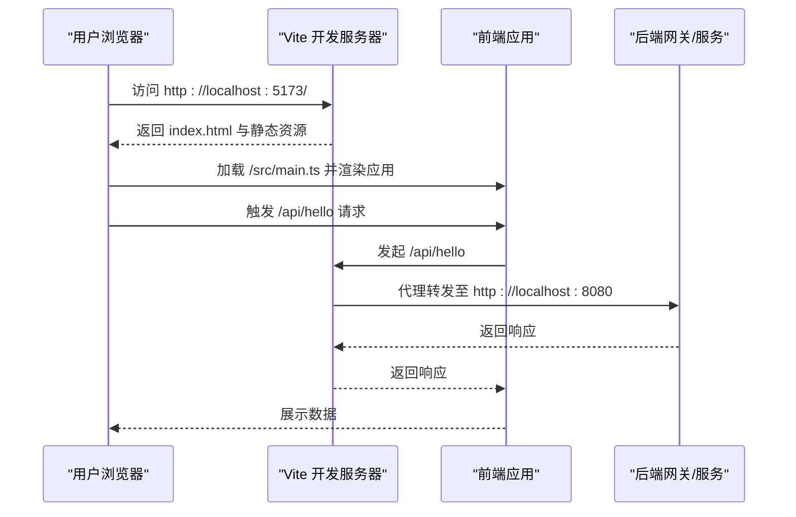
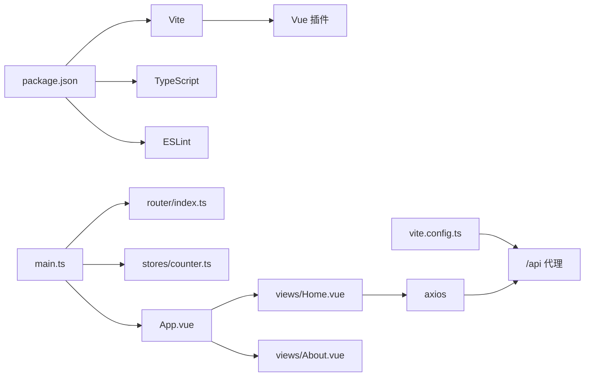

# 前端应用部署

<cite>
**本文引用的文件**
- [package.json](file://frontend/package.json)
- [vite.config.ts](file://frontend/vite.config.ts)
- [index.html](file://frontend/index.html)
- [main.ts](file://frontend/src/main.ts)
- [tsconfig.json](file://frontend/tsconfig.json)
- [tsconfig.node.json](file://frontend/tsconfig.node.json)
- [App.vue](file://frontend/src/App.vue)
- [router/index.ts](file://frontend/src/router/index.ts)
- [views/Home.vue](file://frontend/src/views/Home.vue)
- [views/About.vue](file://frontend/src/views/About.vue)
- [stores/counter.ts](file://frontend/src/stores/counter.ts)
- [login.md](file://requrement/login.md)
</cite>

## 目录
1. [简介](#简介)
2. [项目结构](#项目结构)
3. [核心组件](#核心组件)
4. [架构总览](#架构总览)
5. [详细组件分析](#详细组件分析)
6. [依赖分析](#依赖分析)
7. [性能考虑](#性能考虑)
8. [故障排查指南](#故障排查指南)
9. [结论](#结论)
10. [附录](#附录)

## 简介
本文件面向前端应用部署与运维，围绕 Vite 构建工具在本项目的配置与优化展开，覆盖开发服务器设置、生产构建配置、静态资源处理、依赖管理与脚本命令、不同部署环境的配置差异（路径、代理、API 端点）、静态资源优化与缓存策略、CDN 集成与 HTTPS 设置，以及部署到 Nginx、Apache、GitHub Pages 等平台的步骤与配置要点。内容以仓库中现有配置为依据，避免臆测，确保可操作性与可追溯性。

## 项目结构
前端工程位于 frontend 目录，采用 Vue 3 + Vite + TypeScript 技术栈，使用 Pinia 进行状态管理，Vue Router 实现前端路由，axios 用于 HTTP 请求。项目通过 Vite 提供开发服务器与生产构建能力，TypeScript 编译配置分别针对应用与 Vite 配置文件进行隔离编译。

**图表来源**
- [index.html:1-14](file://frontend/index.html#L1-L14)
- [main.ts:1-10](file://frontend/src/main.ts#L1-L10)
- [App.vue:1-41](file://frontend/src/App.vue#L1-L41)
- [router/index.ts:1-16](file://frontend/src/router/index.ts#L1-L16)
- [views/Home.vue:1-64](file://frontend/src/views/Home.vue#L1-L64)
- [views/About.vue:1-18](file://frontend/src/views/About.vue#L1-L18)
- [stores/counter.ts:1-13](file://frontend/src/stores/counter.ts#L1-L13)
- [vite.config.ts:1-23](file://frontend/vite.config.ts#L1-L23)
- [tsconfig.json:1-26](file://frontend/tsconfig.json#L1-L26)
- [tsconfig.node.json:1-11](file://frontend/tsconfig.node.json#L1-L11)
- [package.json:1-31](file://frontend/package.json#L1-L31)

**章节来源**
- [package.json:1-31](file://frontend/package.json#L1-L31)
- [vite.config.ts:1-23](file://frontend/vite.config.ts#L1-L23)
- [index.html:1-14](file://frontend/index.html#L1-L14)
- [main.ts:1-10](file://frontend/src/main.ts#L1-L10)
- [tsconfig.json:1-26](file://frontend/tsconfig.json#L1-L26)
- [tsconfig.node.json:1-11](file://frontend/tsconfig.node.json#L1-L11)

## 核心组件
- 开发服务器与代理
  - Vite 开发服务器默认端口与本地代理规则，将 /api 前缀转发至后端网关地址，便于前后端联调。
- 生产构建
  - 使用 Vite 执行类型检查与打包，输出静态资源到 dist 目录，遵循现代浏览器兼容目标。
- 路由与入口
  - 基于 History 模式的前端路由，入口文件挂载应用实例，注册路由与状态管理。
- 类型系统
  - 应用与 Vite 配置分别使用独立 tsconfig，确保 bundler 模式下的模块解析与严格类型检查。
- 依赖与脚本
  - package.json 中定义了 dev/build/preview/lint 四类脚本，依赖 Vue、Vue Router、Pinia、Axios 等运行时库及 Vite、Vue 插件、TypeScript、ESLint 等开发工具。

**章节来源**
- [vite.config.ts:12-21](file://frontend/vite.config.ts#L12-L21)
- [package.json:6-11](file://frontend/package.json#L6-L11)
- [router/index.ts:10-13](file://frontend/src/router/index.ts#L10-L13)
- [main.ts:1-10](file://frontend/src/main.ts#L1-L10)
- [tsconfig.json:1-26](file://frontend/tsconfig.json#L1-L26)
- [tsconfig.node.json:1-11](file://frontend/tsconfig.node.json#L1-L11)

## 架构总览
下图展示了从浏览器访问到后端 API 的典型链路，包括开发代理、静态资源加载与 API 请求路径重写。

**图表来源**
- [vite.config.ts:14-20](file://frontend/vite.config.ts#L14-L20)
- [views/Home.vue:28-35](file://frontend/src/views/Home.vue#L28-L35)
- [main.ts:1-10](file://frontend/src/main.ts#L1-L10)
- [index.html:10-11](file://frontend/index.html#L10-L11)

## 详细组件分析

### Vite 配置与优化
- 插件与别名
  - 启用 Vue 插件，配置路径别名 @ 指向 src，简化导入路径书写。
- 开发服务器
  - 指定本地端口；配置 /api 前缀代理，开启跨域并重写路径，便于联调后端。
- 生产构建
  - 通过脚本组合类型检查与打包，产物位于 dist 目录，遵循 ES2020 目标与现代模块格式。
- 优化建议（基于现有配置）
  - 可结合 Vite 官方插件实现静态资源内联阈值、压缩与分包策略（如按需引入与动态导入），以降低首屏体积与提升缓存命中率。
  - 在生产环境启用资源指纹与持久化缓存策略，配合 CDN 与 HTTPS 提升安全性与性能。

**章节来源**
- [vite.config.ts:5-22](file://frontend/vite.config.ts#L5-L22)
- [package.json:6-11](file://frontend/package.json#L6-L11)

### 依赖管理与脚本命令
- 运行时依赖
  - Vue、Vue Router、Pinia、Axios，支撑视图层、路由、状态与网络请求。
- 开发依赖
  - Vite、@vitejs/plugin-vue、TypeScript、vue-tsc、ESLint 及其生态插件，保障开发体验与质量。
- 脚本命令
  - dev：启动 Vite 开发服务器
  - build：先执行类型检查，再进行生产构建
  - preview：预览生产构建产物
  - lint：执行 ESLint 自动修复

**章节来源**
- [package.json:12-29](file://frontend/package.json#L12-L29)
- [package.json:6-11](file://frontend/package.json#L6-L11)

### 路由与入口
- 入口文件负责创建应用实例、注册 Pinia 与路由，并挂载到 DOM。
- 路由采用 History 模式，基于路径匹配首页与关于页。
- 应用根组件提供导航与主内容区域，配合视图组件展示业务内容。

**章节来源**
- [main.ts:1-10](file://frontend/src/main.ts#L1-L10)
- [router/index.ts:1-16](file://frontend/src/router/index.ts#L1-L16)
- [App.vue:1-41](file://frontend/src/App.vue#L1-L41)

### 视图与状态
- Home 视图集成计数器 Store 与后端接口测试按钮，演示状态更新与 API 调用。
- About 视图展示技术栈信息。
- 计数器 Store 使用组合式 API 定义状态与派生计算。

**章节来源**
- [views/Home.vue:1-64](file://frontend/src/views/Home.vue#L1-L64)
- [views/About.vue:1-18](file://frontend/src/views/About.vue#L1-L18)
- [stores/counter.ts:1-13](file://frontend/src/stores/counter.ts#L1-L13)

### TypeScript 配置
- 应用 tsconfig
  - 目标 ES2020，bundler 模式解析，严格模式与未使用变量/参数检测，路径映射 @/* 指向 src/*。
- Vite 配置 tsconfig
  - 针对 Vite 配置文件的编译选项，启用 bundler 解析与合成默认导入。

**章节来源**
- [tsconfig.json:1-26](file://frontend/tsconfig.json#L1-L26)
- [tsconfig.node.json:1-11](file://frontend/tsconfig.node.json#L1-L11)

### 静态资源与 HTML 入口
- HTML 入口声明语言、视口、标题与图标，通过模块脚本加载应用入口。
- 应用通过相对路径引用静态资源，构建后由 Vite 输出到 dist 并自动处理资源命名与缓存。

**章节来源**
- [index.html:1-14](file://frontend/index.html#L1-L14)

### API 请求与代理联动
- 前端通过 axios 访问 /api/hello，Vite 开发服务器根据代理规则将其转发至后端地址。
- 该机制在开发阶段屏蔽跨域问题，生产阶段需确保后端 CORS 或通过反向代理统一处理。

**章节来源**
- [views/Home.vue:28-35](file://frontend/src/views/Home.vue#L28-L35)
- [vite.config.ts:14-20](file://frontend/vite.config.ts#L14-L20)

## 依赖分析
- 组件耦合
  - 入口文件依赖路由与状态管理；视图组件依赖 Store 与公共组件；路由依赖视图组件。
- 外部依赖
  - 运行时依赖 Vue 体系与 HTTP 客户端；开发依赖提供构建、类型检查与代码质量保障。
- 代理与后端集成
  - 开发代理将 /api 前缀转发至后端，前端无需关心后端具体端口与域名。

**图表来源**
- [package.json:12-29](file://frontend/package.json#L12-L29)
- [main.ts:1-10](file://frontend/src/main.ts#L1-L10)
- [router/index.ts:1-16](file://frontend/src/router/index.ts#L1-L16)
- [stores/counter.ts:1-13](file://frontend/src/stores/counter.ts#L1-L13)
- [App.vue:1-41](file://frontend/src/App.vue#L1-L41)
- [views/Home.vue:1-64](file://frontend/src/views/Home.vue#L1-L64)
- [views/About.vue:1-18](file://frontend/src/views/About.vue#L1-L18)
- [vite.config.ts:14-20](file://frontend/vite.config.ts#L14-L20)

**章节来源**
- [package.json:12-29](file://frontend/package.json#L12-L29)
- [main.ts:1-10](file://frontend/src/main.ts#L1-L10)
- [router/index.ts:1-16](file://frontend/src/router/index.ts#L1-L16)
- [stores/counter.ts:1-13](file://frontend/src/stores/counter.ts#L1-L13)
- [App.vue:1-41](file://frontend/src/App.vue#L1-L41)
- [views/Home.vue:1-64](file://frontend/src/views/Home.vue#L1-L64)
- [views/About.vue:1-18](file://frontend/src/views/About.vue#L1-L18)
- [vite.config.ts:14-20](file://frontend/vite.config.ts#L14-L20)

## 性能考虑
- 代码分割与懒加载
  - 将大型视图或第三方库按需动态导入，减少首屏 JavaScript 体积。
- 静态资源优化
  - 利用 Vite 的资源内联阈值与压缩策略，合理设置图片、字体与媒体资源的缓存策略。
- 缓存策略
  - 对不常变更的静态资源启用长缓存，对 HTML 与入口资源采用短缓存或协商缓存。
- CDN 与 HTTPS
  - 通过 CDN 分发静态资源，结合 HTTPS 强制与 HSTS 提升安全与性能。
- 构建产物分析
  - 使用可视化工具分析包体构成，识别冗余依赖与重复模块，持续优化。

[本节为通用性能指导，不直接分析特定文件，故无“章节来源”]

## 故障排查指南
- 开发代理无法访问后端
  - 检查代理目标地址与端口是否正确，确认后端服务已启动且允许跨域。
- 路由刷新 404
  - 生产环境需配置服务器回退到 index.html，或使用后端路由兜底。
- 构建失败
  - 先执行类型检查，修正类型错误后再进行打包；关注模块解析与路径别名配置。
- 资源加载异常
  - 确认构建输出目录与静态资源引用路径一致；检查 CDN 或服务器的缓存头设置。

**章节来源**
- [vite.config.ts:14-20](file://frontend/vite.config.ts#L14-L20)
- [package.json:6-11](file://frontend/package.json#L6-L11)
- [tsconfig.json:18-21](file://frontend/tsconfig.json#L18-L21)

## 结论
本项目以 Vite 为核心构建工具，结合 Vue 3 生态与 TypeScript，提供了清晰的开发与构建流程。通过合理的代理配置、路由与入口组织、类型系统分离与脚本命令，能够高效完成开发与部署准备。建议在生产环境中进一步完善代码分割、静态资源优化与缓存策略，并结合 CDN 与 HTTPS 提升性能与安全性。

[本节为总结性内容，不直接分析特定文件，故无“章节来源”]

## 附录

### 不同部署环境的配置差异
- 路径配置
  - 开发：使用相对路径与 Vite 本地服务；生产：根据部署子路径调整 publicPath（如需要）。
- 代理设置
  - 开发：通过 Vite 代理 /api；生产：通过反向代理（Nginx/Apache）或后端统一处理。
- API 端点切换
  - 建议通过环境变量注入 API 基础地址，区分开发、测试与生产环境。

[本节为通用配置指导，不直接分析特定文件，故无“章节来源”]

### 静态资源优化、代码分割与缓存策略
- 优化手段
  - 动态导入大模块、拆分 vendor 与业务代码、启用压缩与资源指纹。
- 缓存策略
  - 静态资源长缓存，HTML 短缓存或协商缓存；合理设置 Cache-Control 与 ETag。
- CDN 集成
  - 将 dist 目录托管至 CDN，配置全球加速与 HTTPS；确保回源路径与缓存头一致。

[本节为通用优化指导，不直接分析特定文件，故无“章节来源”]

### HTTPS 与域名配置
- 证书与强制 HTTPS
  - 使用受信 CA 证书，启用 HTTP/2 与 TLS 最小版本；配置 HSTS。
- 域名与子路径
  - 若部署在子路径，需同步调整 publicPath 与路由基础路径。

[本节为通用安全与配置指导，不直接分析特定文件，故无“章节来源”]

### 部署到 Nginx
- 步骤概要
  - 构建产物上传至服务器；配置站点根目录指向 dist；回退所有未命中路径到 index.html；开启 gzip/HTTP2；配置 HTTPS 与 HSTS。
- 关键点
  - 代理后端 API（如 /api）至后端服务；设置静态资源缓存头；限制访问敏感文件。

[本节为通用部署指导，不直接分析特定文件，故无“章节来源”]

### 部署到 Apache
- 步骤概要
  - 构建产物上传；启用 mod_rewrite 与 mod_headers；配置 .htaccess 实现回退与缓存；启用 HTTPS。
- 关键点
  - 使用 DirectoryIndex 指向 index.html；为静态资源设置 Expires 与 Cache-Control；代理 /api 至后端。

[本节为通用部署指导，不直接分析特定文件，故无“章节来源”]

### 部署到 GitHub Pages
- 步骤概要
  - 在仓库设置中启用 Pages；选择分支与根目录；构建后将 dist 推送或通过 CI 自动发布。
- 注意事项
  - 如使用子路径部署，需在构建时指定 base；确保回退到 index.html 的重写规则（可通过额外配置实现）。

[本节为通用部署指导，不直接分析特定文件，故无“章节来源”]

### 登录页面需求参考
- 登录页面功能要求
  - 左侧轮播图，右侧支持账号/密码登录、微信扫码、手机号验证等多种登录方式。
- 后端接口支持
  - 需要后端提供相应的认证与授权接口，前端通过 axios 调用。

**章节来源**
- [login.md:1-5](file://requrement/login.md#L1-L5)
- [views/Home.vue:28-35](file://frontend/src/views/Home.vue#L28-L35)