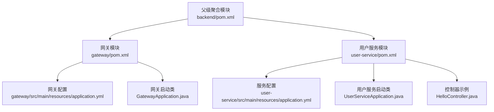
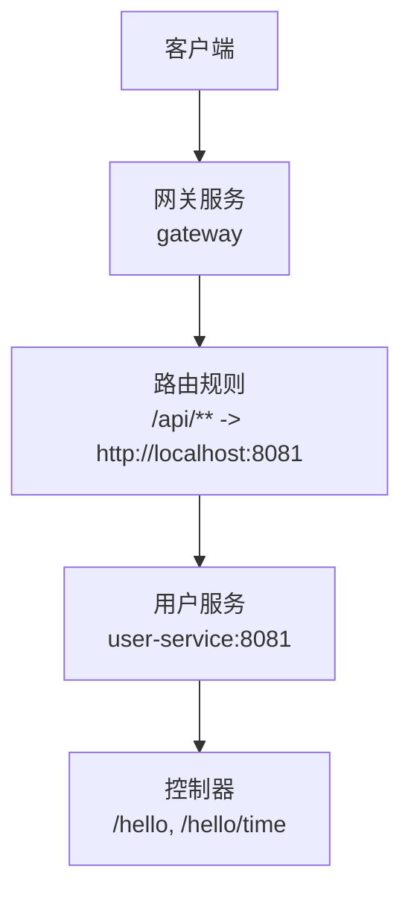
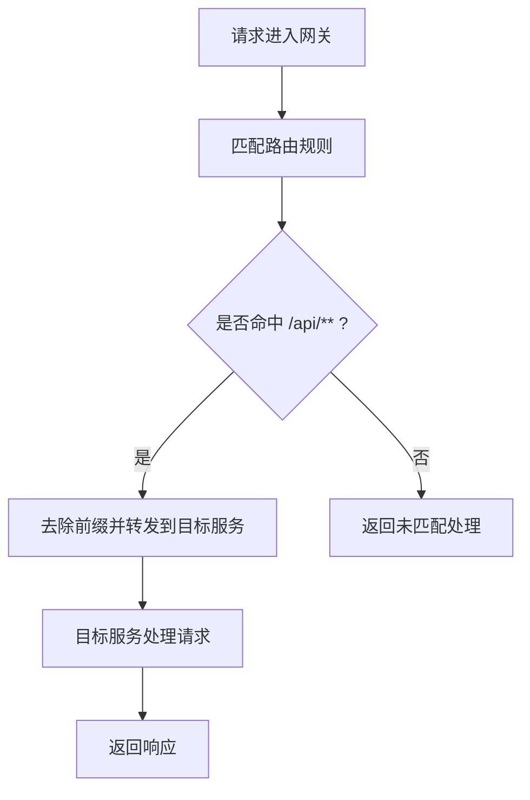
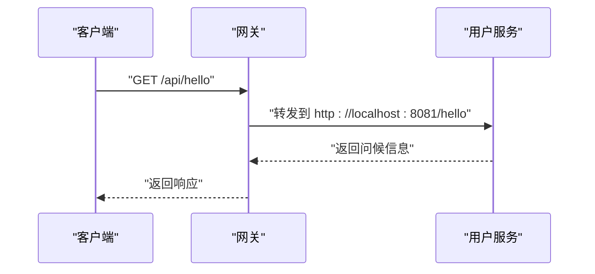
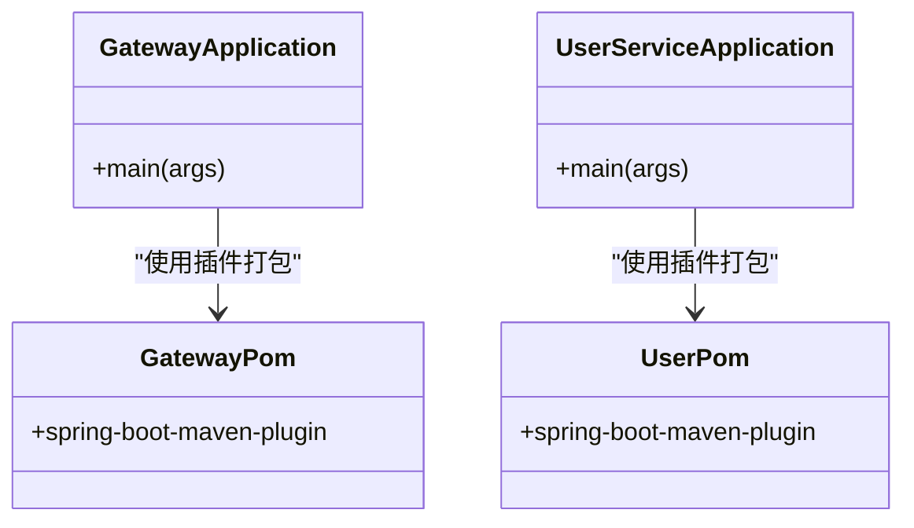
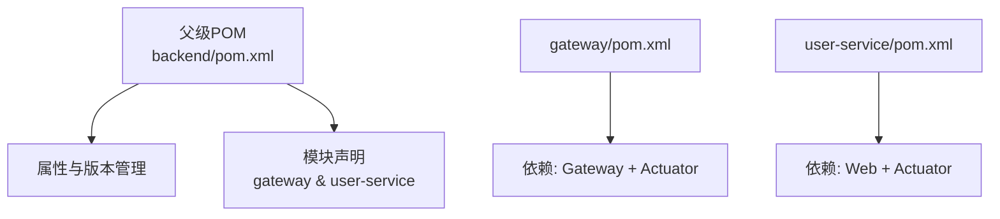

# 后端服务部署

<cite>
**本文档引用的文件**
- [backend/pom.xml](file://backend/pom.xml)
- [gateway/pom.xml](file://gateway/pom.xml)
- [user-service/pom.xml](file://user-service/pom.xml)
- [gateway/src/main/resources/application.yml](file://gateway/src/main/resources/application.yml)
- [user-service/src/main/resources/application.yml](file://user-service/src/main/resources/application.yml)
- [gateway/src/main/java/com/example/gateway/GatewayApplication.java](file://gateway/src/main/java/com/example/gateway/GatewayApplication.java)
- [user-service/src/main/java/com/example/userservice/UserServiceApplication.java](file://user-service/src/main/java/com/example/userservice/UserServiceApplication.java)
- [user-service/src/main/java/com/example/userservice/controller/HelloController.java](file://user-service/src/main/java/com/example/userservice/controller/HelloController.java)
</cite>

## 目录
1. [简介](#简介)
2. [项目结构](#项目结构)
3. [核心组件](#核心组件)
4. [架构总览](#架构总览)
5. [详细组件分析](#详细组件分析)
6. [依赖分析](#依赖分析)
7. [性能考虑](#性能考虑)
8. [故障排除指南](#故障排除指南)
9. [结论](#结论)
10. [附录](#附录)

## 简介
本文件面向后端服务部署与运维，围绕基于 Spring Boot 与 Spring Cloud 的微服务架构，系统性阐述以下主题：
- Maven 构建与打包：多模块聚合工程、插件配置与 JAR 产物生成
- 运行时配置：application.yml 关键项解析（端口、路由、CORS、监控）
- 环境配置管理：profile 切换与环境变量注入策略
- 微服务间通信与负载均衡：网关路由与服务发现基础
- 健康检查、监控指标与日志：Actuator 暴露与常用端点
- 部署脚本示例与常见问题排查

## 项目结构
该后端采用多模块 Maven 聚合工程组织，顶层 POM 定义公共属性与 Spring Cloud 版本控制；子模块包含网关服务与用户服务，分别提供路由转发与业务接口能力。

图表来源
- [backend/pom.xml:1-55](file://backend/pom.xml#L1-L55)
- [gateway/pom.xml:1-35](file://gateway/pom.xml#L1-L35)
- [user-service/pom.xml:1-35](file://user-service/pom.xml#L1-L35)
- [gateway/src/main/resources/application.yml:1-28](file://gateway/src/main/resources/application.yml#L1-L28)
- [user-service/src/main/resources/application.yml:1-13](file://user-service/src/main/resources/application.yml#L1-L13)
- [gateway/src/main/java/com/example/gateway/GatewayApplication.java:1-12](file://gateway/src/main/java/com/example/gateway/GatewayApplication.java#L1-L12)
- [user-service/src/main/java/com/example/userservice/UserServiceApplication.java:1-12](file://user-service/src/main/java/com/example/userservice/UserServiceApplication.java#L1-L12)
- [user-service/src/main/java/com/example/userservice/controller/HelloController.java:1-21](file://user-service/src/main/java/com/example/userservice/controller/HelloController.java#L1-L21)

章节来源
- [backend/pom.xml:1-55](file://backend/pom.xml#L1-L55)
- [gateway/pom.xml:1-35](file://gateway/pom.xml#L1-L35)
- [user-service/pom.xml:1-35](file://user-service/pom.xml#L1-L35)

## 核心组件
- 网关服务（gateway）
  - 依赖：Spring Cloud Gateway、Spring Boot Actuator
  - 功能：统一入口、路由转发、CORS 全局配置、暴露网关相关监控端点
- 用户服务（user-service）
  - 依赖：Spring Web、Spring Boot Actuator
  - 功能：对外提供 REST 接口（示例控制器），暴露健康与信息端点
- 启动类：各模块通过标准 Spring Boot 启动类完成应用上下文初始化

章节来源
- [gateway/pom.xml:16-25](file://gateway/pom.xml#L16-L25)
- [user-service/pom.xml:16-25](file://user-service/pom.xml#L16-L25)
- [gateway/src/main/java/com/example/gateway/GatewayApplication.java:6-11](file://gateway/src/main/java/com/example/gateway/GatewayApplication.java#L6-L11)
- [user-service/src/main/java/com/example/userservice/UserServiceApplication.java:6-11](file://user-service/src/main/java/com/example/userservice/UserServiceApplication.java#L6-L11)

## 架构总览
下图展示请求从客户端到用户服务的典型路径，以及网关在其中的角色。

图表来源
- [gateway/src/main/resources/application.yml:8-15](file://gateway/src/main/resources/application.yml#L8-L15)
- [user-service/src/main/resources/application.yml:1-2](file://user-service/src/main/resources/application.yml#L1-L2)
- [user-service/src/main/java/com/example/userservice/controller/HelloController.java:7-20](file://user-service/src/main/java/com/example/userservice/controller/HelloController.java#L7-L20)

## 详细组件分析

### 网关服务（gateway）
- 服务器端口：通过 server.port 设置监听端口
- 路由配置：定义基于路径的路由规则，将匹配前缀的请求转发至目标服务地址
- CORS 配置：全局允许跨域访问，便于前端直连网关进行调试
- 监控端点：通过 management.endpoints.web.exposure.include 暴露健康、信息与网关相关端点

图表来源
- [gateway/src/main/resources/application.yml:8-15](file://gateway/src/main/resources/application.yml#L8-L15)

章节来源
- [gateway/src/main/resources/application.yml:1-28](file://gateway/src/main/resources/application.yml#L1-L28)

### 用户服务（user-service）
- 服务器端口：独立端口监听
- 监控端点：暴露健康与信息端点
- 示例接口：提供问候与时间查询接口，验证服务可用性

图表来源
- [gateway/src/main/resources/application.yml:10-13](file://gateway/src/main/resources/application.yml#L10-L13)
- [user-service/src/main/resources/application.yml:1-2](file://user-service/src/main/resources/application.yml#L1-L2)
- [user-service/src/main/java/com/example/userservice/controller/HelloController.java:11-14](file://user-service/src/main/java/com/example/userservice/controller/HelloController.java#L11-L14)

章节来源
- [user-service/src/main/resources/application.yml:1-13](file://user-service/src/main/resources/application.yml#L1-L13)
- [user-service/src/main/java/com/example/userservice/controller/HelloController.java:1-21](file://user-service/src/main/java/com/example/userservice/controller/HelloController.java#L1-L21)

### 应用启动与打包
- 启动类：各模块通过标准 Spring Boot 启动类完成应用初始化
- 打包：使用 spring-boot-maven-plugin 插件生成可执行 JAR 文件

图表来源
- [gateway/src/main/java/com/example/gateway/GatewayApplication.java:6-11](file://gateway/src/main/java/com/example/gateway/GatewayApplication.java#L6-L11)
- [user-service/src/main/java/com/example/userservice/UserServiceApplication.java:6-11](file://user-service/src/main/java/com/example/userservice/UserServiceApplication.java#L6-L11)
- [gateway/pom.xml:28-33](file://gateway/pom.xml#L28-L33)
- [user-service/pom.xml:27-34](file://user-service/pom.xml#L27-L34)

章节来源
- [gateway/src/main/java/com/example/gateway/GatewayApplication.java:1-12](file://gateway/src/main/java/com/example/gateway/GatewayApplication.java#L1-L12)
- [user-service/src/main/java/com/example/userservice/UserServiceApplication.java:1-12](file://user-service/src/main/java/com/example/userservice/UserServiceApplication.java#L1-L12)
- [gateway/pom.xml:27-34](file://gateway/pom.xml#L27-L34)
- [user-service/pom.xml:26-35](file://user-service/pom.xml#L26-L35)

## 依赖分析
- 顶层 POM：定义 Java 版本、Spring Cloud 版本、聚合模块与公共插件
- 子模块 POM：声明各自依赖与插件，继承父级版本管理
- 运行时依赖：网关引入 Spring Cloud Gateway 与 Actuator；用户服务引入 Web 与 Actuator

图表来源
- [backend/pom.xml:22-28](file://backend/pom.xml#L22-L28)
- [backend/pom.xml:30-33](file://backend/pom.xml#L30-L33)
- [gateway/pom.xml:16-25](file://gateway/pom.xml#L16-L25)
- [user-service/pom.xml:16-25](file://user-service/pom.xml#L16-L25)

章节来源
- [backend/pom.xml:1-55](file://backend/pom.xml#L1-L55)
- [gateway/pom.xml:1-35](file://gateway/pom.xml#L1-L35)
- [user-service/pom.xml:1-35](file://user-service/pom.xml#L1-L35)

## 性能考虑
- 路由与过滤器链：合理设计路由规则与过滤器顺序，避免不必要的路径匹配与字符串处理开销
- 监控端点：仅暴露必要端点，减少敏感信息泄露风险与资源消耗
- 端口与并发：为不同服务分配独立端口，结合容器编排实现水平扩展与负载均衡
- 日志级别：生产环境建议降低默认日志级别，聚焦错误与关键指标

## 故障排除指南
- 端口冲突
  - 现象：启动失败或端口占用
  - 处理：调整 server.port 或释放占用端口
  - 参考
    - [gateway/src/main/resources/application.yml:1-2](file://gateway/src/main/resources/application.yml#L1-L2)
    - [user-service/src/main/resources/application.yml:1-2](file://user-service/src/main/resources/application.yml#L1-L2)
- 跨域问题
  - 现象：浏览器因 CORS 抛错
  - 处理：确认全局 CORS 配置已启用且允许来源、方法与头
  - 参考
    - [gateway/src/main/resources/application.yml:16-21](file://gateway/src/main/resources/application.yml#L16-L21)
- 路由不通
  - 现象：访问 /api/** 返回 404 或无法转发
  - 处理：核对路由 ID、URI 与路径断言；确认 StripPrefix 行为
  - 参考
    - [gateway/src/main/resources/application.yml:10-15](file://gateway/src/main/resources/application.yml#L10-L15)
- 监控端点不可见
  - 现象：访问 /actuator/health 等返回 404
  - 处理：确认 management.endpoints.web.exposure.include 已包含对应端点
  - 参考
    - [gateway/src/main/resources/application.yml:23-28](file://gateway/src/main/resources/application.yml#L23-L28)
    - [user-service/src/main/resources/application.yml:8-13](file://user-service/src/main/resources/application.yml#L8-L13)
- 控制台输出异常
  - 现象：接口返回内容不符合预期
  - 处理：检查控制器映射路径与方法签名
  - 参考
    - [user-service/src/main/java/com/example/userservice/controller/HelloController.java:7-20](file://user-service/src/main/java/com/example/userservice/controller/HelloController.java#L7-L20)

## 结论
本项目以多模块 Maven 工程为基础，结合 Spring Boot 与 Spring Cloud 实现了网关统一入口与用户服务业务接口。通过合理的 application.yml 配置与 Actuator 监控，能够快速完成本地开发、测试与生产部署。建议在生产环境中进一步完善服务发现、配置中心、安全加固与可观测性体系。

## 附录

### Maven 构建与打包流程
- 在根目录执行构建，父级 POM 将依次构建子模块
- 使用 spring-boot-maven-plugin 生成可执行 JAR，包含启动类与依赖库
- 产物位置：各模块 target 目录下的可执行 JAR

章节来源
- [backend/pom.xml:47-54](file://backend/pom.xml#L47-L54)
- [gateway/pom.xml:27-34](file://gateway/pom.xml#L27-L34)
- [user-service/pom.xml:26-35](file://user-service/pom.xml#L26-L35)

### 运行时配置详解（application.yml 关键项）
- 服务器端口
  - 网关：server.port
  - 用户服务：server.port
  - 参考
    - [gateway/src/main/resources/application.yml:1-2](file://gateway/src/main/resources/application.yml#L1-L2)
    - [user-service/src/main/resources/application.yml:1-2](file://user-service/src/main/resources/application.yml#L1-L2)
- 路由配置
  - spring.cloud.gateway.routes
  - 包含 id、uri、predicates、filters 等
  - 参考
    - [gateway/src/main/resources/application.yml:8-15](file://gateway/src/main/resources/application.yml#L8-L15)
- CORS 跨域配置
  - spring.cloud.gateway.globalcors.cors-configurations
  - 参考
    - [gateway/src/main/resources/application.yml:16-21](file://gateway/src/main/resources/application.yml#L16-L21)
- 监控端点配置
  - management.endpoints.web.exposure.include
  - 参考
    - [gateway/src/main/resources/application.yml:23-28](file://gateway/src/main/resources/application.yml#L23-L28)
    - [user-service/src/main/resources/application.yml:8-13](file://user-service/src/main/resources/application.yml#L8-L13)

### 环境配置管理策略
- Profile 切换
  - 使用 spring.profiles.active 激活特定 profile
  - 通过 application-{profile}.yml 分离环境配置
- 环境变量注入
  - 使用 spring.config.import 或外部化配置源（如文件、环境变量、配置中心）
  - 通过命令行参数或容器环境变量覆盖 application.yml 中的值

### 微服务间通信与负载均衡
- 通信方式
  - 网关统一入口：/api/** 路由转发至用户服务
  - 负载均衡：结合服务发现组件（如 Eureka、Consul）实现多实例轮询
- 当前状态
  - 本仓库演示了静态 URI 转发；生产建议接入服务注册与发现

章节来源
- [gateway/src/main/resources/application.yml:10-15](file://gateway/src/main/resources/application.yml#L10-L15)

### 健康检查、监控指标与日志
- 健康检查
  - 暴露 health 端点，用于容器探针与运维监控
  - 参考
    - [gateway/src/main/resources/application.yml:24-27](file://gateway/src/main/resources/application.yml#L24-L27)
    - [user-service/src/main/resources/application.yml:9-12](file://user-service/src/main/resources/application.yml#L9-L12)
- 监控指标
  - 使用 Actuator 暴露 JVM、HTTP 请求等指标
  - 生产建议接入 Micrometer 与监控平台
- 日志
  - 建议按环境设置日志级别与输出格式，避免生产打印过多调试日志

### 部署脚本示例（概念性说明）
- 构建阶段
  - 在根目录执行构建，生成各模块可执行 JAR
- 运行阶段
  - 独立启动用户服务与网关服务，确保端口不冲突
  - 通过环境变量或配置文件覆盖默认端口与路由
- 编排阶段
  - 使用容器编排平台（如 Docker Compose、Kubernetes）管理服务生命周期与扩缩容