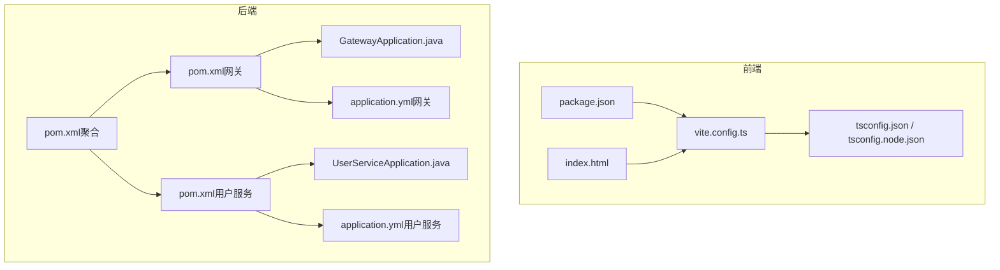
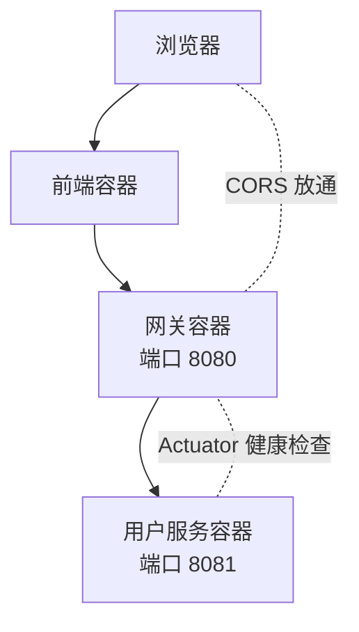
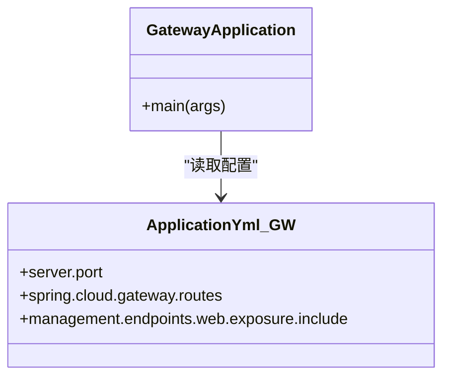
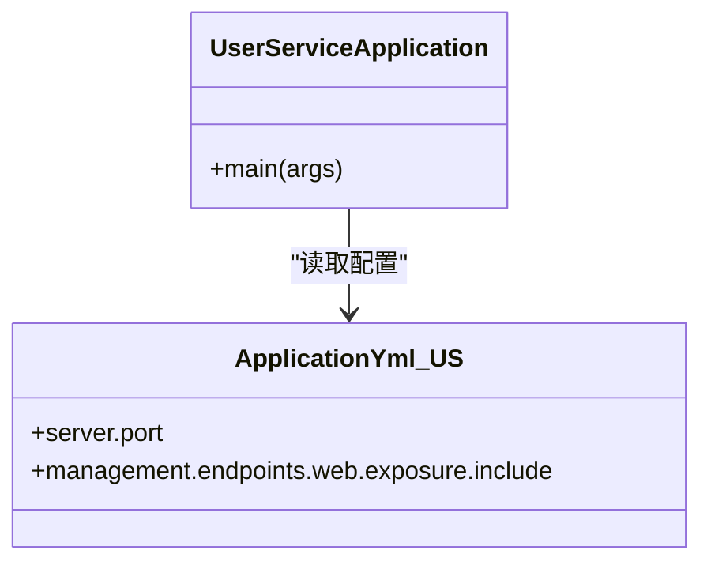
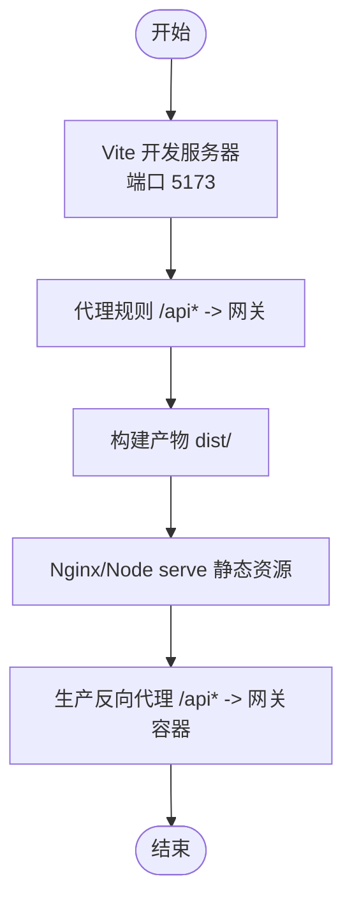
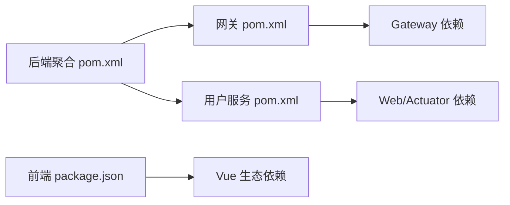

# 容器化部署

<cite>
**本文引用的文件**
- [GatewayApplication.java](file://backend/gateway/src/main/java/com/example/gateway/GatewayApplication.java)
- [UserServiceApplication.java](file://backend/user-service/src/main/java/com/example/userservice/UserServiceApplication.java)
- [application.yml（网关）](file://backend/gateway/src/main/resources/application.yml)
- [application.yml（用户服务）](file://backend/user-service/src/main/resources/application.yml)
- [pom.xml（后端聚合）](file://backend/pom.xml)
- [pom.xml（网关模块）](file://backend/gateway/pom.xml)
- [pom.xml（用户服务模块）](file://backend/user-service/pom.xml)
- [vite.config.ts（前端）](file://frontend/vite.config.ts)
- [package.json（前端）](file://frontend/package.json)
- [tsconfig.json（前端）](file://frontend/tsconfig.json)
- [tsconfig.node.json（前端）](file://frontend/tsconfig.node.json)
- [index.html（前端）](file://frontend/index.html)
- [login.md（需求）](file://requrement/login.md)
</cite>

## 目录
1. [简介](#简介)
2. [项目结构](#项目结构)
3. [核心组件](#核心组件)
4. [架构总览](#架构总览)
5. [详细组件分析](#详细组件分析)
6. [依赖分析](#依赖分析)
7. [性能考虑](#性能考虑)
8. [故障排查指南](#故障排查指南)
9. [结论](#结论)
10. [附录](#附录)

## 简介
本文件面向在生产环境中进行容器化部署的工程团队，围绕当前仓库中的前后端与微服务结构，提供从镜像构建到编排运行的完整指南。内容涵盖：
- Dockerfile 多阶段构建策略与基础镜像选择
- Docker Compose 服务定义、网络与卷挂载
- 容器间通信、端口映射与服务发现
- 生产级资源限制、健康检查与自动重启
- 安全配置、密钥管理与敏感信息保护
- 监控、日志与性能调优
- 常见部署问题排查与解决

## 项目结构
该项目采用前后端分离与后端微服务分层的组织方式：
- 后端为 Maven 聚合工程，包含网关与用户服务两个子模块，均基于 Spring Boot 构建
- 前端使用 Vite + Vue 3 技术栈，开发服务器默认监听本地端口
- 配置文件中明确了各服务的端口与路由规则，便于容器化后的网络编排

图表来源
- [pom.xml（后端聚合）:1-56](file://backend/pom.xml#L1-L56)
- [pom.xml（网关模块）:1-36](file://backend/gateway/pom.xml#L1-L36)
- [pom.xml（用户服务模块）:1-36](file://backend/user-service/pom.xml#L1-L36)
- [GatewayApplication.java:1-12](file://backend/gateway/src/main/java/com/example/gateway/GatewayApplication.java#L1-L12)
- [UserServiceApplication.java:1-12](file://backend/user-service/src/main/java/com/example/userservice/UserServiceApplication.java#L1-L12)
- [application.yml（网关）:1-28](file://backend/gateway/src/main/resources/application.yml#L1-L28)
- [application.yml（用户服务）:1-13](file://backend/user-service/src/main/resources/application.yml#L1-L13)
- [vite.config.ts（前端）:1-23](file://frontend/vite.config.ts#L1-L23)
- [package.json（前端）:1-31](file://frontend/package.json#L1-L31)
- [tsconfig.json（前端）:1-26](file://frontend/tsconfig.json#L1-L26)
- [tsconfig.node.json（前端）:1-11](file://frontend/tsconfig.node.json#L1-L11)
- [index.html（前端）:1-14](file://frontend/index.html#L1-L14)

章节来源
- [pom.xml（后端聚合）:1-56](file://backend/pom.xml#L1-L56)
- [pom.xml（网关模块）:1-36](file://backend/gateway/pom.xml#L1-L36)
- [pom.xml（用户服务模块）:1-36](file://backend/user-service/pom.xml#L1-L36)
- [vite.config.ts（前端）:1-23](file://frontend/vite.config.ts#L1-L23)
- [package.json（前端）:1-31](file://frontend/package.json#L1-L31)

## 核心组件
- 网关服务（Gateway）
  - 暴露端口：8080
  - 路由规则：将 /api/** 请求转发至用户服务
  - CORS 全局放通，Actuator 暴露 health、info、gateway
- 用户服务（User Service）
  - 暴露端口：8081
  - Actuator 暴露 health、info
- 前端应用（Vue 3 + Vite）
  - 开发服务器端口：5173
  - 代理规则：将 /api* 请求转发至本地网关地址

章节来源
- [application.yml（网关）:1-28](file://backend/gateway/src/main/resources/application.yml#L1-L28)
- [application.yml（用户服务）:1-13](file://backend/user-service/src/main/resources/application.yml#L1-L13)
- [vite.config.ts（前端）:12-22](file://frontend/vite.config.ts#L12-L22)

## 架构总览
下图展示了容器化后的典型拓扑：前端通过反向代理（可选 Nginx 或网关内置路由）对外提供静态资源；网关作为统一入口，负责路由与跨域；用户服务处理业务逻辑。

图表来源
- [application.yml（网关）:1-28](file://backend/gateway/src/main/resources/application.yml#L1-L28)
- [application.yml（用户服务）:1-13](file://backend/user-service/src/main/resources/application.yml#L1-L13)
- [vite.config.ts（前端）:12-22](file://frontend/vite.config.ts#L12-L22)

## 详细组件分析

### 网关服务（Gateway）
- 功能要点
  - 路由转发：将 /api/** 映射到用户服务
  - 跨域：全局允许来源、方法与头
  - 运维：暴露健康检查与网关元数据
- 容器化建议
  - 基础镜像：官方 JRE 最小镜像
  - 多阶段构建：Maven 编译产物复制至运行时镜像
  - 端口：8080
  - 健康检查：使用 Actuator /actuator/health
  - 环境变量：JAVA_OPTS、SPRING_PROFILES_ACTIVE

图表来源
- [GatewayApplication.java:1-12](file://backend/gateway/src/main/java/com/example/gateway/GatewayApplication.java#L1-L12)
- [application.yml（网关）:1-28](file://backend/gateway/src/main/resources/application.yml#L1-L28)

章节来源
- [GatewayApplication.java:1-12](file://backend/gateway/src/main/java/com/example/gateway/GatewayApplication.java#L1-L12)
- [application.yml（网关）:1-28](file://backend/gateway/src/main/resources/application.yml#L1-L28)
- [pom.xml（网关模块）:16-25](file://backend/gateway/pom.xml#L16-L25)

### 用户服务（User Service）
- 功能要点
  - 提供 REST 接口（示例控制器位于用户服务源码树中）
  - 暴露健康检查与应用信息
- 容器化建议
  - 基础镜像：官方 JRE 最小镜像
  - 多阶段构建：Maven 编译产物复制至运行时镜像
  - 端口：8081
  - 健康检查：使用 Actuator /actuator/health
  - 环境变量：JAVA_OPTS、SPRING_PROFILES_ACTIVE

图表来源
- [UserServiceApplication.java:1-12](file://backend/user-service/src/main/java/com/example/userservice/UserServiceApplication.java#L1-L12)
- [application.yml（用户服务）:1-13](file://backend/user-service/src/main/resources/application.yml#L1-L13)

章节来源
- [UserServiceApplication.java:1-12](file://backend/user-service/src/main/java/com/example/userservice/UserServiceApplication.java#L1-L12)
- [application.yml（用户服务）:1-13](file://backend/user-service/src/main/resources/application.yml#L1-L13)
- [pom.xml（用户服务模块）:16-25](file://backend/user-service/pom.xml#L16-L25)

### 前端应用（Vue 3 + Vite）
- 开发体验
  - 开发服务器端口 5173
  - 代理规则将 /api* 转发至本地网关
- 容器化建议
  - 使用 Nginx 或 Node 镜像提供静态资源
  - 构建产物输出至 dist，Nginx serve 静态目录
  - 反向代理：将 /api* 转发至网关容器域名与端口

图表来源
- [vite.config.ts（前端）:12-22](file://frontend/vite.config.ts#L12-L22)
- [package.json（前端）:6-11](file://frontend/package.json#L6-L11)

章节来源
- [vite.config.ts（前端）:1-23](file://frontend/vite.config.ts#L1-L23)
- [package.json（前端）:1-31](file://frontend/package.json#L1-L31)

## 依赖分析
- 后端聚合工程
  - Java 版本：11
  - Spring Boot 版本：2.7.18
  - Spring Cloud 版本：2021.0.8
  - 子模块：gateway、user-service
- 网关模块
  - 依赖：Spring Cloud Gateway、Spring Boot Actuator
- 用户服务模块
  - 依赖：Spring Web、Spring Boot Actuator
- 前端工程
  - 依赖：Vue 3、Vue Router、Pinia、Axios
  - 开发工具链：Vite、TypeScript、ESLint

图表来源
- [pom.xml（后端聚合）:22-28](file://backend/pom.xml#L22-L28)
- [pom.xml（网关模块）:16-25](file://backend/gateway/pom.xml#L16-L25)
- [pom.xml（用户服务模块）:16-25](file://backend/user-service/pom.xml#L16-L25)
- [package.json（前端）:12-29](file://frontend/package.json#L12-L29)

章节来源
- [pom.xml（后端聚合）:1-56](file://backend/pom.xml#L1-L56)
- [pom.xml（网关模块）:1-36](file://backend/gateway/pom.xml#L1-L36)
- [pom.xml（用户服务模块）:1-36](file://backend/user-service/pom.xml#L1-L36)
- [package.json（前端）:1-31](file://frontend/package.json#L1-L31)

## 性能考虑
- JVM 参数与内存
  - 通过 JAVA_OPTS 设置堆大小、GC 策略与线程参数
  - 建议启用 G1GC 并根据容器 CPU 限额调整并行度
- 应用层面
  - Actuator 暴露健康检查，结合容器健康探针实现快速失败
  - Spring Cloud Gateway 的路由与过滤器应避免不必要的重写与正则匹配
- 前端静态资源
  - 启用 gzip/br 压缩与缓存策略
  - 将 /api* 代理至网关，减少跨域与额外握手
- 网络与连接池
  - 合理设置连接超时、空闲超时与最大连接数
  - 在网关侧统一限流与熔断，降低下游压力

## 故障排查指南
- 健康检查失败
  - 检查 Actuator 暴露端点是否正确配置
  - 确认容器健康探针路径与端口一致
- 跨域问题
  - 网关已开启全局 CORS，确认浏览器请求头与预检请求处理
- 端口冲突
  - 确认容器端口映射与宿主机端口不冲突
  - 检查容器网络模式与主机网络是否混用
- 路由不通
  - 确认 /api* 代理规则与目标服务域名/端口
  - 检查服务间 DNS 解析与容器网络连通性
- 前端无法访问后端
  - 确认开发代理仅用于本地调试，生产需使用反向代理
  - 检查 Nginx 配置与上游服务可达性

## 结论
通过多阶段构建与最小化运行时镜像，结合合理的健康检查与资源限制，可在生产环境稳定运行该应用。建议以 Docker Compose 作为本地编排与演示，Kubernetes 作为生产编排平台，配合集中式日志与指标采集，持续优化性能与可用性。

## 附录

### Dockerfile 编写指南（多阶段构建）
- 基础镜像选择
  - 构建阶段：使用官方 Maven/Node 镜像
  - 运行阶段：使用官方 JRE/Node/Nginx 最小镜像
- 依赖安装策略
  - 后端：先下载依赖再复制源码，利用镜像层缓存
  - 前端：先安装依赖再复制源码，利用镜像层缓存
- 多阶段构建流程
  - 第一阶段：编译/打包产物
  - 第二阶段：复制产物至运行时镜像，移除构建工具与调试信息
- 端口与健康检查
  - 网关：8080，健康检查路径 /actuator/health
  - 用户服务：8081，健康检查路径 /actuator/health
  - 前端：Nginx serve 80，静态资源目录映射

### Docker Compose 配置要点
- 服务定义
  - 网关：映射 8080，依赖用户服务
  - 用户服务：映射 8081，无外部依赖
  - 前端：映射 80（或 443），反向代理 /api* 至网关
- 网络设置
  - 自定义桥接网络，服务间通过服务名解析
- 卷挂载
  - 前端：静态资源卷挂载
  - 日志：容器 stdout 重定向至宿主机日志目录

### 容器间通信、端口映射与服务发现
- 网关与用户服务
  - 网关通过服务名与端口访问用户服务
  - 端口映射：8080（网关）、8081（用户服务）
- 前端与网关
  - 前端通过反向代理访问 /api*，生产环境建议使用 Nginx
- 服务发现
  - Docker Compose 默认通过服务名解析
  - Kubernetes 中使用 Headless/ClusterIP 与 Service 名称

### 生产环境容器编排最佳实践
- 资源限制
  - CPU/内存限额与预留，避免资源争抢
- 健康检查
  - 使用 HTTP GET /actuator/health
- 自动重启策略
  - 建议 restart: on-failure 或 unless-stopped
- 日志与监控
  - stdout/stderr 统一采集
  - 指标：JVM/HTTP/网关路由指标
- 配置管理
  - 使用 ConfigMap/Secret 管理配置与密钥

### 容器安全配置、密钥管理与敏感信息保护
- 最小权限原则
  - 运行用户非 root，只读文件系统
- 密钥与机密
  - 使用 Secret 管理数据库密码、第三方 API 密钥
  - 避免将密钥写入镜像或配置文件
- 网络隔离
  - 仅暴露必要端口，内部服务通过私有网络通信
- 安全扫描
  - 定期扫描基础镜像与依赖漏洞

### 监控、日志收集与性能调优
- 监控
  - JVM 指标：堆、GC、线程
  - 应用指标：HTTP 请求速率、延迟、错误率
  - 网关指标：路由命中、过滤器耗时
- 日志
  - JSON 格式输出，结构化字段包含 traceId
  - 日志轮转与保留策略
- 性能调优
  - JVM 参数与 GC 调优
  - 连接池与线程池参数
  - 前端静态资源压缩与缓存

### 常见部署问题排查与解决方案
- 健康检查失败
  - 检查 Actuator 暴露端点与容器端口映射
- 跨域失败
  - 确认网关 CORS 配置与浏览器预检请求
- 路由 404
  - 检查网关路由规则与目标服务端口
- 前端空白页
  - 检查静态资源路径与 Nginx 配置
- 端口占用
  - 更换映射端口或停止占用进程