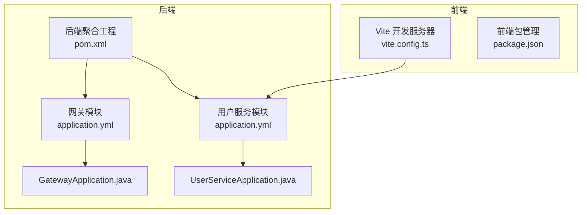
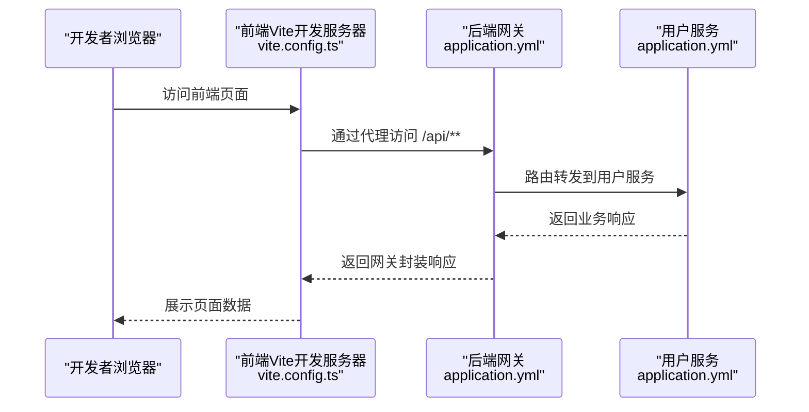
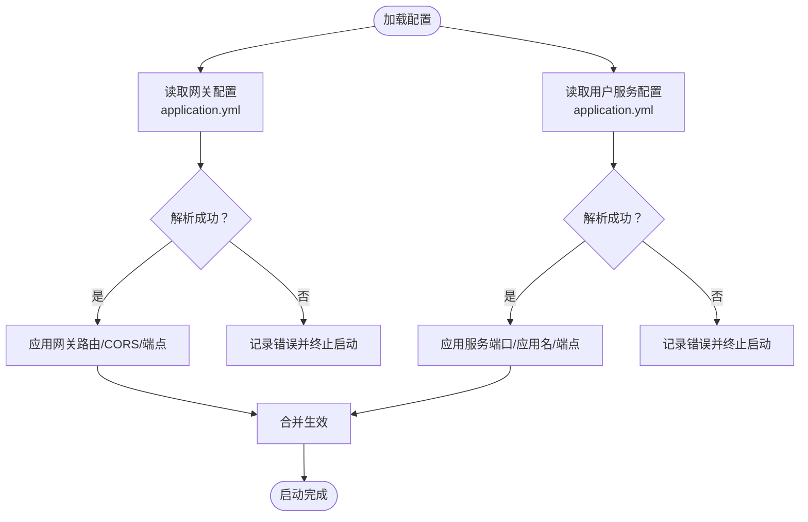
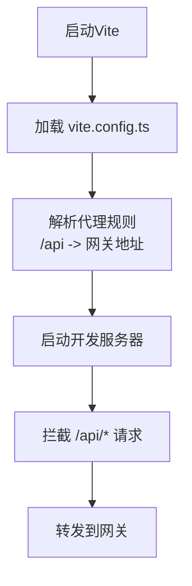
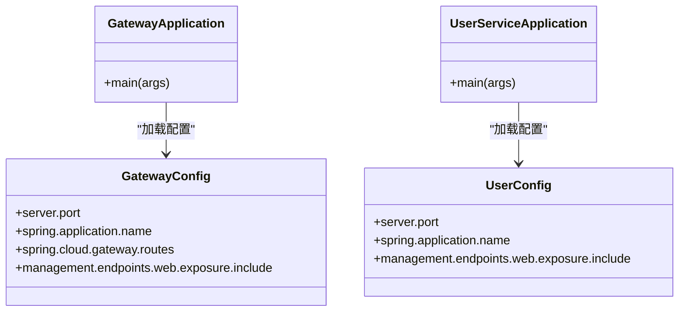
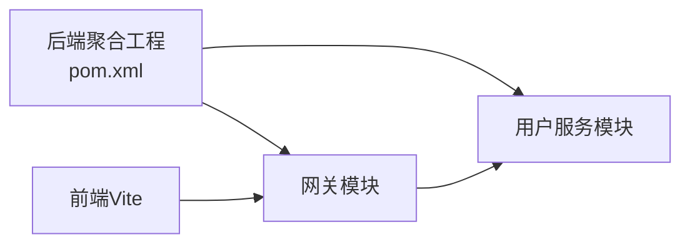

# 环境配置管理

<cite>
**本文引用的文件**
- [application.yml（网关）](file://backend/gateway/src/main/resources/application.yml)
- [application.yml（用户服务）](file://backend/user-service/src/main/resources/application.yml)
- [vite.config.ts（前端）](file://frontend/vite.config.ts)
- [pom.xml（后端聚合工程）](file://backend/pom.xml)
- [package.json（前端）](file://frontend/package.json)
- [GatewayApplication.java（网关启动类）](file://backend/gateway/src/main/java/com/example/gateway/GatewayApplication.java)
- [UserServiceApplication.java（用户服务启动类）](file://backend/user-service/src/main/java/com/example/userservice/UserServiceApplication.java)
- [HelloController.java（用户服务控制器）](file://backend/user-service/src/main/java/com/example/userservice/controller/HelloController.java)
</cite>

## 目录
1. [简介](#简介)
2. [项目结构](#项目结构)
3. [核心组件](#核心组件)
4. [架构总览](#架构总览)
5. [详细组件分析](#详细组件分析)
6. [依赖分析](#依赖分析)
7. [性能考虑](#性能考虑)
8. [故障排查指南](#故障排查指南)
9. [结论](#结论)
10. [附录](#附录)

## 简介
本文件围绕该AI演示项目的环境配置管理进行系统化梳理与规范建议，重点覆盖以下方面：
- 不同运行环境（dev、test、prod）的配置策略与最佳实践
- 配置文件的层次结构、优先级与继承关系
- 环境变量的管理方法（含敏感信息的安全存储与加密思路）
- 配置热更新的实现机制与注意事项
- 配置验证、版本控制与变更管理流程
- 关键配置项模板与示例（数据库连接、API端点、日志级别等）
- 配置冲突的排查方法与解决策略

当前仓库中，后端采用Spring Boot/Spring Cloud配置体系，前端采用Vite开发服务器与代理；整体以本地开发为主，未见环境隔离与密钥管理的具体实现。本文在不改变现有实现的前提下，给出可落地的规范化方案。

## 项目结构
该项目为前后端分离的多模块工程，后端使用Maven聚合管理两个子模块：网关与用户服务；前端使用Vite作为开发服务器与构建工具。配置相关的关键位置如下：
- 后端网关模块：application.yml用于定义网关路由、跨域、管理端点暴露等
- 后端用户服务模块：application.yml用于定义服务端口、应用名称、管理端点暴露等
- 前端Vite：vite.config.ts定义开发服务器端口与API代理规则
- 后端聚合工程：pom.xml声明Spring Cloud版本与父POM，统一依赖管理

**图表来源**
- [pom.xml（后端聚合工程）:1-56](file://backend/pom.xml#L1-L56)
- [application.yml（网关）:1-28](file://backend/gateway/src/main/resources/application.yml#L1-L28)
- [application.yml（用户服务）:1-13](file://backend/user-service/src/main/resources/application.yml#L1-L13)
- [GatewayApplication.java（网关启动类）:1-11](file://backend/gateway/src/main/java/com/example/gateway/GatewayApplication.java#L1-L11)
- [UserServiceApplication.java（用户服务启动类）:1-11](file://backend/user-service/src/main/java/com/example/userservice/UserServiceApplication.java#L1-L11)
- [vite.config.ts（前端）:1-23](file://frontend/vite.config.ts#L1-L23)

**章节来源**
- [pom.xml（后端聚合工程）:1-56](file://backend/pom.xml#L1-L56)
- [application.yml（网关）:1-28](file://backend/gateway/src/main/resources/application.yml#L1-L28)
- [application.yml（用户服务）:1-13](file://backend/user-service/src/main/resources/application.yml#L1-L13)
- [vite.config.ts（前端）:1-23](file://frontend/vite.config.ts#L1-L23)

## 核心组件
- 后端配置载体
  - application.yml：定义服务端口、Spring应用名、Spring Cloud Gateway路由、全局CORS、管理端点暴露等
- 前端配置载体
  - vite.config.ts：定义开发服务器端口与API代理规则，便于本地联调
- 构建与依赖管理
  - pom.xml：统一Spring Boot与Spring Cloud版本，声明模块与插件
  - package.json：定义前端脚本与依赖

**章节来源**
- [application.yml（网关）:1-28](file://backend/gateway/src/main/resources/application.yml#L1-L28)
- [application.yml（用户服务）:1-13](file://backend/user-service/src/main/resources/application.yml#L1-L13)
- [vite.config.ts（前端）:1-23](file://frontend/vite.config.ts#L1-L23)
- [pom.xml（后端聚合工程）:1-56](file://backend/pom.xml#L1-L56)
- [package.json（前端）:1-31](file://frontend/package.json#L1-L31)

## 架构总览
下图展示了本地开发场景下的请求链路与配置交互：

**图表来源**
- [vite.config.ts（前端）:12-21](file://frontend/vite.config.ts#L12-L21)
- [application.yml（网关）:8-15](file://backend/gateway/src/main/resources/application.yml#L8-L15)
- [application.yml（用户服务）:1-2](file://backend/user-service/src/main/resources/application.yml#L1-L2)

## 详细组件分析

### 后端配置组件（Spring Boot/Spring Cloud）
- 网关模块配置要点
  - 服务端口：用于接收前端代理转发的请求
  - Spring Cloud Gateway路由：将/api/**前缀的请求转发至用户服务
  - 全局CORS：允许任意来源、方法与头，便于本地联调
  - 管理端点暴露：health、info、gateway等端点对外可见
- 用户服务模块配置要点
  - 服务端口：独立端口提供REST服务
  - 应用名称：用于监控与日志识别
  - 管理端点暴露：health、info等基础健康检查

**图表来源**
- [application.yml（网关）:1-28](file://backend/gateway/src/main/resources/application.yml#L1-L28)
- [application.yml（用户服务）:1-13](file://backend/user-service/src/main/resources/application.yml#L1-L13)

**章节来源**
- [application.yml（网关）:1-28](file://backend/gateway/src/main/resources/application.yml#L1-L28)
- [application.yml（用户服务）:1-13](file://backend/user-service/src/main/resources/application.yml#L1-L13)

### 前端配置组件（Vite）
- 开发服务器端口：本地开发时的默认端口
- 代理规则：将/api/**前缀的请求代理到后端网关地址，避免跨域问题
- 别名配置：简化路径导入（如@指向src）

**图表来源**
- [vite.config.ts（前端）:12-21](file://frontend/vite.config.ts#L12-L21)

**章节来源**
- [vite.config.ts（前端）:1-23](file://frontend/vite.config.ts#L1-L23)

### 启动类与模块装配
- 网关与用户服务均通过@SpringBootApplication注解启用自动装配
- 父POM统一版本，子模块按需引入依赖

**图表来源**
- [GatewayApplication.java（网关启动类）:1-11](file://backend/gateway/src/main/java/com/example/gateway/GatewayApplication.java#L1-L11)
- [UserServiceApplication.java（用户服务启动类）:1-11](file://backend/user-service/src/main/java/com/example/userservice/UserServiceApplication.java#L1-L11)
- [application.yml（网关）:1-28](file://backend/gateway/src/main/resources/application.yml#L1-L28)
- [application.yml（用户服务）:1-13](file://backend/user-service/src/main/resources/application.yml#L1-L13)

**章节来源**
- [GatewayApplication.java（网关启动类）:1-11](file://backend/gateway/src/main/java/com/example/gateway/GatewayApplication.java#L1-L11)
- [UserServiceApplication.java（用户服务启动类）:1-11](file://backend/user-service/src/main/java/com/example/userservice/UserServiceApplication.java#L1-L11)

## 依赖分析
- 版本与依赖管理
  - 父POM统一Spring Boot与Spring Cloud版本，子模块继承
  - Maven插件：spring-boot-maven-plugin用于打包与运行
- 模块间耦合
  - 网关模块对用户服务存在运行时依赖（路由转发）
  - 前端通过代理依赖网关模块

**图表来源**
- [pom.xml（后端聚合工程）:30-33](file://backend/pom.xml#L30-L33)
- [vite.config.ts（前端）:14-20](file://frontend/vite.config.ts#L14-L20)

**章节来源**
- [pom.xml（后端聚合工程）:1-56](file://backend/pom.xml#L1-L56)
- [vite.config.ts（前端）:1-23](file://frontend/vite.config.ts#L1-L23)

## 性能考虑
- 配置加载性能
  - 将高频访问的配置项置于内存缓存，减少重复解析
  - 控制配置层级深度，避免过深嵌套导致解析开销
- 网关性能
  - 合理设置路由匹配与过滤器顺序，避免不必要的重写与过滤
  - CORS配置应限定来源与方法，减少预检请求
- 前端开发体验
  - 代理仅在开发环境启用，生产构建时通过反向代理统一处理

## 故障排查指南
- 端口冲突
  - 症状：服务无法启动或端口占用
  - 排查：确认application.yml与vite.config.ts中的端口是否被占用
  - 解决：修改任一配置中的端口号
- 路由不通
  - 症状：/api/**请求返回404或无响应
  - 排查：检查网关路由配置与用户服务端口是否一致
  - 解决：修正路由URI或用户服务端口
- 跨域失败
  - 症状：浏览器报跨域错误
  - 排查：确认网关CORS配置是否允许前端来源
  - 解决：调整allowedOrigins/allowedMethods/allowedHeaders
- 管理端点不可访问
  - 症状：无法访问health/info等端点
  - 排查：核对management端点暴露配置
  - 解决：增加include列表中的端点名

**章节来源**
- [application.yml（网关）:1-28](file://backend/gateway/src/main/resources/application.yml#L1-L28)
- [application.yml（用户服务）:1-13](file://backend/user-service/src/main/resources/application.yml#L1-L13)
- [vite.config.ts（前端）:12-21](file://frontend/vite.config.ts#L12-L21)

## 结论
当前项目已具备基本的本地开发配置能力：后端通过application.yml定义服务与网关行为，前端通过vite.config.ts实现API代理。为进一步提升可运维性与安全性，建议引入环境隔离、密钥管理与配置热更新机制，并完善配置验证与变更流程。

## 附录

### 环境配置策略与最佳实践
- 环境分层
  - dev：本地开发，使用application-dev.yml，最小权限与宽松CORS
  - test：集成测试，使用application-test.yml，启用必要的管理端点
  - prod：生产环境，使用application-prod.yml，严格CORS与最小暴露端点
- 配置优先级（从高到低）
  - 命令行参数 > 环境变量 > application-{profile}.yml > application.yml
- 继承关系
  - application.yml为基础公共配置
  - application-{profile}.yml覆盖基础配置，形成“profile”隔离

### 环境变量与敏感信息管理
- 使用环境变量注入敏感信息（如数据库密码、第三方密钥）
- 生产环境建议结合密钥管理服务（如KMS）与配置中心（如Spring Cloud Config），实现密文存储与动态刷新
- 本地开发可使用dotenv文件，但严禁提交到版本库

### 配置热更新机制与注意事项
- 可选方案
  - Spring Cloud Bus + 配置中心：集中式配置中心推送变更
  - 本地热重载：开发阶段通过文件监听与重启策略实现
- 注意事项
  - 热更新需保证幂等性，避免重复初始化
  - 对数据库连接、线程池等资源型配置，需谨慎处理重建与释放

### 配置验证、版本控制与变更管理
- 验证
  - 引入配置校验注解与Schema校验，确保字段类型与范围正确
- 版本控制
  - 配置文件纳入版本库，使用分支策略管理不同环境
- 变更管理
  - 变更需走评审与灰度发布流程，记录变更日志与回滚预案

### 关键配置项模板与示例
- 数据库连接（示例字段）
  - spring.datasource.url
  - spring.datasource.username
  - spring.datasource.password
- API端点（示例字段）
  - server.port
  - spring.cloud.gateway.routes[*].uri
  - management.endpoints.web.exposure.include
- 日志级别（示例字段）
  - logging.level.root
  - logging.level.com.example

### 配置冲突排查方法
- 逐层比对：对比application.yml与application-{profile}.yml差异
- 环境变量覆盖：检查运行时环境变量是否意外覆盖了期望值
- 端到端验证：通过curl或Swagger验证路由与端点行为