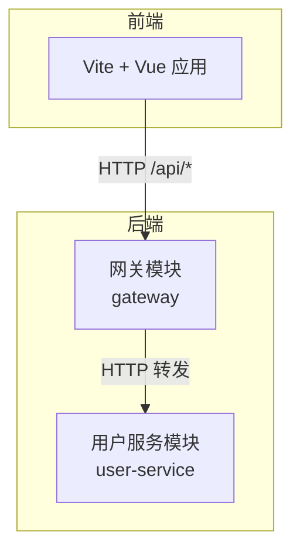
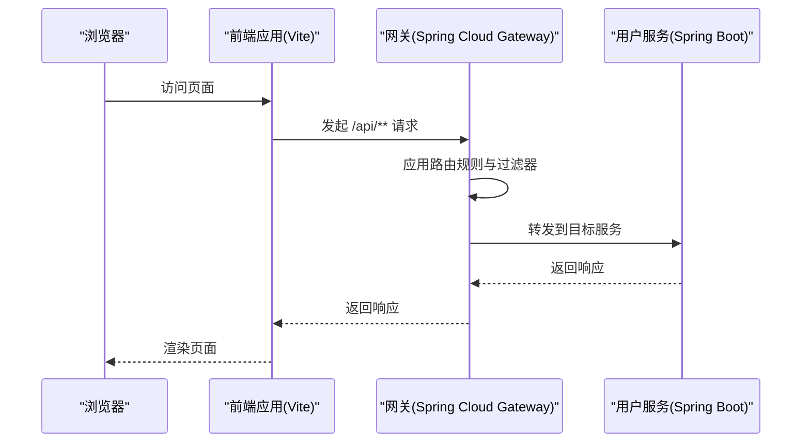
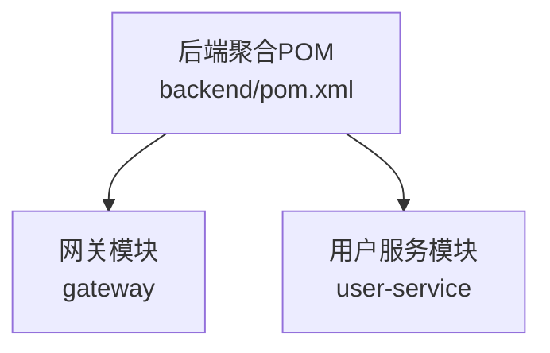

# 部署配置

<cite>
**本文引用的文件**
- [gateway 应用配置](file://backend/gateway/src/main/resources/application.yml)
- [用户服务应用配置](file://backend/user-service/src/main/resources/application.yml)
- [网关应用入口类](file://backend/gateway/src/main/java/com/example/gateway/GatewayApplication.java)
- [用户服务应用入口类](file://backend/user-service/src/main/java/com/example/userservice/UserServiceApplication.java)
- [用户服务控制器](file://backend/user-service/src/main/java/com/example/userservice/controller/HelloController.java)
- [前端 Vite 配置](file://frontend/vite.config.ts)
- [前端包管理配置](file://frontend/package.json)
- [前端 TypeScript 配置](file://frontend/tsconfig.json)
- [前端 TypeScript 节点配置](file://frontend/tsconfig.node.json)
- [后端聚合 POM](file://backend/pom.xml)
</cite>

## 目录
1. [简介](#简介)
2. [项目结构](#项目结构)
3. [核心组件](#核心组件)
4. [架构总览](#架构总览)
5. [详细组件分析](#详细组件分析)
6. [依赖关系分析](#依赖关系分析)
7. [性能考虑](#性能考虑)
8. [故障排除指南](#故障排除指南)
9. [结论](#结论)
10. [附录](#附录)

## 简介
本文件面向从开发到生产的全链路部署场景，覆盖后端服务（Spring Boot + Spring Cloud Gateway）、前端应用（Vite + Vue）与容器化部署（Docker）的配置要点。当前仓库未包含 Kubernetes 配置与 Dockerfile 文件，因此本文件提供可直接落地的部署建议与最佳实践，帮助在不改变现有代码结构的前提下完成生产级部署。

## 项目结构
该项目采用前后端分离的多模块布局：
- 后端为 Maven 聚合工程，包含网关模块与用户服务模块，均基于 Spring Boot。
- 前端为 Vite + Vue 3 工程，通过代理将 /api 请求转发至网关。

图表来源
- [网关应用配置:1-28](file://backend/gateway/src/main/resources/application.yml#L1-L28)
- [用户服务应用配置:1-13](file://backend/user-service/src/main/resources/application.yml#L1-L13)
- [前端 Vite 配置:1-23](file://frontend/vite.config.ts#L1-L23)

章节来源
- [后端聚合 POM:1-56](file://backend/pom.xml#L1-L56)
- [前端包管理配置:1-31](file://frontend/package.json#L1-L31)

## 核心组件
- 网关模块：负责路由规则、CORS 配置与健康检查暴露。
- 用户服务模块：提供受控的 REST 接口，用于演示后端服务。
- 前端应用：本地开发使用代理，生产构建产物由网关或反向代理提供。

章节来源
- [网关应用配置:1-28](file://backend/gateway/src/main/resources/application.yml#L1-L28)
- [用户服务应用配置:1-13](file://backend/user-service/src/main/resources/application.yml#L1-L13)
- [前端 Vite 配置:1-23](file://frontend/vite.config.ts#L1-L23)

## 架构总览
下图展示了从浏览器到后端服务的请求路径，以及各组件间的交互关系。

图表来源
- [网关应用配置:8-15](file://backend/gateway/src/main/resources/application.yml#L8-L15)
- [用户服务控制器:1-21](file://backend/user-service/src/main/java/com/example/userservice/controller/HelloController.java#L1-L21)
- [前端 Vite 配置:14-20](file://frontend/vite.config.ts#L14-L20)

## 详细组件分析

### 网关模块部署配置
- 端口与路由
  - 网关注口：用于接收前端请求。
  - 路由规则：将 /api/** 前缀的请求转发至用户服务地址。
  - 过滤器：剥离前缀以消除多一层路径的影响。
- CORS 允许跨域访问，便于开发与测试。
- 暴露管理端点：health、info、gateway，便于运行时状态观测。

章节来源
- [网关应用配置:1-28](file://backend/gateway/src/main/resources/application.yml#L1-L28)

### 用户服务模块部署配置
- 端口：独立端口对外提供服务。
- 暴露管理端点：health、info，便于运行时状态观测。
- 控制器：提供基础的问候与时间接口，便于快速验证服务可用性。

章节来源
- [用户服务应用配置:1-13](file://backend/user-service/src/main/resources/application.yml#L1-L13)
- [用户服务控制器:1-21](file://backend/user-service/src/main/java/com/example/userservice/controller/HelloController.java#L1-L21)

### 前端应用构建与部署
- 开发服务器：本地开发使用 Vite，默认端口与代理配置将 /api 请求转发至网关。
- 构建命令：先类型检查再打包，确保构建质量。
- 生产部署建议：
  - 使用 Nginx 或网关作为静态资源服务器，指向构建产物目录。
  - 将 /api/** 的静态站点流量通过网关统一转发，实现前后端同源部署。

章节来源
- [前端 Vite 配置:1-23](file://frontend/vite.config.ts#L1-L23)
- [前端包管理配置:6-11](file://frontend/package.json#L6-L11)

### 容器化部署（Docker）
由于当前仓库未包含 Dockerfile 与 docker-compose 文件，以下为通用实践建议：
- 后端镜像
  - 基于官方 JRE 镜像，复制打包后的可执行 JAR 并暴露网关与用户服务端口。
  - 建议使用多阶段构建减少镜像体积。
- 前端镜像
  - 使用 Nginx 镜像，将构建产物复制到 Nginx 默认站点目录。
  - 可启用 Gzip/HTTP/2 提升传输效率。
- 容器编排
  - 使用 docker-compose 或 Kubernetes 部署，分别定义网关与用户服务的服务发现与网络策略。
  - 为敏感配置使用环境变量注入，避免硬编码。

[本节为通用实践说明，不直接分析具体文件，故无“章节来源”]

### Kubernetes 集群部署
以下为推荐的最小化清单设计思路（概念性说明，非现有文件映射）：
- Deployment
  - 为网关与用户服务分别创建 Deployment，设置副本数、滚动更新策略与资源限制。
- Service
  - 为每个服务创建 ClusterIP Service，暴露对应端口，供内部流量访问。
- Ingress
  - 配置 Ingress 将外部域名映射到网关 Service，实现统一入口与 TLS 终止。
- ConfigMap/Secret
  - 将 application.yml 中的环境变量化（如服务端口、目标地址），通过 ConfigMap/Secret 注入。
- 健康检查
  - 使用 readinessProbe/livenessProbe 对接管理端点，保障滚动更新期间的平滑切换。

[本节为通用实践说明，不直接分析具体文件，故无“章节来源”]

## 依赖关系分析
后端采用 Maven 多模块结构，父 POM 管理版本与插件；网关与用户服务各自独立运行。

图表来源
- [后端聚合 POM:30-33](file://backend/pom.xml#L30-L33)

章节来源
- [后端聚合 POM:1-56](file://backend/pom.xml#L1-L56)

## 性能考虑
- 前端
  - 构建时启用压缩与 Tree-shaking，按需加载路由与组件。
  - 使用 CDN 缓存静态资源，结合长期缓存策略与版本号控制。
- 后端
  - 合理设置 JVM 参数与线程池大小，开启必要的压缩与连接复用。
  - 在网关层启用限流与熔断，保护下游服务。
- 网络
  - 前端与后端同源部署可减少跨域与额外跳转，提升首屏速度。

[本节提供通用指导，不直接分析具体文件，故无“章节来源”]

## 故障排除指南
- 网关无法转发
  - 检查路由规则与目标服务地址是否正确。
  - 确认用户服务已启动且端口可达。
- CORS 报错
  - 确认网关中 CORS 配置已生效，或在生产环境通过网关统一处理。
- 健康检查失败
  - 检查管理端点暴露配置与实际端口映射。
- 前端代理无效
  - 确认开发代理的目标地址与端口与网关一致。

章节来源
- [网关应用配置:16-21](file://backend/gateway/src/main/resources/application.yml#L16-L21)
- [前端 Vite 配置:12-21](file://frontend/vite.config.ts#L12-L21)

## 结论
本项目具备清晰的前后端分层与模块化结构，适合快速落地容器化与云原生部署。建议优先完成 Docker 化与环境变量抽象，随后在测试环境中验证 Ingress 与服务网格能力，最终在生产环境引入监控与日志采集体系，持续优化性能与稳定性。

## 附录

### 环境变量与配置模板（示例性说明）
- 网关
  - 环境变量：服务端口、目标服务地址、CORS 允许列表、管理端点暴露范围。
- 用户服务
  - 环境变量：服务端口、管理端点暴露范围。
- 前端
  - 环境变量：API 基础路径、CDN 基础地址、功能开关等。

[本节为通用实践说明，不直接分析具体文件，故无“章节来源”]

### 监控与日志（示例性说明）
- 后端
  - 暴露 Micrometer 指标，集成 Prometheus 与 Grafana。
  - 使用集中式日志（如 ELK/EFK）收集应用日志。
- 前端
  - 通过网关侧日志记录请求路径与状态码，结合浏览器性能指标进行分析。

[本节为通用实践说明，不直接分析具体文件，故无“章节来源”]