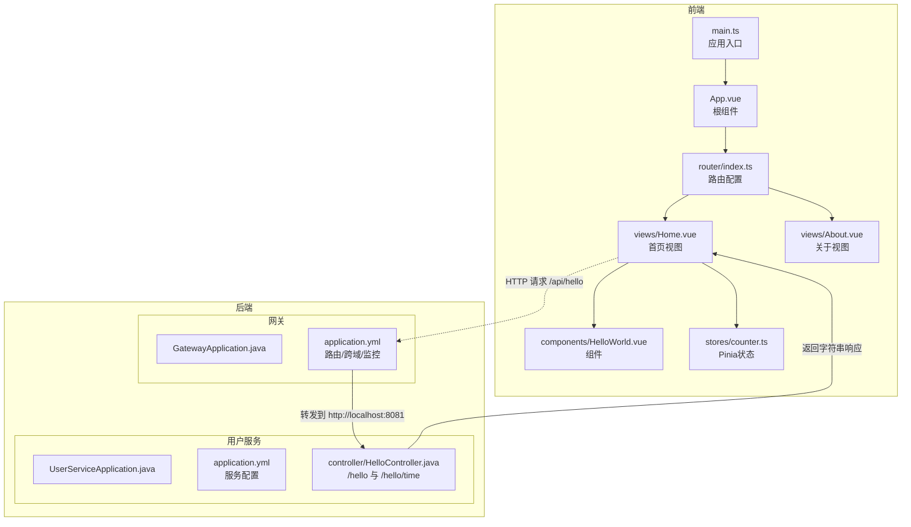
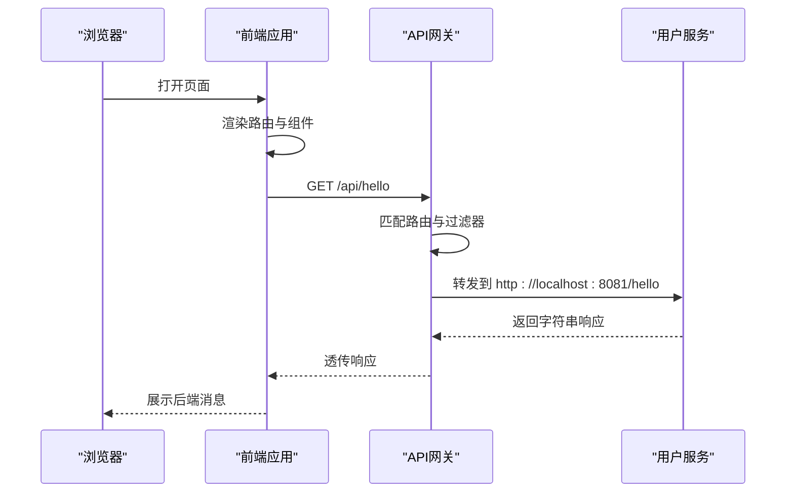
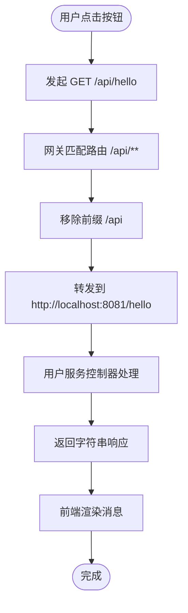

# 项目概述

<cite>
**本文档引用的文件**
- [GatewayApplication.java](file://backend/gateway/src/main/java/com/example/gateway/GatewayApplication.java)
- [application.yml（网关）](file://backend/gateway/src/main/resources/application.yml)
- [UserServiceApplication.java](file://backend/user-service/src/main/java/com/example/userservice/UserServiceApplication.java)
- [application.yml（用户服务）](file://backend/user-service/src/main/resources/application.yml)
- [HelloController.java](file://backend/user-service/src/main/java/com/example/userservice/controller/HelloController.java)
- [pom.xml（后端聚合工程）](file://backend/pom.xml)
- [main.ts](file://frontend/src/main.ts)
- [App.vue](file://frontend/src/App.vue)
- [index.ts（路由）](file://frontend/src/router/index.ts)
- [Home.vue](file://frontend/src/views/Home.vue)
- [About.vue](file://frontend/src/views/About.vue)
- [HelloWorld.vue](file://frontend/src/components/HelloWorld.vue)
- [counter.ts（状态管理）](file://frontend/src/stores/counter.ts)
- [package.json（前端）](file://frontend/package.json)
- [login.md](file://requrement/login.md)
</cite>

## 目录
1. [引言](#引言)
2. [项目结构](#项目结构)
3. [核心组件](#核心组件)
4. [架构总览](#架构总览)
5. [详细组件分析](#详细组件分析)
6. [依赖分析](#依赖分析)
7. [性能考虑](#性能考虑)
8. [故障排查指南](#故障排查指南)
9. [结论](#结论)
10. [附录](#附录)

## 引言
本项目是一个面向AI演示场景的全栈示例工程，采用前后端分离架构：前端基于Vue 3 + Vite + TypeScript + Pinia + Vue Router；后端采用Spring Cloud Gateway作为统一入口，结合独立的用户服务模块。项目目标是通过最小可行的微服务形态，展示从浏览器到API网关再到下游服务的数据流与交互方式，帮助初学者快速理解微服务与现代前端开发的基本概念与实践路径。

## 项目结构
项目采用多模块布局：
- 后端（Maven聚合工程）
  - 网关模块：负责路由转发、跨域配置与健康检查暴露
  - 用户服务模块：提供REST接口示例
- 前端（Vite + Vue 3 + TypeScript）
  - 路由与视图：Home、About页面
  - 组件：可复用的HelloWorld组件
  - 状态管理：Pinia计数器示例
  - 入口：main.ts装配应用、路由与状态管理

图表来源
- [main.ts:1-10](file://frontend/src/main.ts#L1-L10)
- [App.vue:1-41](file://frontend/src/App.vue#L1-L41)
- [index.ts（路由）:1-16](file://frontend/src/router/index.ts#L1-L16)
- [Home.vue:1-64](file://frontend/src/views/Home.vue#L1-L64)
- [About.vue:1-18](file://frontend/src/views/About.vue#L1-L18)
- [HelloWorld.vue:1-18](file://frontend/src/components/HelloWorld.vue#L1-L18)
- [counter.ts（状态管理）:1-13](file://frontend/src/stores/counter.ts#L1-L13)
- [GatewayApplication.java:1-12](file://backend/gateway/src/main/java/com/example/gateway/GatewayApplication.java#L1-L12)
- [application.yml（网关）:1-28](file://backend/gateway/src/main/resources/application.yml#L1-L28)
- [UserServiceApplication.java:1-12](file://backend/user-service/src/main/java/com/example/userservice/UserServiceApplication.java#L1-L12)
- [application.yml（用户服务）:1-13](file://backend/user-service/src/main/resources/application.yml#L1-L13)
- [HelloController.java:1-21](file://backend/user-service/src/main/java/com/example/userservice/controller/HelloController.java#L1-L21)

章节来源
- [pom.xml（后端聚合工程）:1-56](file://backend/pom.xml#L1-L56)
- [package.json（前端）:1-31](file://frontend/package.json#L1-L31)

## 核心组件
- 网关（Spring Cloud Gateway）
  - 职责：统一入口、路由转发、CORS跨域、健康检查暴露
  - 关键配置：定义路由规则（如将/api/**转发至用户服务）、全局CORS策略、管理端点暴露
- 用户服务（Spring Boot）
  - 职责：提供业务接口示例（/hello、/hello/time）
  - 配置：服务端口、管理端点
- 前端应用（Vue 3）
  - 职责：页面渲染、组件化开发、状态管理、路由导航、HTTP调用
  - 特性：脚手架工具链（Vite + TypeScript）、状态管理（Pinia）、路由（Vue Router）

章节来源
- [application.yml（网关）:1-28](file://backend/gateway/src/main/resources/application.yml#L1-L28)
- [HelloController.java:1-21](file://backend/user-service/src/main/java/com/example/userservice/controller/HelloController.java#L1-L21)
- [Home.vue:1-64](file://frontend/src/views/Home.vue#L1-L64)
- [counter.ts（状态管理）:1-13](file://frontend/src/stores/counter.ts#L1-L13)

## 架构总览
系统以“浏览器 → API网关 → 用户服务”的链路组织，前端通过相对路径/api访问后端接口，网关根据路由规则将请求转发到对应下游服务，并剥离前缀以便下游服务按原路径处理。

图表来源
- [Home.vue:28-35](file://frontend/src/views/Home.vue#L28-L35)
- [application.yml（网关）:9-15](file://backend/gateway/src/main/resources/application.yml#L9-L15)
- [HelloController.java:11-14](file://backend/user-service/src/main/java/com/example/userservice/controller/HelloController.java#L11-L14)

## 详细组件分析

### 网关模块
- 启动类：负责引导Spring Boot应用
- 配置要点：
  - 路由规则：将/api/**映射到用户服务URI
  - 过滤器：StripPrefix=1用于去除/api前缀
  - CORS：允许任意源/方法/头
  - 监控：暴露health、info、gateway端点

章节来源
- [GatewayApplication.java:1-12](file://backend/gateway/src/main/java/com/example/gateway/GatewayApplication.java#L1-L12)
- [application.yml（网关）:1-28](file://backend/gateway/src/main/resources/application.yml#L1-L28)

### 用户服务模块
- 启动类：负责引导Spring Boot应用
- 控制器：
  - /hello：返回固定消息
  - /hello/time：返回当前时间字符串
- 配置要点：服务端口、管理端点

章节来源
- [UserServiceApplication.java:1-12](file://backend/user-service/src/main/java/com/example/userservice/UserServiceApplication.java#L1-L12)
- [HelloController.java:1-21](file://backend/user-service/src/main/java/com/example/userservice/controller/HelloController.java#L1-L21)
- [application.yml（用户服务）:1-13](file://backend/user-service/src/main/resources/application.yml#L1-L13)

### 前端应用
- 应用入口：装配Pinia、路由与根组件
- 根组件：提供导航与主区域渲染
- 路由：首页与关于页
- 视图：
  - 首页：展示组件、Pinia计数器、调用后端接口
  - 关于页：技术栈说明
- 组件：可复用的HelloWorld
- 状态管理：计数器store

章节来源
- [main.ts:1-10](file://frontend/src/main.ts#L1-L10)
- [App.vue:1-41](file://frontend/src/App.vue#L1-L41)
- [index.ts（路由）:1-16](file://frontend/src/router/index.ts#L1-L16)
- [Home.vue:1-64](file://frontend/src/views/Home.vue#L1-L64)
- [About.vue:1-18](file://frontend/src/views/About.vue#L1-L18)
- [HelloWorld.vue:1-18](file://frontend/src/components/HelloWorld.vue#L1-L18)
- [counter.ts（状态管理）:1-13](file://frontend/src/stores/counter.ts#L1-L13)

### 数据流与交互流程
- 前端点击按钮触发HTTP请求
- 请求路径为/api/hello
- 网关匹配路由并转发到用户服务
- 用户服务控制器返回字符串响应
- 前端接收并展示结果

图表来源
- [Home.vue:28-35](file://frontend/src/views/Home.vue#L28-L35)
- [application.yml（网关）:9-15](file://backend/gateway/src/main/resources/application.yml#L9-L15)
- [HelloController.java:11-14](file://backend/user-service/src/main/java/com/example/userservice/controller/HelloController.java#L11-L14)

## 依赖分析
- 后端聚合工程
  - 父POM：继承spring-boot-starter-parent
  - 属性：Java版本、Spring Cloud版本
  - 模块：gateway、user-service
  - 插件：spring-boot-maven-plugin
- 前端工程
  - 依赖：vue、vue-router、pinia、axios
  - 开发依赖：@vitejs/plugin-vue、typescript、vite、eslint等

章节来源
- [pom.xml（后端聚合工程）:1-56](file://backend/pom.xml#L1-L56)
- [package.json（前端）:1-31](file://frontend/package.json#L1-L31)

## 性能考虑
- 网关层
  - 路由与过滤器应保持轻量，避免在网关中做重逻辑
  - CORS配置在开发阶段允许通配符，生产环境建议收敛允许范围
- 用户服务
  - 接口简单，适合扩展为更复杂的业务服务
- 前端
  - 使用Vite构建，开发体验与热更新友好
  - Pinia状态管理适合小型到中型应用的状态集中管理

## 故障排查指南
- 网关无法转发
  - 检查路由配置是否正确匹配/api/**
  - 确认下游服务地址与端口可达
- 跨域问题
  - 确认CORS配置已启用且允许来源/方法/头
- 健康检查
  - 访问管理端点查看网关与服务健康状态
- 前端请求失败
  - 确保网关与用户服务均已启动
  - 检查浏览器控制台网络错误与后端日志

章节来源
- [application.yml（网关）:16-27](file://backend/gateway/src/main/resources/application.yml#L16-L27)
- [Home.vue:28-35](file://frontend/src/views/Home.vue#L28-L35)

## 结论
本项目以极简方式展示了微服务与现代前端的协作模式：前端通过统一网关访问后端服务，网关承担路由与跨域等横切职责。该架构便于后续扩展：可在不改变前端调用方式的前提下新增服务模块，或在网关层引入鉴权、限流等能力。对于初学者，这是一个低门槛的入门范式；对有经验的开发者，可在此基础上快速迭代出更贴近生产的解决方案。

## 附录
- 技术栈选择说明
  - 前端：Vue 3生态成熟、TypeScript类型安全、Vite构建高效、Pinia状态管理直观
  - 后端：Spring Cloud Gateway作为API网关，Spring Boot提供简洁的微服务骨架
- 登录页面需求
  - 前端：登录页布局与多种登录方式（账号密码、微信扫码、短信验证码）
  - 后端：提供登录相关API接口支撑
- 实际使用示例
  - 在首页点击“获取后端消息”，观察控制台与页面响应
  - 切换到“关于”页查看技术栈说明
  - 使用计数器组件验证Pinia状态变更

章节来源
- [login.md:1-5](file://requrement/login.md#L1-L5)
- [Home.vue:11-15](file://frontend/src/views/Home.vue#L11-L15)
- [About.vue:5-7](file://frontend/src/views/About.vue#L5-L7)
- [counter.ts（状态管理）:4-12](file://frontend/src/stores/counter.ts#L4-L12)