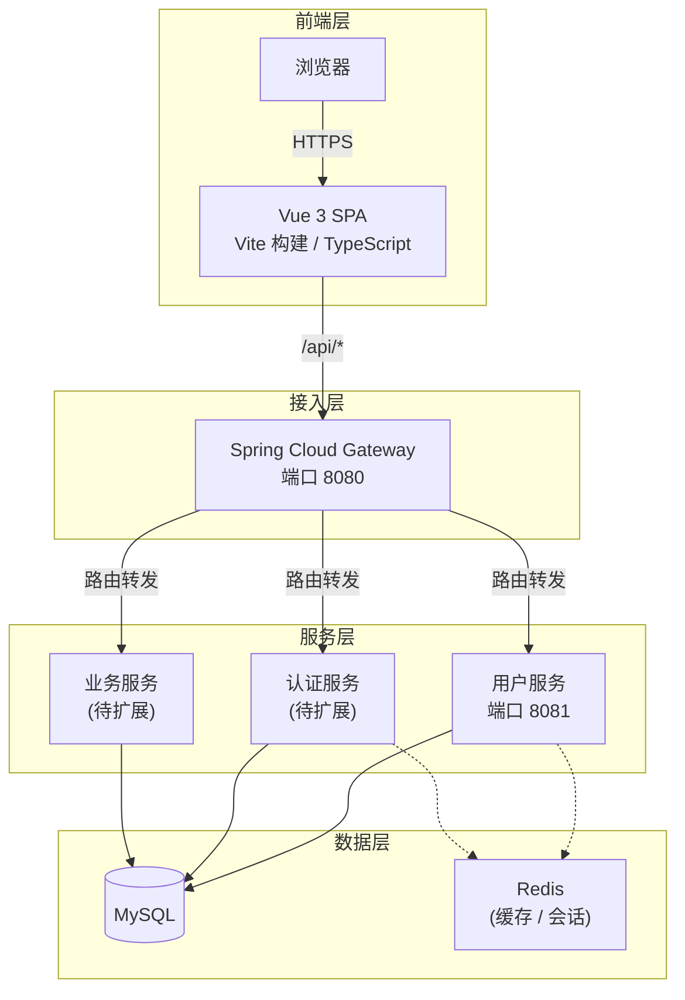

# 系统架构设计文档

## 概述

本项目采用前后端分离架构，前端基于 Vue 3 构建单页应用，后端基于 Spring Cloud 构建微服务集群，数据持久化选用 MySQL。

## 指导文档对齐

### 技术栈（tech.md）
- 前端：Vue 3 + Vite + TypeScript
- 后端：Java + Spring Boot 2.7.18 + Spring Cloud 2021.0.8
- 数据库：MySQL

### 项目结构（structure.md）
- 前后端代码分别置于 `frontend/` 与 `backend/` 目录
- 后端采用 Maven 多模块组织

---

## 架构分层

### 整体架构图



---

## 前端架构

### 技术选型
| 技术 | 版本 | 用途 |
|------|------|------|
| Vue | 3.x | 渐进式前端框架 |
| Vite | 5.x | 构建工具与开发服务器 |
| TypeScript | 5.x | 静态类型检查 |
| Vue Router | 4.x | 客户端路由 |
| Pinia | 2.x | 全局状态管理 |
| Axios | 1.x | HTTP 请求库 |

### 目录结构
```
frontend/
├── src/
│   ├── components/      # 公共组件
│   ├── views/           # 页面视图
│   ├── router/          # 路由配置
│   ├── stores/          # Pinia Store
│   ├── api/             # API 接口封装（待创建）
│   ├── utils/           # 工具函数（待创建）
│   └── assets/          # 静态资源
├── package.json
└── vite.config.ts       # 代理配置 /api -> Gateway:8080
```

### 开发服务器代理
- 前端端口：`5173`
- 所有 `/api/**` 请求通过 Vite 代理转发至 Gateway（`http://localhost:8080`）

---

## 后端架构

### 技术选型
| 技术 | 版本 | 用途 |
|------|------|------|
| Java | 11 | 运行时 |
| Spring Boot | 2.7.18 | 微服务基础框架 |
| Spring Cloud | 2021.0.8 | 微服务治理 |
| Spring Cloud Gateway | 3.1.x | API 网关 / 路由 |
| Maven | 3.6+ | 构建工具 |
| MySQL | 8.x | 关系型数据库 |

### 模块划分
```
backend/
├── pom.xml              # 父 POM，统一版本管理
├── gateway/             # 网关模块（端口 8080）
│   └── 路由 /api/** -> 各业务服务
└── user-service/        # 用户服务模块（端口 8081）
    └── 提供用户相关 REST API
```

### 网关职责
- **路由转发**：根据路径前缀将请求分发到对应服务
- **跨域处理**：统一配置 CORS，避免各服务重复处理
- **负载均衡**：后续可集成 Spring Cloud LoadBalancer
- **认证鉴权**：后续可扩展 JWT 校验过滤器

### 服务间通信
- 当前：通过 Gateway 做 HTTP 路由转发
- 后续扩展：服务间调用可采用 OpenFeign + 服务注册中心（Nacos / Eureka）

---

## 数据层设计

### MySQL
- 用户表、角色表、权限表（认证模块）
- 业务数据表（按领域划分）

### Redis（建议扩展）
- 用户会话（Session / Token 缓存）
- 热点数据缓存
- 分布式锁（高并发场景）

---

## 组件与接口

### 前端核心组件

#### 登录模块（待开发）
- **登录页面**：支持账号密码、微信扫码、手机号验证
- **路由守卫**：未登录用户拦截至登录页
- **Axios 拦截器**：自动附加 Token，统一错误处理

#### API 封装模块（待创建）
- **Base URL**：`/api`
- **拦截逻辑**：请求前加 Token，响应后统一处理 401/403

### 后端核心组件

#### 用户服务（user-service）
- **用户控制器**：用户 CRUD、登录、注册
- **统一响应封装**：`Result<T>` 标准返回体
- **全局异常处理**：`@RestControllerAdvice`

#### 网关（gateway）
- **路由配置**：`application.yml` 中声明各服务路由规则
- **跨域过滤器**：全局 CORS 配置

---

## 错误处理策略

| 场景 | 处理方式 | 用户感知 |
|------|----------|----------|
| 前端网络异常 | Axios 拦截器捕获，显示网络错误提示 | 弹窗/Toast 提示 |
| 后端 401 未授权 | 跳转登录页，清除本地 Token | 页面跳转 |
| 后端 500 服务端错误 | 前端显示通用错误页或重试按钮 | 错误提示 |
| 网关路由失败 | 返回 503，前端提示服务不可用 | 友好提示 |

---

## 测试策略

### 前端
- **单元测试**：Vitest 覆盖组件与 Store 逻辑
- **E2E 测试**：Playwright 覆盖登录、页面导航等关键流程

### 后端
- **单元测试**：JUnit 5 + Mockito 覆盖 Service / Controller
- **集成测试**：`@SpringBootTest` 测试完整上下文

---

## 演进路线

| 阶段 | 内容 |
|------|------|
| 当前 | 单体网关 + 单业务服务，前后端联调通 |
| 第一阶段 | 接入 MySQL，完成用户注册/登录/认证 |
| 第二阶段 | 接入 Redis，缓存热点数据与 Session |
| 第三阶段 | 拆分认证服务、业务服务，引入服务注册与配置中心 |
