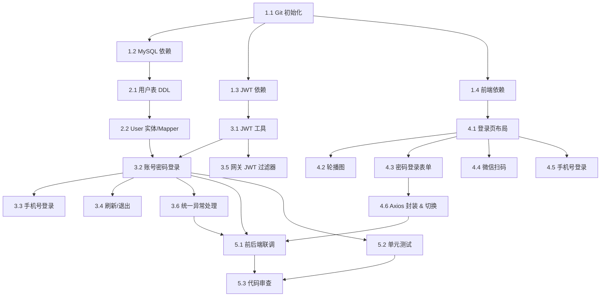

# 任务分解文档

---

## 阶段一：基础环境搭建

- [ ] 1.1 初始化 Git 仓库并提交基础代码
  - 执行 `git init`，添加远程仓库 origin
  - 提交现有代码（前端 Vue、后端 Spring Cloud）
  - _Requirements: 基础配置_
  - _Prompt: Role: DevOps Engineer | Task: 初始化 Git 仓库，配置远程 origin，提交现有代码 | Success: 仓库初始化完成，代码已推送到远程_

- [ ] 1.2 后端引入 MySQL 依赖与连接配置
  - File: `backend/user-service/pom.xml`（添加 `mysql-connector-java`、`mybatis-plus-boot-starter`、`spring-boot-starter-jdbc`）
  - File: `backend/user-service/src/main/resources/application.yml`（配置数据源、MyBatis-Plus）
  - _Leverage: 现有 Spring Boot 项目结构_
  - _Requirements: 需求 3_
  - _Prompt: Role: Java Backend Developer | Task: 在 user-service 中引入 MySQL 驱动与 MyBatis-Plus，配置数据库连接 | Restrictions: 不修改现有接口，配置项使用 application.yml | Success: 应用启动无报错，能成功连接 MySQL_

- [ ] 1.3 后端引入 JWT 与 Security 依赖
  - File: `backend/user-service/pom.xml`（添加 `jjwt`、`spring-boot-starter-security`）
  - _Requirements: 需求 2_
  - _Prompt: Role: Java Backend Developer | Task: 引入 JWT 与 Spring Security 依赖 | Restrictions: 使用 jjwt 0.11.x 版本 | Success: 依赖引入成功，编译通过_

- [ ] 1.4 前端引入 Element Plus / Ant Design Vue 等 UI 库
  - File: `frontend/package.json`
  - 安装 UI 组件库、Axios、VueUse
  - _Requirements: 需求 1_
  - _Prompt: Role: Frontend Developer | Task: 安装项目所需前端依赖（UI库、HTTP请求库等） | Restrictions: 使用 npm 并指定 --cache 到项目内 .npm-cache | Success: node_modules 安装完成，前端 dev 启动正常_

---

## 阶段二：数据库与实体层

- [ ] 2.1 设计并创建用户表（users）
  - File: `backend/user-service/src/main/resources/db/migration/V1__create_users_table.sql`
  - 包含字段：id、username、password_hash、phone、email、avatar_url、status、created_at、updated_at
  - _Requirements: 需求 3.1, 3.2_
  - _Prompt: Role: Database Architect | Task: 编写用户表 DDL，字段设计满足登录与扩展需求 | Restrictions: 使用 InnoDB 引擎，UTF8MB4 字符集，包含索引 | Success: SQL 在 MySQL 中执行成功，表结构符合需求_

- [ ] 2.2 创建 User 实体类与 MyBatis-Plus Mapper
  - File: `backend/user-service/src/main/java/com/example/userservice/entity/User.java`
  - File: `backend/user-service/src/main/java/com/example/userservice/mapper/UserMapper.java`
  - _Leverage: MyBatis-Plus 注解模式_
  - _Requirements: 需求 3_
  - _Prompt: Role: Java Backend Developer | Task: 创建 User 实体与 Mapper，使用 MyBatis-Plus | Restrictions: 实体类放在 entity 包，Mapper 放在 mapper 包 | Success: 单元测试能正常 CRUD 用户记录_

---

## 阶段三：后端认证 API 开发

- [ ] 3.1 实现 JWT 工具类（生成、解析、验证 Token）
  - File: `backend/user-service/src/main/java/com/example/userservice/util/JwtUtil.java`
  - 支持 Access Token（2小时）与 Refresh Token（7天）
  - _Requirements: 需求 2.1, 2.6, 2.7_
  - _Prompt: Role: Java Backend Developer | Task: 实现 JWT 生成与验证工具类 | Restrictions: 密钥从配置文件读取，支持过期校验 | Success: 单元测试覆盖 Token 生成、解析、过期场景_

- [ ] 3.2 实现账号密码登录接口
  - File: `backend/user-service/src/main/java/com/example/userservice/controller/AuthController.java`
  - File: `backend/user-service/src/main/java/com/example/userservice/service/AuthService.java`
  - Endpoint: `POST /api/auth/login`
  - 校验用户名密码 → 生成 JWT → 返回 Token
  - _Leverage: UserMapper, JwtUtil, BCryptPasswordEncoder_
  - _Requirements: 需求 2.1, 2.2_
  - _Prompt: Role: Java Backend Developer | Task: 实现账号密码登录接口，密码使用 BCrypt 校验 | Restrictions: 返回统一响应体，错误信息不暴露内部细节 | Success: Postman 测试登录成功返回 Token，密码错误返回 401_

- [ ] 3.3 实现手机号验证码登录接口
  - Endpoint: `POST /api/auth/login/phone`
  - 校验手机号与验证码 → 生成 JWT
  - _Requirements: 需求 2.3, 2.4_
  - _Prompt: Role: Java Backend Developer | Task: 实现手机号登录接口，验证码使用 Redis 缓存（先模拟） | Restrictions: 验证码 5 分钟有效，错误 3 次锁定 | Success: 接口测试通过，验证码过期返回 400_

- [ ] 3.4 实现 Token 刷新与退出接口
  - Endpoint: `POST /api/auth/refresh` 与 `POST /api/auth/logout`
  - _Requirements: 需求 2.6, 2.7_
  - _Prompt: Role: Java Backend Developer | Task: 实现 Token 刷新和退出接口 | Success: Refresh 正常返回新 Token，Logout 清除会话_

- [ ] 3.5 网关增加 JWT 校验过滤器
  - File: `backend/gateway/src/main/java/com/example/gateway/filter/JwtAuthFilter.java`
  - 放行白名单（登录相关接口），其余请求校验 JWT
  - _Requirements: 需求 2.6, 2.7_
  - _Prompt: Role: Java Backend Developer | Task: 在 Gateway 中添加 JWT 校验全局过滤器 | Restrictions: 登录/注册/验证码接口放行，其他接口校验 Authorization Header | Success: 无 Token 访问受保护接口返回 401，携带有效 Token 正常放行_

- [ ] 3.6 统一异常处理与响应封装
  - File: `backend/user-service/src/main/java/com/example/userservice/common/Result.java`
  - File: `backend/user-service/src/main/java/com/example/userservice/common/GlobalExceptionHandler.java`
  - _Requirements: 非功能需求-可靠性_
  - _Prompt: Role: Java Backend Developer | Task: 创建统一响应体与全局异常处理器 | Success: 所有接口返回统一 JSON 格式，异常不暴露堆栈_

---

## 阶段四：前端登录页面开发

- [ ] 4.1 创建登录页面路由与基础布局
  - File: `frontend/src/views/login/LoginPage.vue`
  - File: `frontend/src/router/index.ts`（添加 `/login` 路由）
  - 页面分为左侧轮播图区（约 50%）与右侧登录区（约 50%）
  - _Requirements: 需求 1.1, 1.6_
  - _Prompt: Role: Vue Frontend Developer | Task: 创建登录页面，实现左右分栏布局，添加路由 | Restrictions: 使用 Flex 布局，支持响应式（小屏幕时上下堆叠） | Success: 访问 /login 正常显示布局，无样式错乱_

- [ ] 4.2 实现左侧轮播图组件
  - File: `frontend/src/views/login/components/CarouselSection.vue`
  - 支持自动轮播、指示器、切换动画
  - _Requirements: 需求 1.2_
  - _Prompt: Role: Vue Frontend Developer | Task: 实现轮播图组件，支持自动播放和指示器 | Restrictions: 图片懒加载，使用过渡动画 | Success: 轮播正常播放，切换流畅_

- [ ] 4.3 实现账号密码登录表单
  - File: `frontend/src/views/login/components/PasswordLoginForm.vue`
  - 包含用户名、密码（显示/隐藏切换）、记住密码、登录按钮
  - _Requirements: 需求 1.3_
  - _Prompt: Role: Vue Frontend Developer | Task: 实现账号密码登录表单，表单校验，登录按钮 Loading 状态 | Restrictions: 使用表单校验库，登录时禁用按钮并显示 Loading | Success: 表单校验正常，点击登录调用后端接口_

- [ ] 4.4 实现微信扫码登录组件
  - File: `frontend/src/views/login/components/WechatLoginForm.vue`
  - 展示二维码占位区与提示文字
  - _Requirements: 需求 1.4_
  - _Prompt: Role: Vue Frontend Developer | Task: 实现微信扫码登录 UI（先预留接口，二维码可模拟） | Success: 组件正常显示，切换 Tab 可见_

- [ ] 4.5 实现手机号验证码登录组件
  - File: `frontend/src/views/login/components/PhoneLoginForm.vue`
  - 手机号输入、验证码输入、获取验证码按钮（60秒倒计时）
  - _Requirements: 需求 1.5_
  - _Prompt: Role: Vue Frontend Developer | Task: 实现手机号登录表单，倒计时按钮，表单校验 | Restrictions: 手机号格式校验，验证码 6 位数字 | Success: 倒计时正常，表单校验通过后可提交_

- [ ] 4.6 实现登录方式切换与 Axios 封装
  - File: `frontend/src/views/login/components/LoginTabs.vue`
  - File: `frontend/src/api/auth.ts`（登录 API 封装）
  - File: `frontend/src/utils/request.ts`（Axios 拦截器：自动附加 Token，统一错误处理）
  - _Requirements: 需求 1, 需求 2_
  - _Prompt: Role: Vue Frontend Developer | Task: 封装 Axios 请求，实现登录方式切换 Tab，登录成功后存储 Token 并跳转首页 | Success: 登录成功跳转到首页，Token 存储到 localStorage，请求自动带 Token_

---

## 阶段五：集成测试与联调

- [ ] 5.1 前后端联调测试
  - 前端启动（`npm run dev`），后端启动（Gateway + User Service）
  - 验证账号密码登录完整流程
  - _Requirements: 全部_
  - _Prompt: Role: Full-stack Developer | Task: 联调登录接口，确保前端调用 → 网关转发 → 后端处理 → 返回 Token 全流程正常 | Success: 浏览器中完成登录，拿到 Token，后续请求带 Token 可访问受保护接口_

- [ ] 5.2 编写后端单元测试
  - File: `backend/user-service/src/test/java/.../AuthServiceTest.java`
  - 覆盖：登录成功、密码错误、用户不存在、Token 生成与验证
  - _Requirements: 非功能需求_
  - _Prompt: Role: Java QA Engineer | Task: 编写 AuthService 和 JwtUtil 的单元测试 | Success: 测试覆盖率 > 80%，mvn test 全部通过_

- [ ] 5.3 代码审查与清理
  - 检查代码规范、注释、README 更新
  - 提交最终代码
  - _Prompt: Role: Senior Developer | Task: 代码审查，清理无用代码，更新文档 | Success: 代码风格统一，无编译警告，README 包含启动说明_

---

## 依赖关系图

